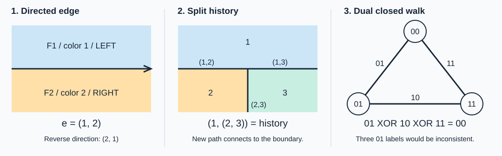

# 四色问题的边侧递归模型

[English](README.md) · [完整数学基础](docs/FOUNDATIONS.md) · [研究计划](docs/RESEARCH_PLAN.md)
· [文献对照](docs/RELATED_WORK.md) · [API 与示例](docs/API.md)

本项目将 Qinzi27 提出的“用 `(1,2)` 描写有向边左右两侧颜色，用
`(1,(2,3))` 记录区域递归分裂”整理为可阅读、可运行、可检查的研究基础。
我们研究：递归时必须保留哪些信息，才能保证局部选择在闭合后仍然一致？

这里已经给出定义、基础命题的证明、受限图类上的精确算法和独立检查。
**本项目尚未给出覆盖所有平面图的递归算法，也不声称完成新的四色定理证明。**
符号、群流与动态规划本身均有相关先例，原创性需要针对具体新结果继续查证。



## 从直觉到定义

1. 一条边必须有方向，左右两侧记录“面编号 + 颜色”，方向反转时交换左右。
2. `(1,(2,3))` 记录的是历史；分裂后各段边需要分别更新为 `(1,2)`、`(1,3)`、`(2,3)`。
3. 悬空边不创造新面；其两侧是同一个面，颜色差为零。
4. 将四种颜色编码为 `00,01,10,11`，边差分为左右颜色的异或。
5. 沿对偶图的闭路绕回原面，差分异或必须为零；仅检查单边非零还不够。
6. 递归接口保存所有能扩张到内部的边界赋色，而不能只保存一次贪心选择。

这里的“面”指平面嵌入的连通区域，包含外部无界面。仅在一个点接触不要求异色。
只有共享实际边界的不同面才构成着色约束。模型中保留完整旋转系统，括号树不能替代它。

## 基础已经补齐到哪里

| 内容 | 状态 |
| --- | --- |
| 有向半边、旋转系统、左右面、分裂历史的定义 | 已写入理论文档；实现可检查嵌入 |
| 悬空延伸与闭合分面 | 可重放操作日志；记录每一步新旧面的对应关系 |
| 闭路一致性与颜色恢复的等价关系 | 有完整基础证明与实现 |
| 平面原图的顶点缺陷与对偶闭路条件 | 有证明；明确桥与自环的处理 |
| 边界扩张集合的粘合公式 | 有证明与小图枚举；一般枚举为指数复杂度 |
| 堆叠三角剖分的唯一扩张 | 有归纳证明；这是已知原理的基准例 |
| 圈、仙人掌图、theta 图的修复公式 | 有推导；明确无桥及流模型范围 |
| 两端系列—并联网络的最小修复 | 有四状态递推、最优见证和独立穷举对照 |
| 每个平面图都能由少量局部规则成功处理 | 尚待证明，不能由小图实验代替 |
| 最小充分状态、新的局部修复界或原创性 | 待研究与进一步查新 |

最小修复研究的是“给定边标签，最少改几条边才能得到合法流”。这是一个
明确的优化问题。当前实现针对**给定分解表达式的两端系列—并联网络**，
不会把任意平面图自动转成这样的表达式。

## 复现

安装 Python 3.10 或更新版本，进入仓库根目录运行；核心程序不需要额外依赖：

```sh
python -m fourcolor demo
python -m unittest discover -s tests -v
python scripts/validate.py
```

最后一个命令生成 [验证报告](outputs/validation.json)。报告保留测试范围、
随机种子和独立对照结果，检查有限实例与实现正确性。

```python
from fourcolor.repair import Edge, Parallel, minimum_repair

# 三条平行边最初都是 01。要使两个三度端点的异或均为零，
# 三条边最终必须分别是 01、10、11，因此至少修改两条边。
network = Parallel(Parallel(Edge(1), Edge(1)), Edge(1))
cost, labels = minimum_repair(network)
assert cost == 2
```

`repair_table` 的状态是端点处所有入射边标签的异或，即**端点缺陷**，
不是两个端点颜色的差。因此串联要求两边状态相同，并联使用异或卷积。
这个区别在理论和程序里使用同一约定。

原始递归过程也可以直接运行：

```python
from fourcolor.history import tetrahedron_history, replay

initial, operations = tetrahedron_history()
final_map, log = replay(initial, operations)
assert len(final_map.faces) == 4
# 初始三角形有两个面；悬空延伸后仍为2，闭合两次后变为3和4。
```

仓库也保留一个关键负例：在区域邻接图中，四边形边界分别预着色为
`0,1,2,3`，中心顶点与四个边界顶点相邻，就无法保持边界颜色继续着色。
同一个图却可以三着色。因此“当前合法”不等于“永远无需重着色”，
递归必须说明如何保留候选状态或允许颜色调整。

下载后用浏览器打开 [互动图解](docs/explainer.html)，可检查边方向、闭合分裂
和闭路约束；README 中的静态图可以直接在 GitHub 显示。

## 后续研究

优先问题是：在指定递归语法下，哪些边界信息可以安全省略？
其次是寻找可证明的修复距离界、分割顺序等价条件和可复现的冲突结构。
详细的研究对象、成功标准和证明义务见 [研究计划](docs/RESEARCH_PLAN.md)。

原始直觉由 Qinzi27 提出；形式化、文献整理、证明草稿和程序有 AI 辅助，
欢迎提供具体反例与相关研究。已知结论与项目猜想会分别标注。
引用请使用 [CITATION.cff](CITATION.cff)，并注明运行时的提交版本。

检索关键词：**四色定理、四色问题、平面图着色、有向边、左右面、递归分割、
边界状态、预着色扩张、Klein 四元群、Tait 着色、无处为零流**。

当前仓库公开供阅读和核验，尚未由作者选择开源复用许可，见 [REUSE.md](REUSE.md)。
