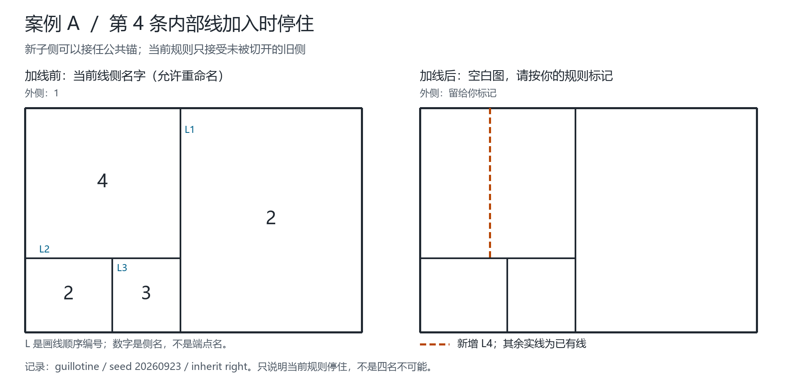
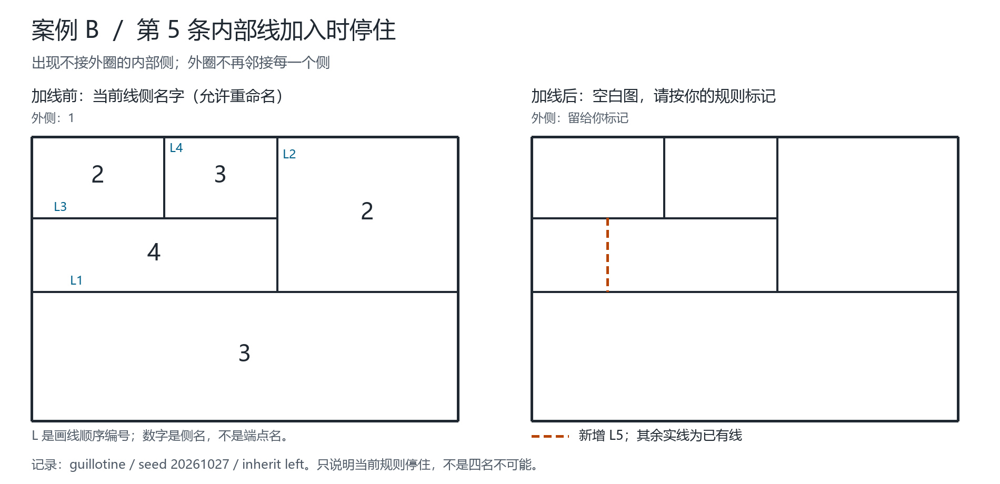

# 双公共锚规则接入连续构造：结果与下一处缺口

日期：2026-09-18。发起思路：Qinzi27 的母线继承与新增分割后的同步重新命名。

**结论：上轮85个一步证书已转成真实连续运行，全部能越过旧阻塞，共多完成228步；但这85条普通矩形历史后来仍全部再次受阻。原条带80次仍全部完成。不能把局部修复数解释为整张图完成数。**

## 1. 本轮实现了哪一步

上轮 [综合模型](RETAINED_PROFILE_SYNTHESIS-2026-09-18.md) 证明：在简单平面侧邻接图中，若外侧和另一个侧是相邻的公共锚，且都邻接其余每个侧，那么删去两个锚后是线性森林。固定两个锚名，每个剩余路径分量用另外两个名字交替即可。

新模块 `fourcolor/anchor_forest.py` 将此规则接入完整构造，顺序事先固定：

1. 调用原完整边界最小可用名规则。
2. 若需要同步改名，先调用原有准确识别的直条带规则。
3. 仍受阻时，检查是否有**唯一未被本次分割的旧侧**可以与外侧作公共锚，且完整剩余邻接确为线性森林。
4. 有则固定这两个锚名；每条路径从标识字典序较小的端点起，以剩余较小名字开始交替；同步重算所有相关母线当前分段名字。
5. 无合格锚、或有多个无法按已定规则确定的旧锚，停止并保留原状态及具体诊断。

本轮沿用上轮一步诊断的确定性约定，没有临时更换相位、尝试其他继承方向或启用着色搜索。只有两个锚名固定，其他旧名和哪个子侧实际继承旧名可能改变，事件分别记录 `requested_inherit` 与 `actual_inherit`。不宣称改名数最少。

生产模块不导入研究脚本中的选名逻辑。旧模块、报告和网页规则没有改写。给定锚后的交替命名具有直接构造性，但当前完整识别器包含重复集合扫描，**不将整个程序的复杂度宣传为线性时间**。

## 2. 如何保证对照公平

- 使用与上轮完全相同的220个历史、切线顺序和种子，每个历史的左右继承策略分别运行，共440次新策略运行。
- 普通递归矩形为160个原有种子及20个额外种子；条带为40个重排历史，每个24步。40条带历史最终线网相同，不能称40张不同的最终地图。
- 与上轮 `complete-boundary+verified-strip` 的440次运行逐一对应。
- **3431个原来成功的前缀步骤**逐步比较切线、继承名、保留约束、选名、方法和整条母线剖面哈希，全部一致。
- 上轮85个一步结果只用于事后核验，没有把证书中的颜色作为程序输入；新程序在到达旧阻塞时独立重建同一结果，之后继续执行余下切线。
- 从头连续运行至24步完成、或首个新阻塞。没有挑选成功前缀拼接，也没有失败后重新抽随机种子。

正式主报告：[anchor-forest-continuation-2026-09-18-v2.json](../outputs/anchor-forest-continuation-2026-09-18-v2.json)。无v2后缀的首版是补齐成功同步前诊断核验之前的检查点，保留不覆盖；两版命名轨迹和完成统计一致。

## 3. 连续运行结果

| 历史组 | 新策略运行数 | 完整完成 | 最终受阻 | 旧版累计成功步数 | 新版累计成功步数 |
| --- | ---: | ---: | ---: | ---: | ---: |
| 原有160个普通矩形历史×2方向 | 320 | 0 | 320 | 1343 | 1550 |
| 额外20个普通矩形历史×2方向 | 40 | 0 | 40 | 168 | 189 |
| 40个条带历史×2方向 | 80 | 80 | 0 | 1920 | 1920 |

普通矩形的旧85处阻塞全部修复后继续，共多推进228步。每条多走步数分布为：

| 额外成功步数 | 1 | 2 | 3 | 4 | 5 | 6 | 13 |
| --- | ---: | ---: | ---: | ---: | ---: | ---: | ---: |
| 历史运行数 | 25 | 23 | 17 | 7 | 7 | 5 | 1 |

后续共使用双锚森林同步114次，说明部分历史再次触发该规则。**114次同步不是114张图完成；85条有所推进的历史最终都再次受阻。** 其余275条普通矩形历史没有越过原来的首阻塞。原条带成功历史的命名和最终结果保持不变。

## 4. 新阻塞的准确结构原因

程序第一层诊断是279次没有合格的“未切旧侧公共锚”、81次外侧已不邻接所有侧。进一步用独立脚本 `scripts/audit_anchor_stops.py` 重建邻接并细分，结果见 [阻塞结构报告](../outputs/anchor-forest-stops-2026-09-18.json)：

| 结构类别 | 数量 | 能说明什么 |
| --- | ---: | --- |
| 没有任何第二个全局公共锚 | 219 | 当前双公共锚定理无法直接应用；不是四色不可能 |
| 公共锚只存在于本次新子侧 | 60 | 仍有双锚结构，但“锚必须是未切旧侧”的当前策略不覆盖 |
| 至少一个侧不接外圈 | 81 | 外侧作为全局公共锚的前提失效 |

这里60次共有71个新子侧锚候选，均核实删锚后的完整邻接是线性森林；因此其中11次有两个新子侧候选。这是结构识别结果，**本轮没有实施新子侧接任锚的策略，也没有计算其连续历史成功数**。

这与“新增分割改变母子关系”的想法形成了一个具体连接：有些图仍满足可直接重命名的数学结构，但程序保留的旧锚身份已不再合适。不能把“没有未切旧锚”误写成“完全不存在公共锚”。锚侧身份、几何母线身份仍是不同对象，不可直接互换。

### 两个可复核代表

- 种子20260923、右继承：旧第3步由森林规则修复，新第4步 `(187,0)→(187,402)` 再阻塞。新子侧 `[187,0,415,402]` 邻接全部其他侧，但没有未切旧侧满足这一要求。适合研究“新子侧继承锚角色”。
- 种子20260909、左继承：旧第3步修复后成功走到第8步，第9步因出现不接外框的内部侧而停止。此时仅更换另一旧锚并不能恢复“外侧邻接全部侧”的前提，需要更一般的局部结构与接口规则。

## 5. 独立验证与边界

正式v2报告的5725份证书全部通过 JavaScript 独立几何构建、边两侧取样，以及 Python 从旋转次序重建侧一致类的检查：

\[
5725=3659\text{ 份已提交四色状态}+2066\text{ 份未提交诊断}。
\]

2066份诊断又包括360个最终受阻步骤的冻结命名，以及1706个已成功同步步骤之前的冻结命名。诊断可含名字5，检查器不会因超过四色就隐藏它；这些状态没有提交，不能作为“四名成功”计数。

- Python全部197项测试通过；新增9项专项测试覆盖旧85份证书、275个不合格状态、真实后续切线、完整母线更新、确定性和结构负例。
- Node全部99项测试通过。
- 数据与源码SHA-256核验通过，主实验启动和结束时检查源码未改变。
- 闭环、桥、斜线、任意复杂旧接点尚不在此矩形适配器范围；有限实验不能代替一般证明。
- 若一个真实简单平面邻接图同时有两个相邻全局公共锚，却检测到删锚后仍有圈或分支，这是与已证明前提矛盾的模型/实现告警，不应包装成普通案例的新失败类别。本轮没有出现这种情况。

## 6. 复现与后续目标

Python3.10+标准库与Node20+即可；在仓库根目录运行，使用尚不存在的输出名：

```sh
python -m unittest discover -s tests -v
python scripts/validate_anchor_forest.py --output outputs/anchor-forest-rerun.json
python scripts/audit_anchor_stops.py --input outputs/anchor-forest-rerun.json --output outputs/anchor-stops-rerun.json
python scripts/validate.py --output outputs/validation-anchor-rerun.json
node --test tests/web.test.mjs tests/construction.test.mjs tests/renaming.test.mjs tests/priority-names.test.mjs
```

下一步可先针对这60处研究“新子侧继承旧父侧的锚名”：明确什么时候允许锚角色迁移，以及11处双候选时的固定优先级。应作为单独新策略测试，不能暗中改写本轮规则。随后再处理不具有全局双锚的结构，研究局部子结构之间的约束接口。

本轮没有修改线上网站、提交Git或上传GitHub。新结果已回接综合说明与项目下一步记录；所有旧实验保留。

## 7. 发给提出者人工标记的实际停止图

这些图直接读取正式v2报告，不是凭印象重画，也没有在空白图中预填诊断名字5。左图显示加线前已提交的合法名字，右图显示加线后线网；新增线用橙色虚线，其他线用实线。所有坐标统一等比缩放，保持接点关系。数字表示侧名；`L1` 等只表示内部线的画线顺序，外框另记。

### A：新子侧接任锚（第4条内部线）



[A独立空白PNG](figures/anchor-failures-2026-09-18/case-a-blank.png) · [A空白SVG](figures/anchor-failures-2026-09-18/case-a-blank.svg)。对应上文种子20260923、right，第4步；新增 `(187,0)→(187,402)`。

### B：不邻外圈的内部侧（第5条内部线）



[B独立空白PNG](figures/anchor-failures-2026-09-18/case-b-blank.png) · [B空白SVG](figures/anchor-failures-2026-09-18/case-b-blank.svg)。选择较简单的种子20261027、left，第5步，而不是上文较复杂的第9步示例；新增 `(160,172)→(160,327)`，新内部侧为 `[160,172,518,327]`。

两条新增线在报告中都按上→下记录。因此 `right` 指沿线向下的有向右侧，即图左；`left` 指图右。这只是重现原运行的约定，不要求人工方案沿用。两例均在第3步成功同步后，继续构造才再次停止。

人工标记时可改变旧名、选择其他起始母线或重新安排命名顺序；请保留线网本身。如果换锚或母子关系，请用箭头说明；尽量记录从哪条线开始、保留哪一侧、哪一步触发旧名更新。这样可以验证给出的最终名字，也可以把推理过程落实成新规则。

出图不调用命名求解器，不改变本轮算法。源数据、坐标、字体和SHA-256见 [manifest.json](figures/anchor-failures-2026-09-18/manifest.json)。PNG不依赖阅读端字体；SVG保留可编辑文字，需要相应中文字体。用Pillow与中文字体运行独立出图工具（这是可选出图依赖，不改变核心标准库要求），输出目录须未使用：

```sh
python scripts/render_anchor_failure_cases.py --input outputs/anchor-forest-continuation-2026-09-18-v2.json --output-dir docs/figures/anchor-failures-rerun --font msyh.ttc
```

出图过程按科学可视化流程保留原始数据、分离已提交状态与空白几何，并逐张检查PNG；没有编辑原手绘照片。

## 方法说明

科研审查流程用于分清一步证书、连续运行与普遍证明，并保留所有停止记录；项目驱动学习流程用于从实际阻塞反查假设。流程来源不是数学结论的证据：Kassis, T., Agarwal, V., He, Y., Patel, D., & Brueckner, A. M. (2026). *Scientific Agent Skills: A Library of Procedural Knowledge for Research Agents*. [arXiv:2609.00065](https://doi.org/10.48550/arXiv.2609.00065)，当前记录于2026-09-18核对。
