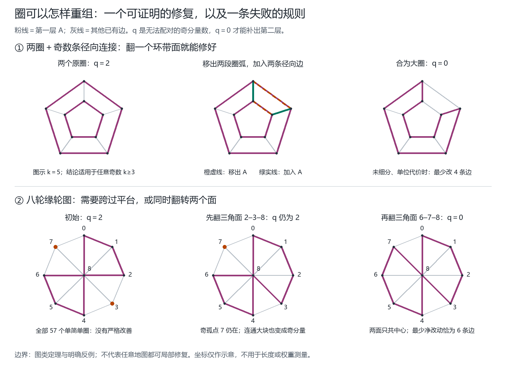

# 第一圈层的局部重组：可证明图类、失败规则与修复代价

日期：2026-09-20。承接 Qinzi27 的独立圈/组合圈提案与 [圈 rank 说明](CIRCLE_RANK-2026-09-20.md)。本轮目标是实际推进“旧第一层不能补全时，怎样重组”，而非修改已有网页取名算法。



## 1. 固定允许的动作与代价

先排除当前原图中的桥，记剩余真实边集为 E。第一层 A 是 E 的偶度边子集；外面参与地图着色，桥仍为同面两侧，不需要覆盖。原图母线身份、当前分段 ID、第一层标记、最终面颜色是不同对象。

一次动作给定一个偶度边集 C，执行

\[
A'=A\triangle C.
\]

即 C 中原本属于 A 的边移出，不属于 A 的边移入。因为对称差保持偶度，新第一层仍然合法。C 可以是单个简单圈、一个面的模 2 边界，或者两个面边界的组合。一般地图的面边界未必是单简单圈，必须注明候选类型；两圈组合也不能被写成“一条简单圈”。

默认代价为改变第一层标记的边数 `|A△A'|`。可选非负整数边权 w 时，代价为改变边的权重和。多步过程中另记每次翻转代价之和；同一边改两次会相消，累计操作代价不一定等于最终净改动代价。

这个代价只度量**第一层边标记**，不度量全部面改色数或第二层改动数。补全 B 时可能影响其他位置的编码，因此不能把第一层的局部改动界转述为整个旧取名算法的局部重命名界。

## 2. 可以计算的障碍量，以及它的局限

令 V 包含全部已声明顶点（包括孤立点），T 为 G=(V,E) 中度为奇数的顶点集。由于 A 偶度，余边 R=E\A 的奇点集始终等于 T，不随 A 改变。

对图 `(V,A)` 的每个连通分量 W，包括孤立顶点，计算 `|W∩T|` 的奇偶。定义

\[
q(A)=\#\{W: W\text{ 是 }(V,A)\text{ 的分量且 }|W\cap T|\text{ 为奇数}\}.
\]

由经典 T-join 判据，`q(A)=0` 当且仅当 A 可以补出第二偶度层 B，覆盖所有 E。因为整个 T 的大小为偶数，q 始终为偶数。若每一步严格减少 q，则每步至少减少 2，最多接受 `q(A₀)/2` 步；**这个界只约束已接受步骤，不保证一定有下一步可接受动作。**[Chekuri，第 13 讲，Proposition 3](https://courses.grainger.illinois.edu/cs598csc/sp2010/Lectures/Lecture13.pdf#page=1)

本轮原型逐项评估预先给定的候选动作，按 `(新 q, 本步代价, 本步边数, 边 ID 序列, 候选序号)` 排序，取严格改善的最佳项。若没有严格改善，明确返回 `stalled`，附所有候选分数。它没有隐藏四色求解器、递归回溯或在失败时偷偷扩大候选族。

## 3. 一个完整的小定理：两圈与奇数条径向连接

### 图类与结论

考虑两个互不相交的嵌套圈，按环向顺序由 k≥3 条互不交叉的径向路径相连，所有连接落点互异。每段圈弧和每条径向路径都允许任意度 2 细分。压缩这些度 2 路径后，原图为棱柱图 `C_k □ K₂`。初始 A 为两个原圈。

- k 为偶数：`q(A)=0`，原 A 可直接补全，无须修改。
- k 为奇数：`q(A)=2`。任选相邻两条径向路径之间的环带面，翻转它的完整边界，即可得到可补全的 A'。
- k 为奇数，边权非负时：在**全部可补全的偶度 A'** 中，最小 `w(A△A')`，恰好等于最便宜的一个环带面完整边界的总权重。

未细分、每条边权重 1 时，最少改变 4 条边。若每条原始边均细分成 L 段、每段权重 1，则最少改变 `4L` 条细分边。于是“对任何细分都只改固定数量边段”不可能；按压缩后的 4 条拓扑路径计仍是常数。

### 为什么翻一个扇区就够

翻转一个环带四边面的边界，移出两条圈弧，移入两条径向路径，把原来两圈重组成一个包含全部原始度 3 顶点的大圈。该圈包含 2k 个奇度顶点，数量为偶数。被移出路径内部的度 2 顶点即使在 A' 中孤立，也不属于 T，不形成奇偶障碍。因此 q 降至 0。

这是直接的构造，不需要先求一份完整四色着色。任选一个扇区均可行；若优化指定的非负边权，只需比较 k 个扇区的边界代价。

### 为什么它还达到最小代价

先在压缩后的三正则图上讨论。成功 A' 在每个度 3 顶点的度必须为 2：偶度只允许 0 或 2，而度为 0 会留下单个奇点分量，违反 q=0。所以原 A 与成功 A' 的补集都是完美匹配。

两个完美匹配的对称差分解为顶点不交的交替圈；这里每个交替圈在圈边与径向边之间交替。交替圈每访问一个环向指标，就经过该指标唯一的径向边，同时访问上下两端；简单圈条件禁止随后再次访问该指标。把径向边压缩后，投影只能在相邻两个指标间沿上下两条圈边往返，或遍历全部 k 个指标。前者是一个环带四边面；后者含 k 条径向边，每条交换一次上下圈，闭合要求交换偶数次，所以 k 必须为偶数。因此奇数 k 的差集由若干顶点不交的环带四边面边界组成。

初始 A 本身失败，故差集非空。非负权下，任何成功差集的代价至少是最便宜单个环带面边界的代价；上一段已构造达到该代价的单面翻转，所以上下界相等。

度 2 细分不会改变这个论证：偶度要求一条内部无分叉的路径上所有边的选入状态一致；把整条路径权重相加即可。**不能用细分后的圈长奇偶取代 q。**例如 k=3、L=2 时，两个圈虽然都长 6 条细分边，却仍各有三个奇度连接点，原 A 依然失败。

所用交替圈结构属于经典匹配理论；参见 [Goemans 2017 讲义，第 3 页](https://math.mit.edu/~goemans/18453S17/matching-notes.pdf#page=3)。三正则图中完美匹配、全偶圈 2-factor 与三边着色的关系可参见 [Abreu 等，§1 Proposition 1.1](https://arxiv.org/pdf/2106.00513#page=2)。这里把它具体用于当前图类的修复代价，未作“文献首次发现”声明。

## 4. 一条看似自然的推广确实失败

### 完整反例

取一个有 8 个轮缘顶点和 1 个中心顶点的轮图。顶点为 0–8，中心为 8。轮缘边 ID 0–7 分别连接 `(i,(i+1) mod 8)`；辐条边 ID 8–15 分别连接 `(i,8)`。

初始第一层为

```text
A = [0, 1, 4, 5, 8, 10, 12, 14]
```

它由两个在中心接触的四边圈组成。轮缘顶点 3、7 在 A 中孤立，都是原图奇度顶点，所以 q=2。

**翻转任何单个简单圈，都不能把 q 降到 0。**该轮图全部 57 个简单圈的 q' 分布为：q'=2 有 33 个，q'=4 有 20 个，q'=6 有 4 个。因此即使候选包含全部简单圈，“每步必须严格减少 q”仍会停住；这不是少选了某个面的实现问题。

### 不依赖穷举的解释

成功的单圈 C 必须经过原来的孤点 3、7，否则未经过的孤点仍构成障碍。轮图简单圈只有两种：完整轮缘，或者两条辐条加一段连续轮缘弧。

完整轮缘会移出夹住顶点 1、5 的两条旧 A 边，产生新的奇孤点。任何经过 3、7 的连续轮缘弧，也必然把 1 或 5 放在弧的内部，同样移出该顶点的两条旧 A 边。因此任何单简单圈都不能成功。q 非负且为偶数，故 q=2 时不存在严格下降动作。

### 两步平台路径与最优代价

先翻三角面 `C₁=[2,10,11]`，再翻三角面 `C₂=[6,14,15]`，有

```text
A₀ = [0,1,4,5,8,10,12,14]          q=2
A₁ = [0,1,2,4,5,8,11,12,14]        q=2
A₂ = [0,1,2,4,5,6,8,11,12,15]      q=0
```

第一步吸收了一个奇孤点，但形成另一个奇分量，因此 q 暂时不变；第二步才把两个奇障碍一起消除。两三角面不共享边，只共享中心顶点。也可以将 `C₁△C₂` 作为一次“两圈组合”动作，直接 q=2→0。

这 6 条改变边达到全局最小：任何差集 `D=A₀△A'` 必须偶度。在简单图中，一个非空且少于 6 条边的偶度边集只能是单个简单圈；若含多个边不交圈，每圈至少 3 条边，合计至少 6 条。上一段已排除单简单圈成功，而上述两三角面达到 6 条。

这证明了一个明确的规则边界：**强制单简单圈、每步严格改善，不能保证修复；允许圈组合或暂不改善的平台步骤，至少能越过这个反例。**但后者仍不是一般终止性证明。

## 5. 实现和实验怎样区分

新增的 `fourcolor/circle_layer_repair.py` 接受一个显式候选族，不自行扩大动作范围。成功记录 A'、B 和补全证书；停住记录剩余障碍和全候选分数。独立检查器复核记录与本步选择规则。

`scripts/circle_repair_oracles.py` 只用于有界实验：枚举全部偶层、简单圈及最小改动目标，不进入修复算法。其可补全筛选与生产代码共用已经证明的数学判据，但独立实现；小图另外用全 B 覆盖枚举交叉核查。它不是大图求解后备，也不把有限枚举称作一般证明。

正式实验脚本 `scripts/validate_circle_repair.py` 比较预先声明的三种候选族：单面；单面加共享边双面；单面加任意双面。所有失败均保留，并与有界全偶层最优解比较净改动代价。详细图类、大小、赋权方式、数据来源、停止状态、源码哈希与计数以 `outputs/circle-repair-2026-09-20.json` 为准。

固定实验范围为轮图轮缘数 3–9、棱柱图圈长 3–7，共 12 张有明确平面嵌入的图，枚举全部 1,512 个偶层。其间 258 个初始已可补全，1,254 个实际需要修复。所有面（包括无界外面）均为候选，重复的翻转边集去重并保存来源。下表只把需要修复的状态作为成功率分母：

| 候选动作；每步均要求 q 严格下降 | 成功修复／需要修复 | 停住 | 达到全局最少净改动的修复数 |
|---|---:|---:|---:|
| 单面 | 1120 / 1254 | 134 | 836 |
| 单面＋共享边双面 | 1227 / 1254 | 27 | 934 |
| 单面＋任意双面 | 1254 / 1254 | 0 | 1032 |

最优 oracle 在这些图上枚举完整循环空间：由面边界生成所有不同向量，核对偶度及维数 `E−V+1` 后，遍历全部可补全目标 A'，而不是只检查某组基环。最大实例有 512 个偶层；棱柱圈长 7 虽有 21 条边，但只有 256 个偶层，因此不需要突破子集枚举 helper 的 20 边上限。

任意双面策略在本次范围全成功，**仍有 222 个修复没有达到最少净改动**。一个现成例子是轮缘数 6 的轮图，沿用“轮缘边在前、辐条在后”的编号，初始 `A=[0,6,7]`。该策略翻整个外圈，改 6 条边；全偶层 oracle 的唯一最优差集是 `[2,3,4,8,11]`，只改 5 条边。这个差集是一条简单圈，恰为三个连续三角面的合成边界。有限成功不能证明固定双面候选完备，也不能证明贪心选择达到最优。

额外核验：原图八种蓝线组合的指定 A 全部零步成功；36 个棱柱细分例和 6 个正整数权重例通过；76 个顶点数不超过 4 的简单图中，121 个偶 A、289 对偶 A/B 的直接覆盖核验与判据一致。大型细分例的最优性明确依赖本节前的解析命题，未伪称对子集全枚举。

复现时使用新输出名：

```shell
python -m unittest discover -s tests -v
python scripts/validate.py --output outputs/validation-circle-repair-rerun.json
python scripts/validate_circle_repair.py --output outputs/circle-repair-rerun.json
python scripts/render_circle_repair.py --input outputs/circle-repair-rerun.json --output-dir docs/figures/circle-repair-rerun
```

没有改变旧的网页求解器、四色取名规则或冻结实验成绩。上轮三圈原图仍是无需修改 A 的成功例；本轮推进的是它所引出的失败后重组问题。

## 6. 接下来真正值得判断的命题

可以继续研究“在哪些明确图类中，固定数量的面组合就足以找到下降动作”，以及“允许平台动作时，怎样避免循环并证明步数界”。代价宜同时保留压缩路径数、实际边段数与触及母线数，避免通过细分随意改变所谓局部规模。

当前能成立的是上述棱柱图类的构造与最优代价，以及轮图对严格单圈下降的反例。它们没有给出一般四色构造，没有证明任意两面组合策略完整，也没有证明最小净改动可以由每步局部最便宜选择得到。

工作流来源：使用 Scientific Agent Skills 的论证审查指导，数学结论另由本文证明和上述图论原文支持。Kassis, T., Agarwal, V., He, Y., Patel, D., & Brueckner, A. M. (2026). *Scientific Agent Skills: A Library of Procedural Knowledge for Research Agents*. [arXiv:2609.00065](https://arxiv.org/abs/2609.00065)，本轮核验为 v2 预印本。

## English research summary

We investigate repairs of a fixed even contour layer using symmetric differences with explicitly declared even edge sets. For an odd prism with the initial layer consisting of its two rings, flipping one annular face always restores extendability. With nonnegative additive edge costs, the cheapest such face attains the minimum repair cost, including under degree-two subdivisions. An eight-rim wheel provides a counterexample to strict descent by single simple-cycle flips: every such move preserves or increases the obstruction count, while two triangular face flips repair the layer at the optimal cost of six changed edges. The implementation records success and stalled states separately and compares bounded candidate families with finite exhaustive oracles. These are restricted constructive results and an explicit algorithmic limitation, not a general local proof of the Four-Color Theorem.
