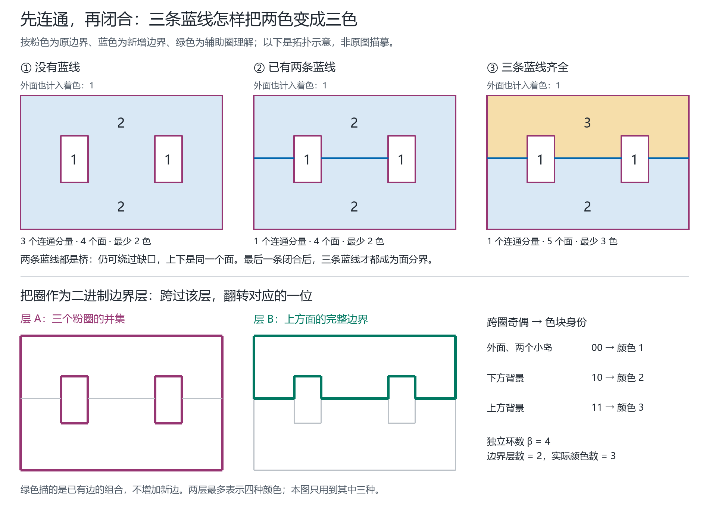

# 从独立圈到闭合边界层：三条蓝线例子的理论发展

日期：2026-09-20。出发点及原图来自 Qinzi27。本轮将图意整理为可检验的命题与独立原型；不改动此前取名算法或冻结成绩。

**图意假设：**粉色外圈及两个内圈是真实边界；蓝色三段依次连接外圈、左岛、右岛、外圈；绿色是追踪已有边的辅助轮廓，不是另加一条实际边。连接弧内部互不交叉，落点互不重合。以下结论依赖这些接触关系，而不依赖轮廓是否圆、矩形或弯曲。如果绿色也是实际边，需要重新建立面与交点。



这张图是依据上述接触关系生成的拓扑示意，不是原截图的像素描摹；原图保留原样。无界外面也作为一个面参与着色；仅沿边相邻要求异色，点接触不要求异色。

## 1. 你的两色观察为什么成立

设外面为 O，两个岛内部为 I₁、I₂，原来的背景为 S。

这里“最少颜色”指整张地图所需的最少颜色种数 χ；它与每一步优先选编号最小的颜色是两个问题。不同圈可以共享二元边界层，但接入同一地图后，所标记的共享面必须有一致的颜色，不能把各圈的局部取名当作任意独立的全局赋色。

- 无蓝线时，O、I₁、I₂ 都只邻接 S。因此可令 O、I₁、I₂ 为颜色 1，S 为颜色 2，且一色不可能。
- 任意只保留一条或两条蓝线时，它们都只是把原本不同的边界连通分量接起来。蓝线是原图中的桥（bridge），两侧仍是同一个背景面，故最少颜色数仍为 2。
- 三条蓝线齐全时，连接网络闭合，背景才分裂成 U、D 两个面。U 与 D 相邻，而且都邻接 O、I₁、I₂。对偶简单图为 `K₂ ∨ 3K₁`：一个相邻顶点对，加上三个彼此不相邻、却都连接该顶点对的顶点。因此至少三色，并可取 O、I₁、I₂=1，D=2，U=3。

下表的面数包含外面；H 是把三个原始圈各压缩为一个顶点、只保留蓝色连接的多重图。

| 蓝线数 | 原图连通分量 C | H 的独立环数 β(H) | 原图独立环数 β(G) | 面数 F | 最少颜色 χ |
|---|---:|---:|---:|---:|---:|
| 0 | 3 | 0 | 3 | 4 | 2 |
| 1，任意一条 | 2 | 0 | 3 | 4 | 2 |
| 2，任意两条 | 1 | 0 | 3 | 4 | 2 |
| 3 | 1 | 1 | 4 | 5 | 3 |

**关键更新规则：加入最后一条蓝线后，先前两条也不再是桥。**不能把“出生时没有分面”永久当成该线的属性。此前的线身份可以保留，但当前分段、两侧面身份、色差必须随闭合事件更新。

## 2. 圈的“最大、最小、rank”需要指定比较对象

### 2.1 包含关系与嵌套深度：圈在哪里

对选定的简单闭曲线族，以 Jordan 内部包含定义偏序：`C ≼ D` 表示 C 围成的内部包含在 D 的内部。当前原始圈族中，外圈最大，两个内圈都是极小元，彼此不可比。给外圈深度 h=0，两内圈 h=1。这是嵌套深度，不是色数，也不是线性代数中的秩。

“极小”是不能再向下包含，“最小”要求小于所有其他对象；两个互不包含的岛圈没有共同的最小圈。若要求最短周长、最小面积，应另指定坐标、权重和允许的候选圈，拓扑本身不给这些量。新增组合圈可能重叠，整个圈族不一定还能组织成一棵包含树。

### 2.2 循环空间的秩：有多少个独立闭合约束

原图 G 的循环空间（cycle space）使用 GF(2) 运算：一条边出现两次相消，圈的加法是对称差 `⊕`。其维数为

\[
\beta(G)=|E|-|V|+C=F-1.
\]

选一棵生成森林，每加入一条非森林边，就得到一个基本环；这些环组成大小为 β(G) 的基。它给出最大线性无关圈族，也给出生成整个循环空间所需的最少基向量数，但基并不唯一。没有要求每个基环代表一种颜色。

当前完整图可选三个原始粉圈 C₀、C₁、C₂，加上绿色的上方面边界 U 为基，秩为 4。下方面边界可由

\[
D=C_0\oplus C_1\oplus C_2\oplus U
\]

恢复。注意一个面的边界在一般地图中可能包含多个闭曲线或重复经过桥；它的模 2 边界向量是循环空间元素，但未必是单个简单圈。

对 k 个原本互不接触的圈，加 m 条上述类型的连接弧，H 有 C 个连通分量，则

\[
\beta(H)=m-k+C,\qquad
\beta(G)=k+\beta(H),\qquad F=k+1+\beta(H).
\]

这给出了一个精确的“新增闭合 rank”：连接不同分量时不增长；连接同一分量内的两个位置时增长 1。它计算新增的面数，不直接计算新增颜色。一般非连通平面图的 Euler 公式见 [Erickson 课程讲义，第 1 页](https://jeffe.cs.illinois.edu/teaching/compgeom/2021/scribbles/02-25-prep.pdf)。

### 2.3 二进制边界层：需要多少位来区分相邻面

一个边界层 A 定义为原图的一个偶度边子集：每个顶点在 A 中的度都是偶数，环边计两次。它可以由多个圈组成，不要求连通。选定外面编码为 0，从外面走到某个面，跨过 A 中的边就翻转一位；偶度保证不同路径给出相同的奇偶结果。

以 A 为三个粉圈的并集，跨外圈一次得到背景位 1，再跨一个岛圈得到岛内部位 0。因此原图的三个圈已经可以共用一个二元层，而非给每个圈分配一个独立颜色。

三条蓝线闭合后，加上 B=上方面的完整边界，得到：

| 面 | A 位 | B 位 | 二进制编码 | 显示颜色 |
|---|---:|---:|---|---:|
| 外面、两个岛内部 | 0 | 0 | 00 | 1 |
| 下方背景 D | 1 | 0 | 10 | 2 |
| 上方背景 U | 1 | 1 | 11 | 3 |

绿色组合圈由已有边组成，不再切出新面。A 与 B 可以重叠：某条边属于两层，就同时翻转两位。判断覆盖用集合并 `A ∪ B`；组合循环向量用对称差 `A ⊕ B`，这两个运算不能混用。

**桥处理：**令 E° 为删除所有当前原图桥之后的边集。若 k 个偶度边集的并集覆盖 E°，便得到至多 `2^k` 种编码的合法面着色。反过来，将合法面颜色写成二进制，每一位的色差边集就是一个偶度层，并覆盖全部非桥。若允许任意此类层，则

\[
k_{\min}=\lceil\log_2\chi\rceil.
\]

当 χ=1 时取 k=0。两层保证至多四色，但不能区分实际最少三色和四色。当前图为 β(G)=4、k_min=2、χ=3，三者意义不同。这与本项目 [FOUNDATIONS.md](FOUNDATIONS.md) 已有的 `Z₂ × Z₂` 色差/流表述一致，不是新的四色等价性发现。

## 3. 一个可以直接构造、也可以明确判失败的条件

**固定第一层的补全命题。**在 G° 上先给定一个偶度边集 A。令剩余待覆盖的边为 `R=E°\A`。存在第二个偶度边集 B，使 `A∪B=E°`，当且仅当：

> 图 `(V,A)` 的每一个连通分量 W，都有偶数条 R 边跨出 W。

孤立顶点也必须作为 A 的连通分量检查。这里计算跨出分量的边，不能把分量内部的 R 边误计一次。

**证明与算法。**B 必须包含全部 R，只能再从 A 中补选 X，故 `B=R∪X`、`X⊆A`。以 ∂ 表示顶点度奇偶向量，B 偶度等价于

\[
\partial X=\partial R\quad\text{over GF(2)}.
\]

必要性：在 A 的一个分量内，把所有顶点的奇偶需求相加，内部边贡献两次相消，跨出的 R 边贡献一次。A 中没有边通向该分量外部，因此奇数需求无法由 X 消除。

充分性：在 A 的每个分量选一棵生成树。从叶到根处理：若叶顶点的剩余需求为 1，就选入它到父顶点的边，并同时翻转父顶点的需求。所有非根顶点都可消除；整个分量的总需求为偶数，保证最后根的需求也为 0。所有选入边构成 X，从而构造出 B。孤立顶点只需检查自己的需求是否为 0。

若用 A 在 GF(2) 上的顶点—边关联矩阵 M_A 表达（环边列为零），同一条件是

\[
\operatorname{rank}(M_A)=\operatorname{rank}([M_A\mid\partial R]),
\qquad \operatorname{rank}(M_A)=|V|-c_A.
\]

所以，与着色直接相关的可检验 rank 问题可以具体化为“增加需求列会不会升秩”，而不是先给每个圈一个大小编号再据此选色。

本命题是经典 **T-join 存在性判据**在固定边界层中的应用：以 `(V,A)` 为宿主图，令 T 为 R 中度为奇数的顶点集，X 就是待求的 T-join。原文及证明见 [Chekuri，2010 年第 13 讲，第 1 页 Definition 2、Proposition 3](https://courses.grainger.illinois.edu/cs598csc/sp2010/Lectures/Lecture13.pdf#page=1)。上述证明在此完整给出，不主张原创定理。森林传播本身不枚举颜色，也不调用旧求解器。它解决给定 A 能否补全，并不负责挑选一定可补全的 A，也不保证 B 最短、圈数最少或最终颜色最少。

**代入你的图。**缺任意蓝线时，蓝线都是桥，先从 E° 中排除，R 为空，A 已足够。三线齐全时，每个粉圈分量都有两条蓝边跨出，条件成立。选合适的粉色弧与全部蓝线组合，即得到图中的绿色上方边界。通用森林算法也会产出合法第二层，但未要求它恰好选绿色这个三色方案。

### 可以进一步精确定义“最小或最大构造”

若固定 A、上述奇偶可行性条件已通过，并给每条候选边指定非负权重 w（例如每段计 1，或使用已有几何的线段长度），可把目标定义为第二层 B 的总边权最小。由于 R 必选，目标成为

\[
\min w(B)=w(R)+\min_{X\subseteq A,\ \partial X=\partial R} w(X).
\]

右侧正是宿主图 `(V,A)` 上的最小代价 T-join；已有标准算法通过奇点间最短路与最小权完美匹配求解，见 [同一讲义第 2 页 §1.1、Theorem 5](https://courses.grainger.illinois.edu/cs598csc/sp2010/Lectures/Lecture13.pdf#page=2)。这是可以复用的已知优化问题，本轮森林原型尚未实现此最优解。

还可得到配对的最大值：因为 A 偶度，若 X 可行，`A\X` 也有同样的奇偶边界。因此取一个最小解 X_min，令 `X_max=A\X_min`，便有

\[
\max w(B)=w(R)+w(A)-w(X_{\min}).
\]

这两个极值都只在**固定 A、固定现有边集**内比较；允许多圈或空层。它们不是最少颜色数、最少简单圈个数或最大包围面积。若想优化“触及的母线数”，多段共用一个母线代价便不再是普通可加边权，需另定义优化问题。

## 4. 一个必须保留的边界例子

只画一个外圈和一个内圈，再用三条端点各异、互不交叉的径向弧连接两圈。圆环背景被分为三个两两相邻的扇区；它们又都邻接外面及内岛。因此该图的最少颜色数为 4：三个扇区各用一色，外面与内岛共用第四色。

若固定 A 为两个原始圈的并集，每个 A 分量都有三条 R 边跨出，奇偶条件失败。失败只说明**若坚持至多两层，这组第一层不能保留**；换一个跨过两个圈的偶度第一层，可以补出第二层。测试用三棱柱的边图表达同一拓扑。

这张图也有 β(G)=4、F=5，却需要四色；你的三圈图同样 β(G)=4、F=5，只需三色；四个互不接触的圈也有 β(G)=4、F=5，只需两色。由此可以直接否定“独立圈数或面数单独决定最少颜色数”。

更一般地，在允许桥两侧为同一面的地图着色定义下，至多两色的准确判据是：删去全部当前原图桥后，每个顶点度为偶数。必要性来自绕顶点一圈必须翻转偶数次；充分性可由偶边集的跨圈奇偶着色得到。这里是原图的偶度性质对应实际平面区域对偶的二分性，不是混用原图与对偶的环。非连通嵌入的相关定理见 [Huggett–Moffatt，§3 Theorem 4](https://arxiv.org/pdf/1106.4189)。

在原始圈的所有蓝线落点互异这一额外条件下，H 为森林对应当前两色情形；若多个蓝端点汇于同一圈点，H 中有环仍可能保持偶度，不能只看 H 的环数。实际分段与顶点接触顺序必须保留。

## 5. 怎样接回此前的线优先研究

可将状态分成三层：原始母线/圈的身份；当前原图及每条分段的两侧面；偶度边界层 A、B。母线名称不要求随着闭合抹除，但它在当前地图上的色差轮廓允许改变。

可研究的下一条明确规则为：

1. 新增线后更新连通性与当前桥；若只连接不同分量，不凭空创建新颜色。
2. 如果形成闭合，先检查旧 A 的偶度及上述奇偶补全条件，返回 B 或具体奇 cut 证书。
3. 若失败，把“修改哪些圈或边段以修复 A”定义为下一项独立问题；指定代价，例如改动旧边层标记的数量，或触及的旧母线数。
4. 先在圈加弧、树状连接等明确图类证明终止与改动界，再与旧例库比较成功和退步。

这一方向给出了可核验的保留条件和失败原因，比仅按嵌套深度分色多了实质约束。本项目尚未给出符合所提线优先、局部更新约束的一般两层选择规则，也未证明其修复界。已有四色着色当然可以编码成两层；两层总存在的表述本身与四色定理等价，不能循环用它作为项目新构造的保证，也不能把项目缺口称为全领域尚无四色算法。

## 6. 可重复实现与证据范围

- `fourcolor/circle_layers.py`：独立标准库原型 `complete_second_layer(vertices, edges, first_layer)`，成功给第二层，失败给奇 cut；另一入口检查证书。所有输入边都要求覆盖，地图调用者必须先排除实际桥。允许环、多重边、孤立点和非连通图；不依赖平面性来完成关联方程。
- `tests/test_circle_layers.py`：独立度数和穷举 oracle；枚举 0–4 顶点全部 76 个带标签简单图及各自所有偶度 A、全部 B，另测本图、三棱柱、K₄ 两种 A、环/重边/孤立点、非法输入与篡改证书。有限测试验证实现，不代替一般证明。
- `scripts/validate_circle_rank.py` 和 `outputs/circle-rank-2026-09-20.json`：确定性检验全部 8 种蓝线子集；独立删边 BFS 核桥、Euler 核面数、对偶 1–4 色穷举核最少颜色，并核对显式 A/B 覆盖、偶度、位编码及 GF(2) 关系。五面四色赋值上界为 `4^5=1024`；无随机抽样。
- `scripts/render_circle_rank.py` 与 `docs/figures/circle-rank-2026-09-20/`：复用已有绘图基元，由已验证几何生成 PNG/SVG，manifest 记录输入/源码哈希、字体和配色。几何引擎的虚拟连接仅用于遍历面，排除于真实边、桥和 rank；落点导致的度 2 细分不改变上述不变量。

在仓库根目录使用已配置的 Python 3.10+ 及 Node，图脚本另需 Pillow 和可用中文字体。重跑请选新输出名，避免覆盖证据：

```shell
python -m unittest discover -s tests -v
python scripts/validate.py --output outputs/validation-circle-rank-rerun.json
python scripts/validate_circle_rank.py --output outputs/circle-rank-rerun.json
python scripts/render_circle_rank.py --input outputs/circle-rank-rerun.json --output-dir docs/figures/circle-rank-rerun
```

多连通面、孔洞及“连接边界分量”和“分裂面”的实现区分，可对照 [CGAL 2D Arrangements 官方手册](https://doc.cgal.org/latest/Arrangement_on_surface_2/index.html)。本轮不新增依赖、不改线上交互和取名策略，也未执行新一轮部署。

工作流来源：本轮科学论证审查使用 Scientific Agent Skills 的相关指导；该工作流文献不是上述数学结论的证据。Kassis, T., Agarwal, V., He, Y., Patel, D., & Brueckner, A. M. (2026). *Scientific Agent Skills: A Library of Procedural Knowledge for Research Agents*. [arXiv:2609.00065](https://arxiv.org/abs/2609.00065)，核验为当前 v2 预印本。

## English research summary

Under the stated interpretation of the sketch, any proper subset of the three connectors preserves a two-colorable map, whereas the complete connection requires exactly three colors. The first two connectors join boundary components; the last creates a new face and makes all three connectors nonbridges. We distinguish containment depth, cycle-space dimension, and the number of binary contour layers. For a fixed even first layer, completion by a second layer reduces to the classical T-join feasibility condition, yielding either a constructive certificate or an odd-cut obstruction. A related two-circle example requires four colors and shows that the initial circle layer need not remain extendable. These results motivate studying certified layer preservation and bounded repairs under the project's line-first rules; they do not establish a new Four-Color Theorem proof or a general local coloring algorithm.
