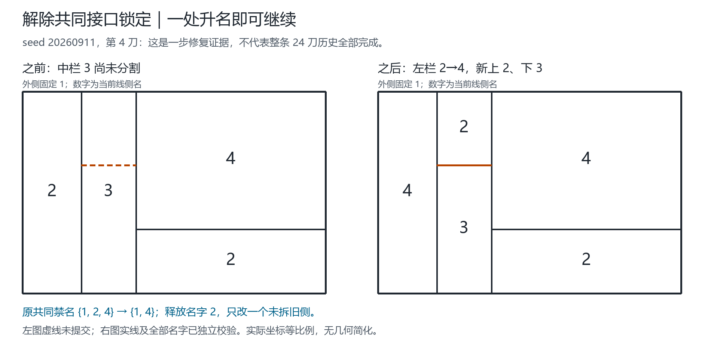
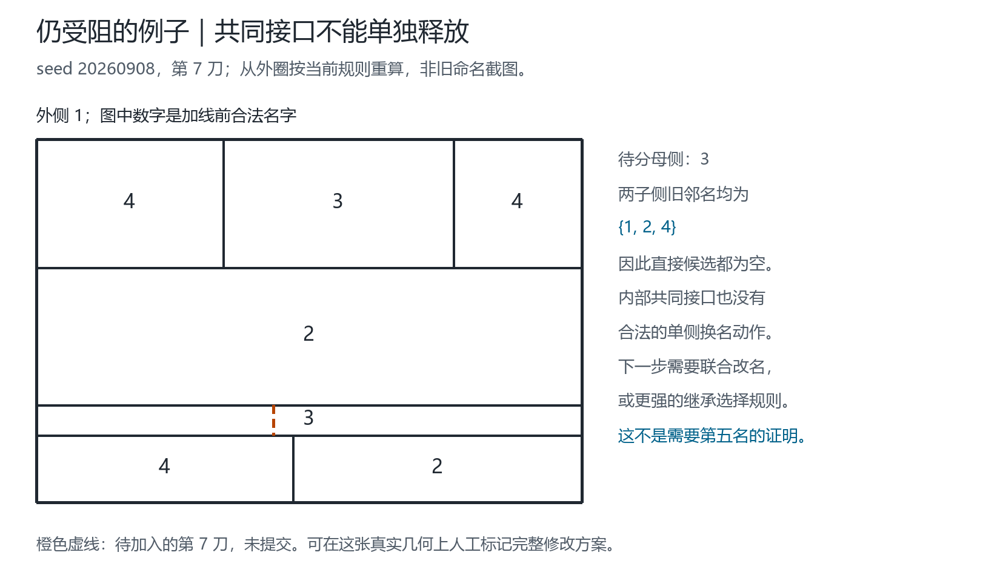

# 从当前线侧名出发：修正规则、条件证明与完整语料复测

> 后续澄清：[每次加线后整图重标](GLOBAL_RESTART-2026-09-18.md)。本页D1-D4属于逐刀继承与有界修复，不是每次清空全部旧名的全图重启。下文seed20260908第7刀停止图只作为旧增量规则对照；新整图重启已自动解开此步，不再将它作为用户新澄清方法的失败证据。

2026-09-18。提出者：Qinzi27。本文整理提出者的母线、当前局部侧名、重命名与最小复用想法；下面具体优先级和预算是可检验的实现提案，不声称已涵盖提出者尚未形式化的全部方法。

**结论边界：已经证明各类操作在所列前提下安全及终止；尚未证明自动选择规则对所有地图完备。** 选标函数不枚举整图着色组合、不回溯画线顺序、不用通用四色求解器提供答案。结构邻接检查、集合运算和奇偶传播仍然需要遍历。

## 1. 这几次错误为什么发生

| 旧问题 | 实际错误 | 本轮处理 |
| --- | --- | --- |
| C从342起步，再声称最小复用受阻 | 合法旧名不等于按新优先级生成的名字 | 同一画线顺序从外圈重放；232与323可整体交换2/3，旧名另作控制 |
| E图保留G4而没有展示G1 | 将历史图当成当前重算图 | G完整邻域不含1就可复用1；E从头8步直接完成，旧图不再作为这个流程失败的证据 |
| 只读两个端点的母线色对 | 两个端点不等于只有两个完整边界禁名 | 每个子侧读取所有正长度边界；历史名不累计为永久禁名 |
| 接到既有T点，母线不唯一就拒绝 | 几何合法性与旧端口命名假设绑在一起 | 单独提出几何；所有母线接触均记录，允许T接续成X，点接触不额外禁名 |
| 把1视为全图专用外色 | 固定外侧身份与禁止内部名字1混淆 | 只固定外侧这个对象；内部1及包含1的双色块均合法候选 |
| 两色块一碰外侧就停 | 接触固定边界不等于必然矛盾 | 外侧不加入改名集合，以完整相位约束判断 |
| 只许降低数字 | 降数不保证省色，也不涵盖合法升名 | 降名阶段只复用已用名字；再补一个有证明的共同接口释放规则 |
| 所有共同接口都锁定 | 共同邻居是真实约束，但未必是不可改的锚 | 外侧仍固定；满足条件的一个内部共同接口可先合法改名 |

不再用“旧图在固定旧名下失败”替代“当前完整重算失败”。反过来，一个新例成功也不替代全部历史的验证。

## 2. 线身份、位置与名字的统一公式

以有向几何母线 `m` 为主体；在所有真实接点处分段，但保留母线身份。令 `I` 是母线上的一个位置区间：

\[
\lambda_t(m,I)=\bigl(c_t(L(m,I)),c_t(R(m,I))\bigr).
\]

`L/R`是该段的真实左右侧身份，`c_t`是当前名字。侧身份是线侧记录的一致类，不因两个侧同名就合并；端点不承担名字。母线可延伸过T点，但不同区间可能有不同当前色对。

同一个侧在所有关联线段上的名字必须一致；不同侧若共用正长度边界，名字必须不同。只在一个点接触不产生异名条件；若原图有桥，其两侧身份相同，色差为零。本轮矩形适配器不处理独立环、孔洞和桥，不能把它的限制说成理论禁止这些结构。

外侧对象 `o` 固定 `c(o)=1`。对内部侧 `v`，1可用的充要条件是：

\[
1\notin\{c(w):w\in N(v)\}.
\]

其中 `N(v)` 包含全部当前正长度共边邻居。仅“不接外侧”不够：若还邻接另一个内部1，依然不能取1。

每次成功改名后，按最终 `c_{t+1}` 重建全部受影响的 `lambda`；历史只负责追溯来源，不继续作为禁名。失败的分割及预览改名一律不提交。

## 3. D1：直接选标

母侧 `p` 名为 `s`，合法新线把它分成 `u,v`。集合 `K={1,2,3,4}` 只是本程序的候选域，绝不是“已证明任何输入都有解”的假设。

\[
R_u=c(N(u)\setminus\{v\}),\quad R_v=c(N(v)\setminus\{u\}),
\qquad A_x=K\setminus(R_x\cup\{s\}).
\]

候选是“一个子侧取 `a in A_x`，另一个继承 `s`”。固定按

\[
\bigl({\bf1}[a\notin Used(c)],\ a,\ bounds(x)\bigr)
\]

选一次，先复用、再小数字、再固定几何位置。若均为空，则明确进入局部修复，不生成并提交5。

**正确性。** 继承子侧的旧边界是父侧边界的子集，原有异名仍成立；新名避开自己的全部旧邻名和兄弟名s；其他边不变。这三类边穷尽约束。候选最小性只针对本次直接动作，不是全图最少色数或未来可扩展性的证明。

## 4. D2：受阻时的有界复用降名

只在D1失败后尝试。固定母侧p及外侧，允许集 `W=N(p)\{o}`。对其中一个旧侧z，允许动作：

\[
b\in Used(c)\setminus c(N(z)),\qquad b<c(z).
\]

按 `(b,bounds(z),id(z))` 选唯一动作；累计最多触及B个不同旧侧，已触及侧可继续下降。默认B=3，不自动扩大。达到局部稳定和被预算截停分别记录。

**安全与终止证明。** 完整邻域排除保证本次变更合法；母名、外名、几何与身份不变。b已经在使用，因此 `Used(c')` 是 `Used(c)` 的子集。势函数 `Phi=sum c(z)` 每次至少减1；每侧最多从4降到1，故最多 `3B` 次实际操作。停止仅是这个允许集和预算下的结果，不是全图最少色。

为什么必须限制“已使用”：四栏同接外1，旧名为 `3—4—3—4`，任意降数字可变成 `2—4—3—2`，把原来总共3种名字变成4种。数字更小不等于名字种类更少。

重新读取完整当前边界，再调用D1一次；仍不成，进入D3。旧E中该过程确实会G4→1，但这一步本身不保证后续成功；从头E已经成功，二者分栏报告。

## 5. D3：固定外侧的双色相位重算

共同旧接口按**身份交集**取：

\[
J=N_{old}(u)\cap N_{old}(v),\qquad Q=K\setminus(\{s\}\cup c(J)).
\]

`Q`不永久删去1。只选一次 `q=min(Q)`，不失败后换q重试。取从两子侧可达、名字属于{s,q}的内部完整分量P；外侧o永不加入P，但它与P的边界关系保留。

本阶段暂固定J；因为q不在c(J)，且合法旧母侧的邻居不能同为s，J不会被错误收入双色改名分量。默认预算限制 `|T union (P\{u,v})|<=B`，T是D2曾触及的旧侧。这个数不是最后净改名数，更不能据超预算说“至少需要改变B+1个侧”。

对P每个连通分量交替标奇偶 `h(x)`，将两个名编码成0/1。任意合法结果必为：

\[
\kappa(c'(x))=h(x)\oplus\theta.
\]

内部奇圈直接给出此两名条件下不可行证书。对跨界边xy，若外部固定名属于此色对，则要求：

\[
\theta=1\oplus\kappa(c(y))\oplus h(x).
\]

同一分量所有要求必须一致；否则返回冲突边及连接路径。注意这些是**侧邻接图的圈**，不是纸上原始母线的闭环。

**必要性与充分性。** 异名边要求奇偶交替，因而排除奇圈；固定边界给出上式。反之，满足奇偶关系及全部边界相位要求即可覆盖内部边、跨界边、未变外部边。选允许相位中相对原始输入改动旧侧较少者，得到这个给定P、给定色对、固定外部问题的最少成本；不是整个策略的最少改名定理。

尤其，外侧1只提供相位约束，不是“碰到就失败”；内部母名1的一个专项例可以经底带4→3后直接切成1/4。

## 6. D4：只释放一个可动共同接口（本轮受阻后的修正）

新入口先完整保留D1-D3的所有成功结果。**仅当Q为空**才考虑下面操作，不把奇圈或超预算偷换为另一搜索流程。

选一个 `z in J\{o}`，令 `r=c(z)`，要求：

1. z是J中唯一使用r的侧；
2. 存在 `b in c(J)\{r}`，且 `b notin c(N(z))`；
3. D2已触及旧侧与z的并集未超过预算。

按 `(b,bounds(z),id(z))` 固定选一次，改 `c(z)=b`。这个操作可以升名。随后只执行一次D1/D3（关闭再次降名），剩余预算扣除已触及旧侧；若重叠会保守双计，因此没有最少改动主张。任何后续失败都回滚到最初输入，不尝试第二个接口或目标。

**释放命题。** 旧态合法说明s不在c(J)。Q空意味着 `c(J)=K\{s}`。z唯一持有r，b已在J出现，因此：

\[
c'(J)=c(J)\setminus\{r\},\qquad Q'=\{r\}.
\]

完整邻域条件又确保旧图改名合法。由D1/D3的正确性，后续若成功，整体合法；有限候选中固定选择一次，过程终止。r仍可能在某一子侧的非共同边界出现，所以释放共同禁名**不保证**完整子侧域非空，必须继续验证。

具体见种子20260911第4刀：旧左栏2、待分中栏3、右上4、右下2，外1。两子侧均有旧邻名{1,2,4}；J为外1、左2、右上4。左栏完整旧邻名仅{1,3}，所以可合法 `2→4`，释放共同禁名2；再令新上侧2、下侧继承3。只改一个旧侧，正面回答“不能仅冻结已有母线的旧名字”。



单步上，D4封装原样返回D1-D3已有成功；同一输入历史在首次旧失败之前保持相同前缀。这不是所有旧命名算法都被新规则支配的声明。

## 7. 测试定义：全部尝试不等于全部成功

语料清单由`scripts/current_corpus.py`生成，不从旧失败处截断后续画线：

- 367份声明历史来源去重为323条；保留每个来源、种子及cohort alias。
- 包含180条普通矩形24刀历史、40条条带24刀历史、全部构造图库及A-E重算/旧名控制。
- 40条条带共享一个终态。60个环/桥种子只有16个不同历史；重复来源不冒充独立地图。
- A/B/C/E是原种子历史的短前缀，属于回归样例，不是额外独立随机样本。
- 静态最终图346份来源去重为302份；其中43份没有声明的合法逐刀历史。全部做独立拓扑审计，但不捏造画线顺序，更不把拓扑通过记作标色成功。
- 矩形适配器不接收环、桥、斜线等输入时记录`outside_scope`，不算数学标色矛盾。它们仍需要一般线网适配器，旧网页未被偷偷替换。

语料是既有探索集合；用它改规则再复测不是未见样本验证，也不提供一般地图成功率或四色新证明。

### 7.1 完整重放结果

正式报告为[v3压缩数据](../outputs/current-names-all-2026-09-18-v3.json.gz)，另有[精简独立核对](../outputs/current-names-summary-2026-09-18.json)。每条历史从其声明初态开始，遇首次失败停止，但不删去剩余请求；“完成”要求所有声明步骤都提交。

| 策略 | 完整完成 | 受阻 | 超出当前适配范围 | 成功提交分割数 |
| --- | ---: | ---: | ---: | ---: |
| 旧局部基线，B=3 | 15 | 220 | 88 | 1906 |
| D1/D3，无降名，B=3 | 15 | 222 | 86 | 1954 |
| D1-D3，B=3 | 16 | 221 | 86 | 2073 |
| D1-D3，B=32对照 | 87 | 150 | 86 | 3603 |
| **D1-D4，B=3，当前默认** | **18** | **219** | **86** | **2189** |
| D1-D4，B=32对照 | 95 | 142 | 86 | 3834 |

每行均为323条去重声明历史；六行1938次运行不是1938张独立地图。B=32仅为放宽局部范围的对照，不是默认全图算法；刻意设置的零预算控制仍保持零预算。

当前默认相比旧基线有65条推进更远，0条更早停止；完整完成数只增加3条，不能把65写成“新增65张成功图”。在180条普通矩形长历史中，默认完整完成3条、范围放宽对照完成40条；40条条带长历史默认均受预算限制，放宽对照全部完成。这也不替代此前针对条带的专用定理。A-E从外圈重算的短回归例全部完成；冻结旧E仍受阻，二者不能混同。

D4与同预算D1-D3直接比较：21条历史推进更远、增加116次提交、新增2条完整完成，无更早停止。D4成功执行25次、涉及21条历史，其中仅2条完整完成；这三个量分别是事件数、受影响历史数、完整成功历史数。旧四策略的1292条运行、9536个提交状态hash和10824份证书与第一阶段报告一致，33项来源hash均与当前源码吻合。精简脚本仅独立审计报告及hash，不冒称又运行了一次几何求解。

所有六策略合计17,491份合法初始/提交状态证书均通过独立线侧检查，另有302份静态图通过独立拓扑审计。静态审计只说明输入几何与拓扑一致，不说明新选标规则能生成其着色。通用验证报告含290项Python测试通过；完整`node --test`另有99项通过。

### 7.2 受阻后的反思：哪些错误已经改，哪些缺口仍在

当前默认219条受阻历史按首次原因分为：174条预算相关、25条固定边界相位冲突、18条无合法单个共同接口释放、2条选定双色子图含奇圈。这里的174包括刻意零预算控制，也包括接口释放后预算不足；不是174条都已知道放宽预算就能解。

放宽到B=32后仍有142条受阻：27条无合法单接口释放、80条相位冲突、34条双色奇圈和1条刻意零预算控制。失败类别会随成功前缀推进而变化，不能把两行分类逐项相减解释成独立修复数量。

因此，已排除“只是旧起点错了”“只是不让用1”“只是遇T点就拒绝”这几种实现错误作为全部受阻的解释。现在至少有三项需要新论证：

1. **同步依赖。** 单个共同接口不能改名，不代表一组旧侧不能同步改名。下一条规则应明确依赖关系及闭合条件，允许必要的升名和降名，不能仅累计祖先禁名。
2. **局部范围。** 当前预算按触及/纳入的旧侧身份计数，不等于净改名数量；需要区分“读取范围”“证明所需分量”和“最终实际改动”。放宽范围并不消除所有相位冲突或奇圈。
3. **选择的完备性。** 对给定两名、给定分量的必要充分判定，不代表这对名字或这组接口总选得对。当前只固定选一次；选定问题无解不代表地图没有四色解。

此外，86条范围外历史需要一般线网适配器；不能借用旧网页对环/扇形的成功结果冒充本轮新函数已经覆盖它们。

**可人工复核的真实停止图：** 种子20260908，从外圈按当前默认规则完成6刀，第7刀拟在中间名3的横带中竖切。两子侧的旧邻名均为{1,2,4}；共同接口是外1、中带2、左下4。中带2的完整邻名已有{1,3,4}，左下4的完整邻名已有{1,2,3}，所以不能单独释放其中一个。图中虚线尚未提交；这是本规则停止，不是四色不可能。



新图与成功图的坐标、当前名字、事件及来源hash保存在[图示清单](figures/current-names-2026-09-18/manifest.json)。下一步应先在这张图上提出一组可证明合法的同步更新，随后重放整条历史；不能只修这一刀就宣称解决后续全部步骤。

## 8. 实现与复现

- `fourcolor/current_geometry.py`：几何分割与多重接点记录；旧适配器保留。
- `fourcolor/current_names.py`：D1-D3、降名证书、固定外侧相位、原子提交。
- `fourcolor/interface_names.py`：最新D4封装；主函数`attempt_interface_cut(state, points, max_old_sides=3)`。
- `scripts/validate_current_corpus.py`：完整历史与静态语料审计；每个合法初始/提交状态均交由独立Node几何与Python线侧检查，不只验证最终彩图。
- `scripts/summarize_current_corpus.py`：来源hash、逐历史结果及证书对应关系的只读核对，区分事件数与完整历史数。

```python
from fourcolor.inherited_names import initial_state, line_profiles
from fourcolor.interface_names import attempt_interface_cut

state = initial_state()
result = attempt_interface_cut(state, [(0, 300), (900, 300)], max_old_sides=3)
if result['status'] == 'split':
    state = result['state']
    print(line_profiles(state))  # 母线身份 -> 位置段 -> 当前有向侧名
else:
    print(result['event']['reason'])  # 保留原state，不把失败草稿当作彩图
```

```sh
python -m unittest discover -s tests -v
python scripts/validate.py --output outputs/validation-current-rerun.json
python scripts/validate_current_corpus.py --include-interface --output outputs/current-all-rerun.json.gz
python scripts/summarize_current_corpus.py --input outputs/current-all-rerun.json.gz --previous outputs/current-names-all-2026-09-18.json --output outputs/current-summary-rerun.json
node --test
python scripts/render_current_cases.py --input outputs/current-names-all-2026-09-18-v3.json.gz --output-dir docs/figures/current-names-rerun
```

使用新输出名；gzip由Python标准库读取。未压缩的第一阶段报告保留不覆盖；正式压缩报告保存完整语料、事件约束、每步状态hash及来源hash；母线剖面和重复端点几何可按历史重建，不将冗余副本堆进每条事件。

v2保留为检查点；v3修复坐标生成器被二次消费的API问题，并补齐实现来源hash，语料结果未变。当前更新限于本地研究函数、证明与复测，尚未接入网页或上传公开仓库。

## 9. 方法审查来源

条件定理在本文逐项给出证明，不以流程工具或实验次数作为数学依据。本报告使用`project-first-learning`、`scientific-critical-thinking`及`scientific-visualization`的项目验证、证据分层和图示来源保留流程。科研审查流程参考 Kassis, T., Agarwal, V., He, Y., Patel, D., & Brueckner, A. M. (2026), *Scientific Agent Skills: A Library of Procedural Knowledge for Research Agents*, [arXiv:2609.00065](https://doi.org/10.48550/arXiv.2609.00065)。2026-09-18核对官方元数据；这是流程出处，不是四色文献或本文数学原创性的证据。
