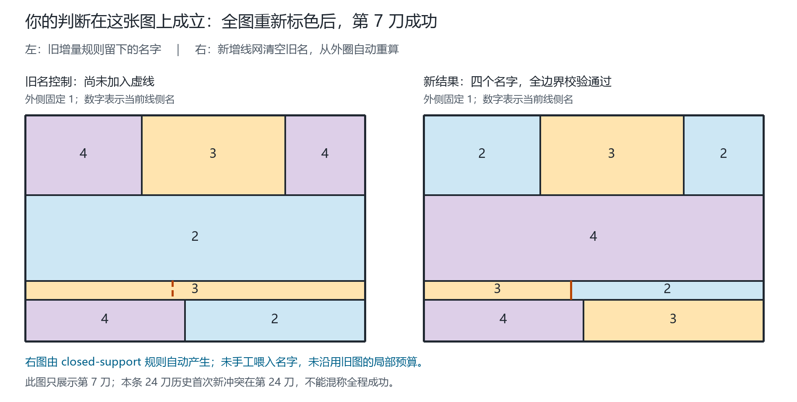

# 每次加线后的整图重标：当前连接、闭环辅助与验证

2026-09-18，Qinzi27的方法澄清及本地可复现实验。本文不是新的四色定理证明。

## 1. 先更正此前实现与意思的偏差

此前D1-D4从空图开始，但逐刀保留旧名，只允许预算内改名。它检验的是**增量延伸**，不是提出者本轮明确的**每次加线后清空全部旧名，对新线网重新排程**。因此，旧seed20260908第7刀停止图不能作为本轮新方法失败的证据。

本轮还出现了第二次解释过强：把“两端仍只接一条母线，有利于后续”实现成了同母线绝对优先。提出者随后明确：**同母线不是命名最重要的条件，重点是两端连接一个闭环结构可能有帮助。**所以`shared-mother`仅保留为已记录的条件对照，不再当成当前方法。

当前建议实现`closed-support`：每次加线后全图重启，先比较当前命名约束，再在并列条件下考虑共同已建立闭环。这个排序是可检验的实现提案，不声称用户已唯一规定了全部平局、取名和闭环识别细节。

## 2. 从“旧名修补”改为“新线网重新求名”

设第t次添加完成的几何线网为G_t，新线为ell：

\[
G_{t+1}=\operatorname{planarize}(G_t\cup\ell),\qquad
c_{t+1}=\mathcal R(G_{t+1}).
\]

这里R不接收c_t，不以旧侧名或历史继承色作固定条件。只初始化外侧1及外圈首个内侧2，其他名字均重新确定。外圈其他内侧并不全被强制为2；内部仍可合法使用1。

已建立的母线身份、接点和沿线位置与名字分开保存。线名仍写作：

\[
\lambda_{t+1}(m,I)=\bigl(c_{t+1}(L(m,I)),c_{t+1}(R(m,I))\bigr).
\]

**关键区别：** 加线后的新名一次整体提交，不要求它在尚未加线的旧图上也已经合法。旧图上冲突的中间改名，不自动否定新线网上合法的同步结果。程序也不再限定只改3个旧侧。

每次重启都重新建立接点区间。长母线穿过T/X时身份不被截断，但排程可引用不同当前区间；无真实接点的degree-2细分不增加权重。整条线的几何端点仍在外圈，不意味着它的每个当前区间都两端接外圈。

## 3. 两种信息必须分开

### 3.1 当前名字约束

候选域D_k(s)属于由有向线侧延续推导的同侧一致类s；数学上这些一致类就是地图的面，但程序选择的是母线区间，不是在所有面上执行全局面优先排序。

对待处理区间I，设U_k(I)为它涉及的不同未定侧，重复出现只算一次：

\[
q_k(I)=\sum_{s\in U_k(I)}(4-|D_k(s)|).
\]

它计数当前传播已排除的不同名字，不是接点总数、母线总数、历史禁名累积，也不是全体潜在逻辑约束数。

### 3.2 共同闭环支撑

用户提到的是纸上的线网闭环，即**原始图primal graph**的圈，不是侧邻接图dual graph的圈。

本轮给“已建立”一个显式约定：外圈边天然属于支撑图H_k；其他真实边仅在其两侧名字都已确定时加入。虚拟岛屿连接边不算母线或闭环支撑。对待命名内部区间I，不能用I自己的边来证明它已经有闭环依托。

记I两端为a,b，定义：

\[
h_k(I)=1\iff a,b\text{位于 }H_k\setminus E(I)\text{的同一个简单闭环上}.
\]

同一闭环可以由多条母线组成，无需母线ID相同。实现用原始图的**点双连通块**判定：两端不同且同处一个含环块；仅被一条桥连接不成立，两个环只共一个接点的“8字形”也不能笼统当成同一环。

**为什么这个方向有可用的结构含义：** 若新线是一个旧侧内部的简单弧，内部不碰旧线，且两个不同端点位于同一简单边界环上，原环在两端间有两条边界弧。新弧分别与它们组成闭合边界，因而可以沿两条边界完整读取并更新当前线侧记录。此时确实完成一次分割；若穿越其他线、接到不同边界分量或形成自交，就不能不加条件地沿用这个推导。这说明闭环能帮助组织边界检查，但并没有证明两条边界只携带两个禁用名字。

这不是给端点命名，端点只用于查询结构；也不新增颜色不等约束。外圈自身不是子线，不得到此偏好。把“已建立”限定为上述支撑图，是本轮实现选择，仍可由提出者进一步修正。

### 3.3 当前排序与选择

当前提案按下式由高到低选择区间：

\[
\operatorname{priority}_k(I)=(q_k(I),h_k(I)).
\]

闭环只用于q相同时的辅助顺序，绝不压过更高的当前名字约束。再用固定母线几何ID与沿线位置破同分。沿选中区间读取一个未定侧，优先复用已经出现的合法名，再取最小数字；**每主动确定一个名字就传播并重算所有权重**，不整条线批量定完后才重算。

同一轮遇到空候选就明确记录冲突，不换颜色或顺序偷偷重试。下一条新线形成另一个G时，则又从零开始；验证脚本会继续检查后面的几何，不能因为前缀命名失败而把后续线网删掉。

## 4. 现在能证明与不能证明的内容

**重启独立性。** 输入是规范化几何，旧颜色不进入函数。相同规范化线网、相同确定性策略产生同样结果，不依赖前一次配色。规范化只忽略输入线段顺序、方向和完全重复段，不声称图同构去重，也不跨空隙合并线。

**条件正确性。** 同侧一致类共享候选；真正分界两侧施加异名；桥两岸属于同一侧，不施加异名。单值传播检查全部真实边界。如果所有域最终均为单值且无冲突，它们构成合法命名。另以独立逐边扫描和线侧轨道检查验证输出，而不是相信绘图显示。

**有限终止。** 每次主动操作都把一个多候选侧钉为单值；若未冲突，已确定侧数严格增加且不减少。初始已有两个不同侧，故至多F−2次主动决定后结束。结束可能是冲突，不能把“终止”偷换成“必成功”。

**尚未证明的内容。** 闭环确实提供了结构依托，但它本身不告诉我们所有边界上已有哪几个名字；q或h较高也不保证最小名承诺将来一定可延伸。四仍是程序输入候选域，不是从有限端点数量推出的结论。当前新规则仍需证明选择完备性，或继续精炼不能过早固定的名字关系。

## 5. 证据、图示与完整重放

正式结果为[四策略完整报告v2](../outputs/global-restart-all-2026-09-18-v2.json.gz)及[精简汇总v2](../outputs/global-restart-summary-2026-09-18-v2.json)。第一轮三策略报告保留为`outputs/global-restart-all-2026-09-18.json.gz`，其中`shared-mother`是后来被澄清为过强的解释，不作当前规则。

### 5.1 用户指出的第7刀已自动重标成功

seed20260908第7刀，新`closed-support`输出为：外1；顶排2—3—2；中间整带4；新薄带左3、右2；底排左4、右3。每条真正边界异名，程序独立核验通过。四种重启策略都能完成这一步，故成功证据支持“应全图重标”的修正，不能单独归功于闭环加权。



这条完整24刀历史的当前规则首次新冲突在第24刀，不再是第7刀；不能只展示第7刀修复就说整条历史完成。

### 5.2 全前缀与静态图

323条声明历史，共6678份含起点的几何前缀引用；另有302份静态输入，合计6980份引用去重为6113份线网输入。缓存以规范化线段集合为键，保留每个历史/步数来源；不同画线顺序共享终图并不增加独立样本数。前缀命名失败后仍继续生成并检查其后几何。

| 明确策略 | 6113线网输入成功 | 323历史所有前缀均成功 | 仅历史终图成功 | 302静态图成功 |
| --- | ---: | ---: | ---: | ---: |
| 旧整线批处理重启对照 | 5330 | 170 | 240 | 216 |
| 当前约束优先，逐次重排 | 5641 | 200 | 267 | 247 |
| 同母线绝对优先（已澄清过强） | 5377 | 177 | 255 | 235 |
| **当前约束优先＋共同闭环辅助** | **5638** | **199** | **264** | **244** |

当前闭环辅助规则还有475份线网输入冲突、124条历史至少一个前缀失败、59条历史终图失败。没有几何导出错误或范围外跳过。独立环/桥/扇形这次真的进入新选标函数，不再仅做拓扑检查；但内部母线仍按最大直线识别，不冒称已经恢复所有手绘曲线的母线身份。

在180条普通矩形长历史中，当前规则57条全前缀完成，122条终图成功；40条条带、16条去重环/桥、60条扇形历史均全前缀成功。13构造图库12条全程成功；A-E各声明流程都成功。冻结旧预色与零预算控制在本轮均明确清除旧名/预算，所以不能与上一轮18/323增量结果直接视为同条件改善。

**本批数据没有显示这版闭环辅助整体优于仅按当前约束排序。** 199与200的全程数很接近但略低；这里仅是既有探索集合上的描述，不作一般成功率或统计优劣结论。它也不意味着闭环结构无用，而是“闭环存在”本身不足以保证接下来那个最小名字承诺安全。

[独立报告审计](../outputs/global-restart-audit-2026-09-18.json)核对31项源码hash、6980份来源映射和完整计数；前三策略的18,339个结果与第一轮逐项不变。闭环辅助与当前约束对照逐6113输入匹配：9份从冲突变成功，12份从成功变冲突，5629份均成功、463份均冲突。确有实际选线顺序变化，不只是轨迹中新增了闭环元数据：seed20260915前12刀的第3次选择在q=3并列时，闭环辅助选择整条y=272线，对照选择y=145的一个区间；前者最终冲突、后者成功。这个事例保留为具体优先级和立即定名的组合问题，不宣称否定其他闭环处理方式。

四策略共24,452次独立检查均通过：成功状态检验完整名字，冲突状态则独立复核已承诺条件下的矛盾；不是24,452次着色成功。完整327项Python测试、107项Node测试通过；[通用验证报告](../outputs/validation-global-restart-2026-09-18.json)。闭环识别另用75个小图的独立简单环枚举作测试oracle，枚举不进入命名算法。

### 5.3 保留新失败，而不是沿用已修复的旧图

[seed20261027第6刀空白标记图](figures/global-restart-2026-09-18-final/still-blocked-step6.png)是当前闭环辅助重启规则真正未解的例子。完整几何已加入第6条线，只是程序未找到合法名字；问号不是已提交色。可以继续标明先检查哪个闭环、沿哪段读取、哪些名字暂不固定。

图与精确坐标、规则轨迹和hash见[图示清单](figures/global-restart-2026-09-18-final/manifest.json)。另保留[连接变化图](figures/global-restart-2026-09-18-final/current-port-weights.png)，展示同一母线在新接点出现后，其当前区间从两端接外圈变为每段一端接外圈；不混淆母线身份和区间权重。

下一步优先研究**在闭环边界上暂存相容关系、何时足以安全固定一个具体名字**。先处理某条线与立即固定其两侧名字是两件事；闭环能组织边界读取，但当前函数仍在多候选处立即选名，这正是尚未排除的失败来源之一。

## 6. 文件与复现

- `fourcolor/global_restart.py::restart_line_names`：每张新线网独立重启，默认`closed-support`。
- `fourcolor/closed_support.py`：原始线网共同闭环支撑识别及证书，不负责选颜色。
- `scripts/restart-geometry.mjs`：只导出几何，旧色标不读取；桥不误标为外侧。
- `scripts/validate_global_restart.py`：323历史的全部前缀以及302静态输入；记录全部失败、恢复、每段成功及仅终态成功。
- `scripts/audit_global_restart.py`：对保存报告的逐项/源码hash/来源映射审计，并对少量优先级分歧独立重放；不是又跑一次全部命名。
- `scripts/render_global_restart.py`：从正式结果重算并核对后精确绘图，不用手工改数字代替程序结果。

```sh
python scripts/validate_global_restart.py --output outputs/global-restart-rerun.json.gz --summary outputs/global-restart-summary-rerun.json
python -m unittest discover -s tests -v
python scripts/validate.py --output outputs/validation-global-restart-rerun.json
node --test
python scripts/render_global_restart.py --input outputs/global-restart-all-2026-09-18-v2.json.gz --output-dir docs/figures/global-restart-rerun
```

使用新的输出路径，脚本拒绝覆盖旧结果。Python核心仅标准库，Node几何引擎沿用项目代码；图示额外使用已有Pillow。尚未接入网页、发布或推送GitHub。

## 7. 审查流程来源

本轮使用project-first-learning澄清操作定义，用scientific-critical-thinking区分具体实现受阻与用户更广泛构想，用scientific-visualization保留精确几何、对照和图示来源。流程参考：Kassis, T., Agarwal, V., He, Y., Patel, D., & Brueckner, A. M. (2026). *Scientific Agent Skills: A Library of Procedural Knowledge for Research Agents*. [arXiv:2609.00065](https://doi.org/10.48550/arXiv.2609.00065)。2026-09-18核对官方最新元数据；该引用是流程来源，不是四色结论或数学原创性的依据。
