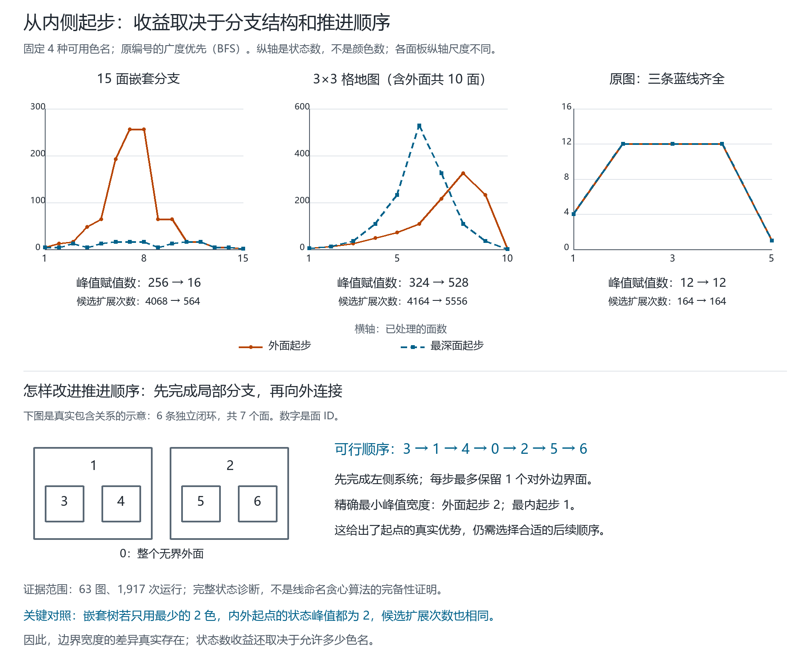

# 从最内闭环起步：实际顺序实验与最少颜色对照

2026-09-20。接续 Qinzi27 的计算顺序提议及 [前一轮说明](INSIDE_OUT_ORDER-2026-09-20.md)。本轮实现独立诊断程序，保留全部合法边界状态；没有把内圈永久冻结，也没有将这个精确枚举器接入原线命名算法。

**结论：内起点可以严格减少必须同时暴露的接口，也能在固定四色状态实验中减少计算量；但这种收益依赖图的结构、后续顺序和允许的颜色数。最少颜色对照表明，嵌套树上的状态数量收益会消失。因此目前支持研究“内侧起步、及时完成局部分支、保留充分接口”的组合规则，尚不支持“从内向外一定更省”或原算法已得到普遍改进。**



## 1. 实验究竟改变了什么

固定同一张最终地图，将每个面视为一个颜色变量；只有共享真实分隔边的不同面之间有不等色约束。同面两侧的桥不生成自约束，虚拟连接桥不加入真实分隔关系。

对处理前缀 P，保留活动边界

\[
B(P)=\{f\in P:\exists g\notin P,\ f\sim g\}
\]

以及能够扩展到 P 内部的**全部**合法边界赋值 R(P)。加入下一个面时检查旧邻面；随后投影掉不会再接触未处理面的变量。相同带色名边界赋值只需保存一个内部见证，因未来约束完全通过边界连接。整体换色类型仅用于统计，实际计算始终对齐色名。

这里改变的是已知最终图上的变量处理顺序，不是不断插入新线、产生新面的几何生长过程。内部见证可以随保留状态变化；不存在“第一步颜色永远不得改变”的额外条件。若未来还会添加未记录的邻接，当前的投影规则不能直接照搬。

记录四项主要指标：

| 指标 | 定义 | 不能替代什么 |
|---|---|---|
| 峰值边界宽度 w | max\|B(P)\| | 不等于最少颜色数或完整状态数 |
| 带色名状态峰值 s | max\|R(P)\| | 不等于地图的完整着色方案数 |
| 换名后的类型峰值 t | 对每个完整边界赋值整体重命名后计数 | 不能独立重命名不同子块后直接拼接 |
| 候选扩展次数 W | 每步尝试 q×前一步带色名状态数，然后求和 | 不是实测运行时间，也不是局部改色次数 |

状态峰值是投影、去重**之后**的保留量。初始空状态计入峰值，累计量只计实际处理步骤；最终可行图投影为一个空边界状态。完整着色见证从同一计算中恢复并逐边检查。

## 2. 预先固定的有限范围

| 图类 | 地图数 | “内侧”的定义 |
|---|---:|---|
| 原图八种蓝线子集 | 8 | 两个岛面，均为距无界外面最深的面 |
| 嵌套 Jordan 圈树 | 37 | 真正包含深度：16 个双臂、7 条链、2 个二叉分支、12 个随机递归树 |
| 轮图的面邻接图 | 7 | 原图轮缘 3–9；所有最深有界面 |
| 棱柱的面邻接图 | 5 | 原图圈长 3–7；内圈面 |
| 矩形格地图 | 6 | 2×2、2×3、2×4、3×3、3×4、4×4 个格子；最大对偶距离 |

共 63 图、最多 17 个面、150 个最深候选面。除嵌套树外，“深度”统一明确为从外面出发的面邻接最短距离代理量，不假定一般地图有唯一包含层次。嵌套树给出 Jordan 闭环构造及 parent 表；其他图保留可重建的原图旋转系统、面边界及 Euler 核验。

每图测试外起点与**所有**最深起点，不能事后挑出最好内起点。三个策略为广度优先 BFS、深度优先 DFS、每步使下一边界最小的 `min_frontier`；后者是局部启发式，不是全局最优算法。每次增加一个邻接未处理面，保持处理前缀连通。

另用原编号和种子 `20260921`、`20260922` 的两次随机重编号检查平局敏感性，比较两侧使用相同编号。随机递归树的单独生成种子为 `20260920`。这得到 **1,917 次运行、1,350 个内外配对**。这些配对包含同图多起点、多策略及同构实例，不能当成独立样本计算一般地图的成功率。

## 3. 固定允许四种颜色：有收益，也有退步

下面只汇总**原编号、BFS**，指标是换名后状态类型峰值 t；每一对为一个内起点与同图外起点。

| 图类 | 内起点更少 | 相同 | 更多 |
|---|---:|---:|---:|
| 嵌套圈树 | 45 | 17 | 0 |
| 原图蓝线子集 | 0 | 16 | 0 |
| 棱柱面图 | 0 | 5 | 0 |
| 矩形格地图 | 9 | 6 | 10 |
| 轮图面图 | 0 | 32 | 10 |
| 合计 | 54 | 76 | 20 |

同样 150 对若使用 DFS，类型数更少／相同／更多为 `17 / 76 / 57`；使用 `min_frontier` 为 `34 / 94 / 22`。重编号后的 BFS 分别为 `81 / 60 / 9`、`82 / 62 / 6`，说明 ID 平局选择有实质影响。完整表见 JSON 的 `groups` 与 `pairs`，不择优隐藏差结果。

几个可直接检查的原编号 BFS 例子：

| 同一地图 | 峰值宽度：外→内 | 带色名状态峰值：外→内 | 候选扩展：外→内 |
|---|---|---|---|
| 两组嵌套双圈，5 个面 | 2→1 | 16→4 | 148→68 |
| 三层二叉嵌套，15 个面 | 4→2 | 256→16 | 4,068→564 |
| 3×3 格地图，含外面 10 个面 | 5→5 | 324→528 | 4,164→5,556 |
| 原图三条蓝线齐全 | 2→2 | 12→12 | 164→164 |

表中多内起点时展示最小面 ID，选例口径在图的 manifest 中声明。15 面图原编号 BFS 的全部八个最深起点数值相同。

**原图本身尚未观察到优势。** 八种蓝线子集在全部方法和编号中共有 144 对，142 持平、2 更差、0 改善。两次更差是完整蓝线图原编号 DFS 从两个岛起步：状态峰值 `12→36`、候选扩展 `164→260`。它们说明起点仍须搭配后续顺序，不是否定原先“三蓝线闭合使最少颜色上升”的结论。

## 4. 最少颜色控制改变了哪些解释

主实验允许四种色名，即使地图只需两色，也保留使用第三、第四色的合法状态。因此新增第二份报告：用独立旧枚举器确定每图最少颜色 q，再对**完全相同**的 1,917 个顺序重跑。

独立核验的方法是：为旧四色枚举器加入 `4-q` 个互邻辅助变量，并将它们分别固定为要排除的色名、邻接所有原变量。辅助图可四色当且仅当原图可用 q 色。辅助变量仅是 oracle 约束，不是真实地图的新面；每个失败的较小 q 也用前沿程序对照。

63 图的最少颜色分布为：44 图二色、12 图三色、7 图四色。最少颜色在这里由精确搜索提供，只是实验控制，不能当成一般算法免费已知的信息。

重要结果：37 个嵌套树的全部 **891 次**运行，在 q=2 时，带色名状态峰值都为 2、类型峰值都为 1，同一图的扩展次数都为 `4n−2`。最少两色下，内起点在这一类上的**状态数收益完全消失**；边界宽度差异仍存在。

原因可以直接证明：连通树的任一连通前缀恰有两种互换色名的二着色；每个非最终前缀都有非空边界，保留的限制仍恰为两种。第一步试 2 次，此后每步试 4 次，共 `2+4(n−1)`。这也说明简单嵌套图无需靠四色状态搜索才能求解。

原编号 BFS 的最少颜色对照中，150 对为状态类型 `0 改善 / 129 持平 / 21 退步`；另外两个编号下仍有改善，因此不能反过来说所有内起点都无用。全部方法及编号的 1,350 对按带色名峰值计为 `101 改善 / 996 持平 / 253 退步`，仅作为这组固定语料的完整描述。

例如 3×3 格地图最少三色时，外起点峰值为 6，内起点为 66；原图完整蓝线图最少三色的 BFS 两侧均为 6。不能将固定四色实验的 `256→16` 直接称为相对于最佳二色方法的加速。

## 5. 仍有可以严格证明的起点优势

### 5.1 最优边界宽度

对最多 10 面的 54 张图，额外穷举固定起点的全部连通前缀子集，得到 177 个固定起点的最优宽度。不是只比较三种启发式。123 个内外起点对中，24 个最优值更小、99 个相同；改善全部属于受测嵌套树。

在双臂链中，O 为无界外面，左右两臂均至少有两个面：

```text
L₂ — L₁ — O — R₁ — R₂
```

从 O 开始，无论下一步选哪边，新加入的邻面仍接触该臂的未处理面，而 O 仍接触另一臂，两者都必须保留，所以宽度至少 2。先完成一条臂再处理另一条臂可达 2。从最内端点开始沿整条链推进，每步最多一个活动边界面，可达 1。**这里的 2→1 是固定起点的最优值差异，不是 BFS 的偶然结果。** 即使用最少两色，该宽度结论仍成立。

图下方的七面嵌套例子同样有最优宽度 2→1。顺序 `3,1,4,0,2,5,6` 先完成左侧局部闭环系统，再接入外面和右侧；它从最内开始，但不是禁止再次进入更深分支的单调层次扫描。

### 5.2 四色状态峰值的精确受限界

进一步令双臂长度为 a,b≥1，q 固定为 4。在全部连通前缀顺序中，从 O 起步的最小**投影后保留状态峰值**恰为

\[
s^*_O=\begin{cases}
4,&\min(a,b)=1,\\
12,&\min(a,b)=2,\\
16,&\min(a,b)\ge3.
\end{cases}
\qquad s^*_{\text{端点}}=4.
\]

证明：连通前缀必为路径上的区间。只剩一个边界面时有 4 个状态；两个边界面相邻时有 `4×3=12` 个状态；两者距离至少 2 时，任意端点色对都可用四种颜色填完中间路径，所以有 16 个状态。短臂长度为 1 或 2 时，先走完短臂分别达到 4 或 12；两臂至少长 3 时，到第三步两端仍有未处理邻面，两个活动端点距离为 2，故 16 不可避免。任一连通区间最多两个边界面又给出上界 16。

该公式另经只读穷举核验 a,b=1..4 的 16 组、242 个外起点合法顺序及 32 个端点顺序。它是本项目对极小路径类的直接推导，不主张首创。若 q=2，状态峰值统一为 2；公式不能跨调色板使用，也不约束投影前的临时扩展数。

其中 a=b=2 的外起点 BFS 峰值为 16，但换成先完成一臂可以降为 12；两种顺序宽度都为 2。因此“宽度最优”和“状态数最优”仍是两件事。

## 6. rank 应怎样继续定义

这轮建议先把研究量分开记录，而非给所有圈赋一个标量等级：

- 包含深度 d：表示位置，用于选择候选起点。
- 当前接口宽度 w：还需同时连接多少面／变量。
- 指定调色板下的接口状态类型数 t_q：内部允许哪些相等／不同关系。

`t_q` 是约束状态计数，不是线性代数的矩阵 rank。相同 w 可以有不同 t_q；更小 w 甚至可以有更大状态数。主报告有 5 个“宽度变小、状态峰值变大”的配对。例如 3×4 网格、BFS、编号种子 20260921、内部面 6：宽度 `8→7`，状态峰值却 `1,728→5,040`。

这里的边界宽度与已有 vertex-separation／pathwidth 思路相连。无向图上允许任意顺序时，最小顶点分离数等于 pathwidth；本文额外固定起点并要求每个前缀连通，不能直接将受限最优值叫作普通 pathwidth。Sage 的公式采用未处理侧边界；在无向图的无约束顺序优化中可由逆序对应到这里的已处理侧。参见 [Sage 官方文档](https://doc.sagemath.org/html/en/reference/graphs/sage/graphs/graph_decompositions/vertex_separation.html)；原理论入口仍是 [FOUNDATIONS.md §5](FOUNDATIONS.md#5-递归边界关系及粘合定理)。本轮不主张这个指标或完整边界动态规划的新颖性。

下一步具体可检验的问题是：**能否用原线命名表示的少量有序端口关系，识别“局部已经完成、可以向外合并”的时机，并在最少颜色对照中保持收益？** 可先从两端口、三端口类以及允许整体换名的闭合分支开始，保留四端口中不同约束类型的区别。完整枚举目前只作核验基线，不作为原方法的隐蔽后备。

## 7. 文件、复现及核验

- `fourcolor/frontier_order.py`：独立完整前沿关系计算及三种顺序。
- `scripts/inside_out_fixtures.py`：全部 63 图及几何／包含证据。
- `scripts/validate_inside_out.py`：主实验、独立前缀枚举和最优连通宽度核验。
- `scripts/validate_inside_out_palette.py`：保持顺序不变的最少颜色控制。
- `outputs/inside-out-experiment-2026-09-20.json`、`outputs/inside-out-palette-2026-09-20.json`：全部顺序、状态计数、见证、配对、来源哈希。
- `scripts/render_inside_out.py` 及 `docs/figures/inside-out-2026-09-20-v2/`：当前公开图、SVG 和 manifest。初版草稿仅保存在本地，当前引用 v2。

Python 3.10+，核心只用标准库；展示用既有 Pillow 与项目 Canvas。仓库根目录运行，下方使用新的 rerun 文件名，已有输出会被拒绝覆盖：

```powershell
python -X utf8 scripts/validate_inside_out.py --output outputs/inside-out-experiment-rerun.json
python -X utf8 scripts/validate_inside_out_palette.py --input outputs/inside-out-experiment-rerun.json --output outputs/inside-out-palette-rerun.json
python -X utf8 scripts/render_inside_out.py --input outputs/inside-out-experiment-rerun.json --palette-control outputs/inside-out-palette-rerun.json --output-dir docs/figures/inside-out-rerun
python -X utf8 -m unittest discover -s tests -v
python -X utf8 scripts/validate.py --output outputs/validation-inside-out-rerun.json
```

新增 17 项测试，总计 **577 项通过**；`scripts/validate.py` 再跑 577 项及其原有数学核验全部通过。前沿测试穷举 76 个 n≤4 小图、6,360 个顺序／调色板组合、25,188 个完整前缀状态集合；另有主实验 577 个前缀的独立暴力关系计数，以及最优宽度 oracle 对 167 个小图固定起点与全部排列的对照。

全部实验是有限实现检验，保留失败／退步结果；不构成新四色证明。本轮没有运行浏览器交互或 Node 回归，因为未修改网页。材料仅在本地，未提交或发布。

**发布补记（2026-09-20）：** 上段是实验完成时的阶段状态。随后获授权将本轮研究公开到 GitHub，并更新 README 与两个网页入口的进展说明。发布阶段的验证另见 [发布记录](WORKLOG-2026-09-20-PUBLICATION.md)，不改写原实验记录；前沿枚举器未接入交互画板。

## English summary

We evaluated inside-start and outside-start processing on 63 plane-map fixtures using identical exact frontier relations, three traversal rules, and three label settings. The four-color experiment contains 1,917 runs and 1,350 paired comparisons. Inside starts can reduce the optimal connected-prefix frontier width, with a strict proof for a restricted path family, but benefits in retained state counts depend on traversal and palette size. A matched minimum-palette control eliminates the state-count advantage on every nested-tree fixture: each connected two-color prefix has exactly two labeled states. Counterexamples also show that a narrower frontier can retain more color states. These results motivate studying sufficient ordered interfaces and local closure rules, while not establishing a complete greedy coloring method or a new Four-Color Theorem proof.
