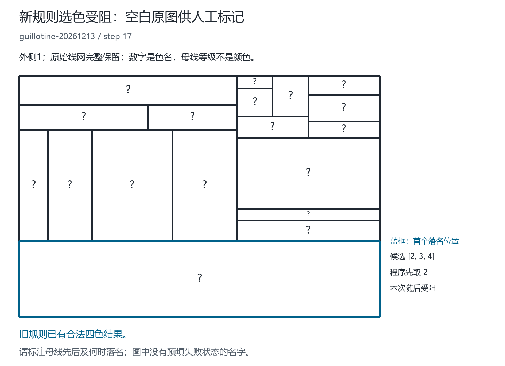

# 等级只辅助排序：完整既有图库重跑

## 本轮问题与规则澄清

用户要求重跑全部结果，并在运行中澄清：**等级不是启动标色的必要条件；
不要求连接的母线结构相同，等级只辅助排序。**

因此本轮保留两份独立实验，不能拼接成功集合：

- `mother-level-current-sides-v1`：先前六例候选，包含“任一母线无法定级就整图停止”的门槛。
  这道门槛是实现者增加的限制，不能归结为用户完整方法的必然要求。
- `mother-level-peer-sides-v2`：按上述澄清取消门槛，再从几何输入完整重跑。
  没有读取 v1 或旧基线的颜色，没有遇到失败再换算法。

旧基线 `tight-hall-relations` 的 7063 成功／6 冲突来自此前已独立核验的完整报告，
本轮按原文件哈希绑定并原样保留作比较；**旧基线未在本轮重新运行**。

## 冻结的 v2 操作定义

几何上的整母线身份、左右侧、原始侧编号和色名继续分开。等级计算仍只依赖几何：
外框根为 1；若内部母线两端均有已定级接触母线，按两端最低支撑等级计算。
不能得到等级时，保存 `level=None`，不能编造一个大等级或证明它们数学上平级。

为了使执行可复现，本轮使用调度键：

\[
K(L)=
\begin{cases}
(0,h(L),g(L)),&h(L)\text{ 已知},\\
(1,0,g(L)),&h(L)\text{ 未知},
\end{cases}
\]

其中 `g(L)` 为按 `(y,x)` 排序的数值端点序。未知者共同进入 `unranked-peer` 待处理组，
不要求母线结构相同。这是本轮执行约定，不是未知等级相等的定理，也未证明这个方向最优。
已知线先处理、未知线后处理仍属一种辅助排序，未来可另行检验其他排序；不能在本轮中途更换。

每次加入一条线，都对完整当前几何清空旧色名后重新开始：

1. 外侧固定 1，外框首个指定内侧固定 2；不是把所有接触外框的侧都固定 2。
2. 对尚未完成的整母线按 `K(L)` 排序。中间 T/X 接点不拆掉母线身份。
3. 母线内部保留原局部紧迫度、区间位置及有向边平局规则。
4. 从完整当前共边约束及既有 Hall／二元关系过滤得到候选域 `D(s)`。
5. 主动落名取 `min(D(s))`，记录当前边界来源、等级或未知状态、调度组及完整传播证书。
6. 所有侧成为单值并通过独立共边检查才算完成；候选为空记录冲突，不换颜色重试。

悬线／桥的左右是同一侧，不产生“两侧必须不同”的条件。如果原有传播已经完成，
未知等级母线不需要强行增加一次主动选择。孤立环和折线也不再仅因无法由外框推出等级而拒绝。

与 v1 相比，v2 **只去掉硬门槛并加入未知组调度**；实际边界约束、过滤器、色盘 1–4
与已定级图的选择顺序不变。因此这不是一个推导“四色上界”的证明。
取当前候选的最小数字也不等于已经求得整图最少色数。

## 完整覆盖与结果

固定库存为 7069 张不同几何：6113 张既有组、961 张此前新种子组，共享 5 张。
完整保留 363 条构造历史、7678 次前缀引用、302 次静态引用，共 7980 次引用。
相同几何只计算一次再关联回每个引用；某一步未完成不会跳过后续几何。
此前新种子组已经看过结果，**本轮不是未见留出测试**。

v1 对照完整结果：6772 完成、296 无法按硬等级条件启动、1 选色冲突。
338／363 条历史全部前缀完成，339／363 张历史终图完成，275／302 静态引用完成。
六张原受阻图均完成；相对旧基线新增 296 个范围拒绝和 1 个真正选色退步。
296 个范围拒绝不是地图需要第五色，也不是用户澄清后的方法失败。

两版均已完整运行，独立审计通过。比较如下：

| 固定规则 | 不同图完成 | 选色冲突 | 等级门槛拒绝 | 全部前缀完成的历史 | 历史终图完成 | 静态引用完成 |
|---|---:|---:|---:|---:|---:|---:|
| 旧基线（已核验归档） | 7063/7069 | 6 | 0 | 359/363 | 363/363 | 302/302 |
| v1 硬等级门槛（本轮对照） | 6772/7069 | 1 | 296 | 338/363 | 339/363 | 275/302 |
| **v2 等级只辅助（本轮修正版）** | **7068/7069** | **1** | **0** | **362/363** | **363/363** | **302/302** |

v2 修复全部六张原受阻图，但另有一张旧成功图退步，净增加 5 张完成图，不能说全库通过。
v1 因等级门槛拒绝的 296 张在 v2 全部完成；原来可定级的 6773 张图（含那 1 张冲突）
其状态、域、锚、颜色、选择次数、等级及完整传播阶段哈希均与 v1 相同。
因此没有通过偷偷改变已定级图的其他规则来制造修复。

唯一受阻历史 `guillotine-20261213` 在第 17 刀受阻，第 18 刀对新完整几何重新启动后恢复完成；
它的终图成功不代表第 17 刀成功。原新种子组 961 张、40 条全部前缀均完成，
但这一组已经参与过研究，不能当作新的泛化证据。

v2 全库共 38,470 次主动选名，6,524 次主动复用 1；
56,184 个过滤阶段、842,388 条 Hall 事件、1,136,098 条关系事件经过独立集合回放，
包括重复传播中的事件，不是独立定理或独立样本数。

新增测试共 30 项：v1 完整运行器 10 项，v2 核心与证书 12 项，v2 完整运行器 8 项。
完整 **457 项 Python 测试、通用验证及 107 项 Node 测试通过**，无失败、错误或跳过。
通用报告为 `outputs/validation-level-sides-peer-full-2026-09-19.json`。

独立审计另检查全部 7069 条存档记录、7980 次引用、283 个批次及校验文件、22 份冻结源码，
并重新运行 15 个固定样本（含六例、唯一冲突、悬线／折线／孤立环）。
这是对全库执行证据的独立审计，不冒称审计又第二次求解了全部 7069 图。

- 正式报告：`outputs/level-sides-peer-full-2026-09-19.json.gz`。
  SHA-256：`5085627be22653ea9b6ea13de5ff851c452a8c702996ee6eda0672d2d72eca07`。
- 简表：`outputs/level-sides-peer-full-summary-2026-09-19.json`。
- 独立审计：`outputs/level-sides-peer-full-audit-2026-09-19.json`。
  SHA-256：`a483ab972da901fb4de9e33927cf8a9f57ddabf90357a9ddf346593f0bcc1b98`。

## 具体受阻图的含义

v1 与 v2 唯一冲突均为 `guillotine-20261213` 第 17 刀，19 个侧（含外侧），输入键：

`8070783fd68de9a9dd22c6d4c8831a55c330290f4a30e2e9c8f6edb70af66132`。

外侧为 1，初始内 2 锚在左上侧 `side1`，坐标 `x=0..544, y=0..72`。
首个主动选择处理横母线 `y=412`，把底部大侧 `side10` 从 `{2,3,4}` 取为 2。
该次决定之后的传播已导出冲突，所以这就是本次路径第一个不能延伸的主动决定。

独立集合回放的最终关键约束是：实际两两共边的三个侧 `[7,16,18]` 均只剩 `{3,4}`，
无法三个取不同名字。最后一次候选预留传播将 `side18` 清空。
不能只看 `hall_conflict` 字段是否非空：这里矛盾以空域体现，完整阶段状态和证书均已检查。

同图旧规则有逐边核验通过的合法完整见证，`side10=3`，完整色序为：

```text
[1,2,4,3,2,4,3,4,2,4,3,2,3,4,1,2,1,1,2]
```

旧见证只用于诊断，不作为新算法输入。它说明地图可合法四色标名，不说明应把所有类似位置
一律改为 3。仍需解释为什么当时该落名／延迟落名／先处理另一条母线；不能靠针对单图改答案。
当前程序把“内2锚在哪个当前侧”与“先处理哪条整母线”分别按固定约定选定。
这并未证明忠实复演了手稿中从粗分割到细分割的继承顺序；人工标注时应一并核对这两个选择，
不能把本程序约定导致的冲突直接当成用户整个思路的反例。

按科学图示完整性流程保留原坐标、原比例与全部窄条，空白图只用蓝框标出首次主动落名的位置。
两张 PNG 为 1450×1050 RGB，SVG 同时保留；均已解码、检查文件哈希并目视检查。
数字重复编码色名；文字／四种填充的最小对比度为 10.05，不把这单一指标当无障碍认证。



[同图旧合法结果，仅作对照](figures/level-sides-peer-full-2026-09-19/least-conflict-old-valid-witness.png)。
图示来源、证书／几何哈希、颜色及导出信息在同目录 `manifest.json`。

## 可复现文件与运行

- v1 完整证据：`outputs/level-sides-full-2026-09-19.json.gz`、同前缀 `summary` 与 `audit`。
- v2 核心：`fourcolor/level_sides_peer.py`。
- v2 独立证书检查：`scripts/validate_level_sides_peer.py`。
- v2 完整运行：`scripts/validate_level_sides_peer_full.py`。
- 全过程保留批次检查点、来源文件 SHA-256、算法与检查器起止哈希、全部状态与历史引用。

在项目目录运行；`python` 应指向已验证的 Python 3.10+ 解释器，`node` 用于纯几何导出。
所有输出路径须使用新的名字，脚本拒绝覆盖。不要使用 `python -O`，否则会禁用证书断言。

```powershell
python -X utf8 scripts/validate_level_sides_peer_full.py --workers 4 --batch-size 25 --output outputs/level-sides-peer-full-rerun.json.gz --summary outputs/level-sides-peer-full-summary-rerun.json --checkpoints outputs/level-sides-peer-full-parts-rerun
python -X utf8 -m unittest discover -s tests -v
python -X utf8 scripts/validate.py --output outputs/validation-level-sides-peer-full-rerun.json
node --test tests/*.test.mjs
python -X utf8 scripts/audit_level_sides_peer_full.py --output outputs/level-sides-peer-full-audit-rerun.json
python -X utf8 scripts/render_level_sides_peer_full.py --input outputs/level-sides-peer-full-2026-09-19.json.gz --output-dir docs/figures/level-sides-peer-full-rerun
```

使用 `--resume` 只能读取来源、算法、库存、策略和批大小均完全匹配且检查点字节哈希通过的中断结果；
这不是遇到配色失败换一条搜索路径。每张图仍只有固定一次算法尝试。

六例的 v2 数学证书必须与 v1 完全一致，仅忽略策略／说明文本和新增加的 `selection_group`
描述字段。JSON 会将整数 dart 键变成字符串，归档后再直接排序哈希可能不同；
本轮使用原生重跑对象核验结果哈希，用 JSON 规范化后的完整结构核验归档证书。
这防止把序列化差异误报为推理变化。

所有成功终态重新检查全部真实共边及线轨道；每次候选过滤和冲突均作集合证书回放。
全轨迹详情保存于六例和每批最小未完成例，其他轨迹在执行时完整核验后保存哈希；
不声称每张图完整大证书均嵌入最终报告。

## 边界与下一步

本轮检验一个明确的程序解释，不等同于证明或证伪用户尚未完全形式化的全部思路。
四个名字是给定输入；当前过滤是必要条件，并未保证贪心下一次决定可延伸。
已有全对偶侧对的关系过滤，不能称为严格只看端点的一层局部规则。
后续若修改调度、锚定或落名判据，应另存候选、重新完整测试，不能从多个策略挑最好结果合并。

旧核心、用户手稿、旧证据和公开网站均保留；本轮仅修改本地研究代码、测试、文档及图示，未上传 GitHub。

## 工作流来源（不是四色理论证据）

本报告采用 Scientific Agent Skills 的科研批判性思维与科研可视化流程，落实冻结比较、
状态分离、完整分母与原坐标图示。这里引用的是工作流程，不支持任何四色新定理或成功率外推：

Kassis, T., Agarwal, V., He, Y., Patel, D., & Brueckner, A. M. (2026).
*Scientific Agent Skills: A Library of Procedural Knowledge for Research Agents*.
[arXiv:2609.00065](https://arxiv.org/abs/2609.00065).
2026-09-19 核对当前记录为 2026-09-02 修订版，无期刊出版记录。
