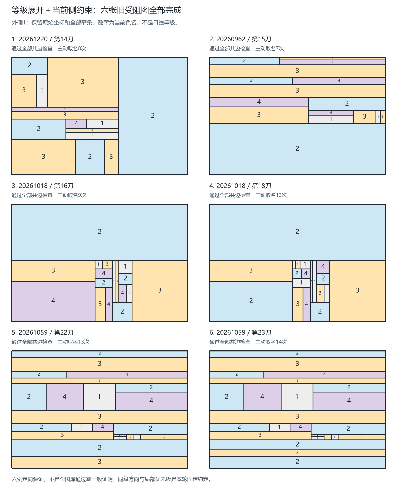
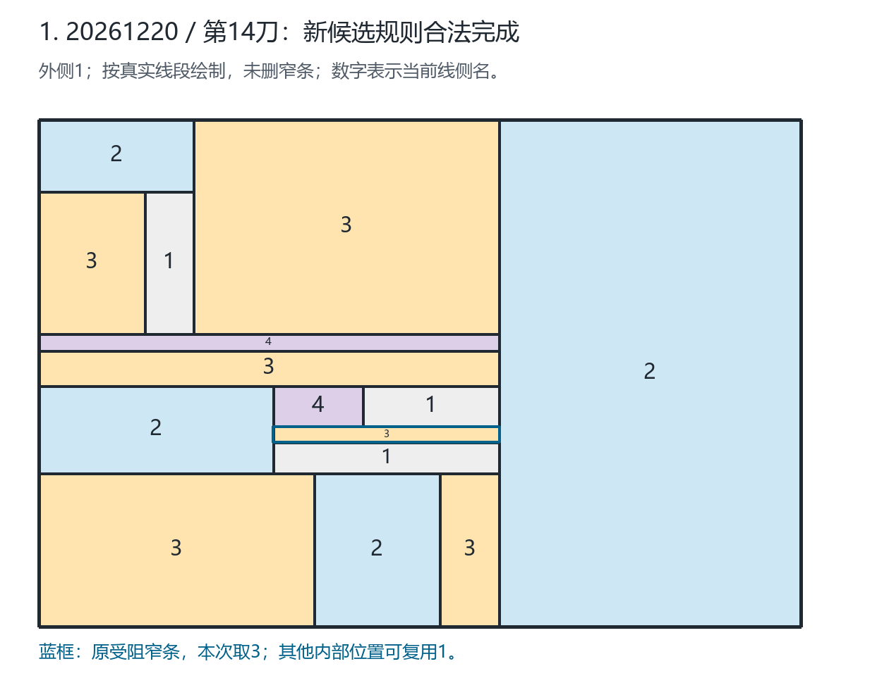

# 母线等级与当前侧约束：六张旧受阻图定向验证

日期：2026-09-19。母线命名、等级继承和内部复用小色名的思路由 Qinzi27 提出。
本轮把最新澄清实现为一个固定实验版本 `mother-level-current-sides-v1`，
**六张指定旧受阻图全部得到合法四色结果**。这是已知实例上的开发验证，
尚未验证新规则在全部 7069 图上的表现，不是一般四色证明。

## 1. 加强了什么，没有改变什么

用户澄清的核心：保留线的继承等级，帮助追踪当前分割依托哪些母线；
外侧1若没有成为该内部侧的实际邻接约束，就不应因为祖先曾出现1而永久禁1。

检查旧程序发现，它已经按当前真实共边关系禁色，没有累计祖先禁名。
因此不能把本轮成功解释成“修复了旧程序永久禁1的错误”。
本轮实际新增的是**等级分阶段、优先完成同一整条母线的当前局部命名，
以及每次取名的边界来源记录**；保留已有 Hall/二元关系过滤。
新实验模块独立于旧算法，未替换网页默认规则。

### 已冻结的操作约定

1. 每张图只输入完整当前几何；清空旧色，从外侧1和一个内侧2重新开始。
   外框只作根锚，不先给所有贴外框的细分侧域上色。
2. 外框等级为1。整条母线两个真实端点分别寻找最低层支撑，
   新线等级为 `1 + max(两端最低支撑等级)`，同步分层。
   同端并列父母线全部记录；中途T/X接点不拆母线，不提高它的等级。
3. 只在最低未完成等级中主动选内部母线。同级按端点的数值坐标
   `(y,x)` 从一边排序，固定一次，不按结果选择方向。
4. 优先完成所选整条母线的当前局部侧；线内保留旧规则的局部紧迫度，
   再按沿线位置平局。传播已确定的侧无需再次主动选名。
5. 每次决定前，从全部当前共边约束做原有过滤，再取 `min(D)`。
   不回溯、不失败换线重试、不导入旧合法解，也不重启另一种策略兜底。

这是一种明确、可运行的形式化，不声称它是用户想法唯一可能的实现。
“完成低级母线的当前剖面”可能提前命名后来贴在这条母线上的深层小侧，
所以**不等于按实际落笔历史先画完粗骨架、再逐步细分**。
同级坐标方向和整线内部优先级也是本轮约定，不是已证明的安全规则。

## 2. 如何表达“内部可以再次取1”

母线记录保留身份、等级、两端父母线选项；局部剖面保留区间和当前左右侧。
对一个连通侧域 `S`，通过它所有边界上的线段读取对侧候选：

```text
F_direct(S) = 实际共边且当前已定名的邻侧颜色集合
A_local(S)  = {1,2,3,4} - F_direct(S)
D(S)       = 原有合法约束过滤后保留的候选
F_derived(S) = A_local(S) - D(S)
选名         = min(D(S))，仅在D非空时
```

等级和祖先的旧色不进入 `F_direct`。但不接外侧1，不等于不接任何内部1；
若内部邻侧已取1，仍须排除。仅点接触不产生共边禁色，桥的同侧不产生自禁。

`1` 没有直接被邻色禁止，也不保证它通过所有关系推导。
所以每个主动步骤另外保存：母线/等级、当前候选、每条实际边界的母线ID、
位置区间、邻侧身份及候选，以及直接禁止和推导排除的区别。
完整推导证书记录在 `propagation_phases`，不是凭一句“已检查”放行。

四个名字仍是程序的输入色表，不是通过等级计数推导出的上界。
必要条件过滤和局部取最小名的组合，尚未证明普遍可延伸。
保留的二元关系过滤也会利用非相邻侧之间的推导关系；当前侧记录是表达方式，
不能把整个算法称作“只看两个端点”或“严格一层局部计算”。

## 3. 六例结果

固定输入来自完整旧库中全部六张 `tight-hall-relations` 失败图。
运行前保存选图清单、输入哈希、源码哈希和唯一排序约定，未按结果挑选子集。

| 历史种子 / 刀数 | 侧域数（含外侧） | 旧当前规则 | 新候选 | 主动取名次数 | 其中主动取1 |
| --- | ---: | --- | --- | ---: | ---: |
| 20261220 / 14 | 16 | 受阻 | 完成 | 8 | 2 |
| 20260962 / 15 | 17 | 受阻 | 完成 | 7 | 2 |
| 20261018 / 16 | 18 | 受阻 | 完成 | 9 | 4 |
| 20261018 / 18 | 20 | 受阻 | 完成 | 13 | 4 |
| 20261059 / 22 | 24 | 受阻 | 完成 | 13 | 4 |
| 20261059 / 23 | 25 | 受阻 | 完成 | 14 | 4 |

合计64次主动取名，全部为当时候选最小值，其中20次取1。
其余44次主动决定的当前直接邻色包含1；本组六图主动步骤中没有额外推导禁1。
这个零计数不表示推导禁1在其他图上不会发生。
传播自动定值不计入主动选择次数，20也不是全图内部1的最终总个数。

每份结果独立核验了全部实际邻边、同侧线轨道一致性及完整传播证书。
另行重跑两套旧规则：旧当前六次受阻、旧 `tight-hall` 六次成功均精确复现。
旧成功色只用于运行后的对照，不进入新函数。最小图新解恰与旧成功解相同，
其余五图新解与旧成功解不同；不能仅凭答案相同认定算法复制答案。



各图的全尺寸 PNG/SVG 和每个侧域的坐标/色名记录见
[图示清单](figures/level-sides-six-2026-09-19/manifest.json)。
绘图复用项目既有矩形程序，仅等比例缩放，不删窄条或改变接触关系；
黑色边界和数字提供非颜色线索。总览缩小时，极窄条数字应在单图原尺寸查看。
PNG为RGB，SVG保留可搜索文字但字体显示依赖查看环境；不是期刊合规或无障碍认证。

## 4. 与用户手稿逐点核对：成功，但没有强制窄条取1

在最小14刀图中，右侧整大块最终仍为2。
本轮沿用旧根锚约定：初始内侧2实际锚在左上角小侧域
`x=0..183, y=0..85`，不是直接把右大块锚定为2。
右大块是后续得到2。这一点不能说成完整复演了手稿的起始动作。

用户圈出的窄条是侧15，原坐标 `x=277..544, y=363..382`。
本次它最终为 **3而非1**，由传播定值，不是一条主动选名记录。
最终相邻侧名为2、4、1、1、2，因此此时直接禁色集合为 `{1,2,4}`，留下3。
其上、下的某些内部位置已经复用了1，不能再让窄条与它们同色。



这不证明用户另一个整体重标方案不能让窄条为1；它只说明本轮固定顺序形成的
邻色条件不同。结果支持“保留结构、允许内部复用1”的方向，
但不能宣称手稿里的每一个具体标记都已被原样复现。

## 5. 验证、复现和下一步

新增：[实验模块](../fourcolor/level_sides.py)、
[六例运行与独立校验](../scripts/validate_level_sides.py)、
[18项专项测试](../tests/test_level_sides.py)、
[绘图程序](../scripts/render_level_sides.py)。

正式数据：[完整六例证书](../outputs/level-sides-six-2026-09-19.json.gz)、
[摘要](../outputs/level-sides-six-summary-2026-09-19.json)、
[运行前清单](../outputs/level-sides-six-selection-2026-09-19.json)。
完整证书 SHA-256：
`27b0a3672b81db4c2d4a8ebb5b8f088fda73f4cbb9e246ac09d81eda37a8354e`。

全部427项Python测试通过，0失败、0错误、0跳过；
[通用验证报告](../outputs/validation-level-sides-2026-09-19.json)通过。
18项新增测试覆盖T/X、同级兄弟线、整线顺序、悬空范围限制、内部1复用、
内部邻1仍禁1、旧色污染、几何等价输入、完整证书及篡改拒绝。
独立复跑六份候选结果，与保存结果逐项一致；登记来源哈希全部匹配。

```shell
python -m unittest discover -s tests -v
python scripts/validate.py --output outputs/validation-level-sides-rerun.json
python scripts/validate_level_sides.py --manifest outputs/level-sides-six-selection-rerun.json --output outputs/level-sides-six-rerun.json.gz --summary outputs/level-sides-six-summary-rerun.json
python scripts/render_level_sides.py --input outputs/level-sides-six-rerun.json.gz --output-dir docs/figures/level-sides-six-rerun
```

选择新输出名，拒绝覆盖旧证据；证书运行禁止 `python -O`。
核心用标准库，绘图沿用项目已有Pillow，不新增依赖。

下一步应冻结本版再跑全部既有图，统计改善与退步，不能把“修好剩余六例”
与旧规则7063例成功简单相加成新规则7069例全过。
随后再预声明未见输入作独立测试；当前六例已用于方法开发。
本轮不发布、不改旧核心或网页，不提交/上传GitHub。

科研批判性思维流程用于控制比较条件、保存反向证据和限制结论；
科学可视化流程用于保留原几何、数字冗余标记和检查导出图。
流程工具引用如下，**不作为四色数学结论的证据**：
Kassis, T., Agarwal, V., He, Y., Patel, D., & Brueckner, A. M. (2026).
*Scientific Agent Skills: A Library of Procedural Knowledge for Research Agents*.
[arXiv:2609.00065](https://arxiv.org/abs/2609.00065),
[DOI](https://doi.org/10.48550/arXiv.2609.00065).
