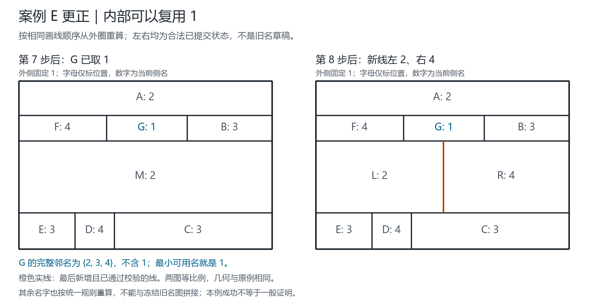
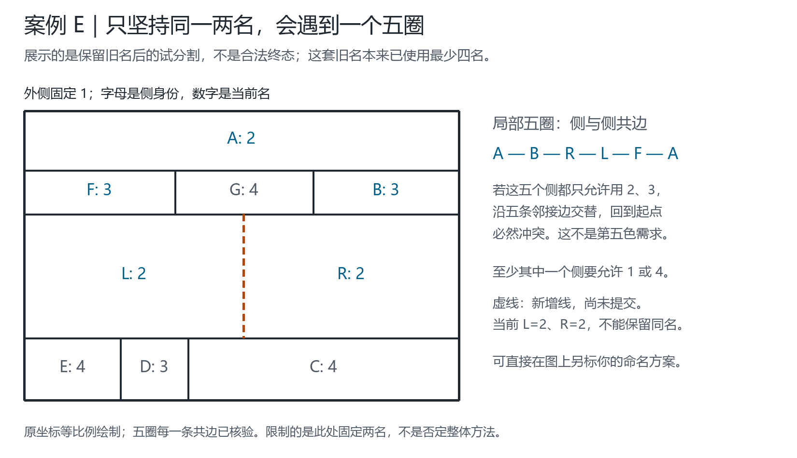

# 复用优先与局部两名同步：规则、证明和边界

日期：2026-09-18。原始母线命名、局部继承与重新标色思路由 Qinzi27 提出。

本轮将C起点修正推广成可执行的选择层，并证明一类固定边界局部重命名问题。**证明针对明确的子问题，不是一般四色定理的新证明；二分图与双色交换的基本事实不作原创性主张。** 新程序是独立研究入口，未替换网站默认规则。

案例编号分属两套材料：A/B/C指9月18日局部标记案例，C为上中下三条带；D/E指“闭合后重命名”交互例中的双锚条带与9旧侧困难例。不要与该旧交互例中另一个“A/B/C”混淆。

## 图示更正：E内部的G应该复用1

提出者指出上中间G不涉及外侧1。这一点正确：旧图G完整邻居为A2、F3、B3、M2，最小可用名是1；不能把历史外圈的1当成所有内部侧的永久禁名。

此前对话展示的五圈图是**冻结旧名的未提交对照**，没有展示已完成的`E_restart`。它不能用来表示“从头按当前规则命名仍受阻”。现将真正重算的第7步和第8步重绘如下，保留旧图但不混用两套名字：



- 第7步：被分母侧名3；G的保留旧邻名为{2,4}，所以避开{2,3,4}后直接取1。提交后G全部邻名为{2,3,4}。
- 第8步：被分母侧名2；新右侧的保留旧邻名为{1,3}，取4；左侧继承2。完整八步均直接成功，无未拆旧侧修复。
- 只在旧图孤立改G4→1也是合法的，但不等于从头重算；旧图其余名字不变时，最后两个子侧的旧邻名仍均为{1,3,4}，不能直接分割。这是不同起点，不应与新图拼接。

重绘脚本`python scripts/render_e_restart.py --input outputs/local-reuse-2026-09-18-v2.json --output-dir docs/figures/e-restart-rerun`会重放八步并检查与源报告一致，再对所画的两个状态分别运行独立Node几何及Python线侧一致性校验。[来源清单](figures/e-restart-2026-09-18/manifest.json)保存当前名字、坐标和证书。没有改动命名核心，也没有由本例推出通用完备性。

本次补充2项回归后，专项17项、完整238项Python测试通过；通用验证再次通过，记录为[validation-e-restart-2026-09-18.json](../outputs/validation-e-restart-2026-09-18.json)。PNG已按科研绘图流程核对标签、等比例几何和已提交线型。下文236项等数字属于重绘前阶段的记录；本次未重跑整套Node单元测试，只独立核验了新图中的两个状态。

## 1. 三种“最少”必须分开

1. **本步优先复用**：在当前允许的直接继承动作中，能不增加名字种类就不增加；同级再取小数字和固定位置。
2. **当前全图名字种类最少**：需要给出额外证明，不能由“每步选最小数字”自动推出。C用三元共边见证，D/E用四元共边见证，才能证明这些具体状态的最少性。
3. **修复时改动旧侧最少**：成本是有多少个未拆旧侧改名；不是用了几种名字，也不是改了多少母线分段记录。

新选择层保证第1条；下面的局部定理在固定局部集合、固定两名与固定外部的范围内保证第3条。没有宣称求得一般图的第2条。

## 2. 对象、几何与当前约束

保留四种不同对象：几何母线身份、母线上的位置区间、真实侧身份、当前名字。母线经过T接点不必变成另一条线，但它沿不同区间可读到不同的当前有序侧名。

令 `G=(V,E)` 是由线侧一致类导出的完整侧邻接图。这里的图边表示两个不同侧身份沿正长度线段相邻，不是某条特定几何母线；同一对侧可能通过多个线段相邻。只碰一个点不产生异名约束。桥两侧属于同一侧，不制造自环不等式。

本文的“奇圈/偶圈”指**侧邻接图中的圈**，不同于纸上原线网的闭环。原线闭合是否真的新增侧，由几何层先检查；不能把两种闭环混为一谈。矩形适配器只接受贯穿同一旧矩形侧的轴对齐分割，自由端不是一次有效分侧；一般曲线、孔洞与桥不由这个适配器处理。

外侧固定名1，其他不接外侧的内部侧仍可复用1。当前侧名不是母线的永久出生名；历史只记录来源，不累计成永久禁名。

## 3. 规则R1：先复用，再取小数字，再处理位置平局

合法旧状态的一侧 `p` 名为 `s`，新线把它分为相邻的两个子侧 `u,v`。设 `R_u,R_v` 分别为两子侧全部当前旧边界邻名。一次计算：

\[
A_u=\{1,2,3,4\}\setminus(R_u\cup\{s\}),\qquad
A_v=\{1,2,3,4\}\setminus(R_v\cup\{s\}).
\]

对允许动作“子侧D取t、另一子侧继承s”，按以下优先级选唯一结果：

\[
\bigl(\mathbf1[t\text{ 未出现在旧状态}],\ t,\ \operatorname{bounds}(D)\bigr).
\]

其中bounds采用现有矩形坐标的字典序。两个子侧、四个固定名字的集合运算不是遍历全图配色组合，不回溯此前步骤。这个优先级与旧M1“先位置、后取名”不同。

**命题R1。** 若两个集合至少一个非空，该选择得到合法新状态；并在“其他旧侧不变且一子侧继承s”的直接动作中，优先避免引入新名字。

**证明。** 继承s的子侧仅保留原父侧的一部分旧邻居，因此其旧边界仍异名。另一侧t避开其全部旧邻名和兄弟的s。其余旧边未变化。三类边穷尽全部约束，故合法。可选动作的额外名字数恰为评分第一项，取最小就达到本步的最少新增种类。证毕。

这个命题**不保证候选集合永远非空**，也不保证该选择让未来每步都能直接成功。

C按这条统一规则从头得到 `3—2—3`，与用户的 `2—3—2` 只差全局交换2/3。第二刀主动复用3，不再为了固定继承方向而提前引入4；不是为C单独写一个例外。

## 4. 定理R2：固定边界的局部两名重算

### 前提

给定局部可改集合 `P⊆V` 和两个不同名字 `a,b`：

- P外的所有名字固定，而且P外之间的邻接原本合法。
- P内全部侧只使用a、b；必须保持同一侧在所有母线上的名字一致。
- 完整邻接已知，包含P内部及全部跨边界接触，不能只读取新线端点。
- 外侧不放入P。P初始可含尚未提交的子侧同名冲突。

**定理。** 存在符合这些条件的局部命名，当且仅当：

1. `G[P]` 可以分成两个奇偶组，即不存在奇长度圈；
2. 每个连通分量的固定外部约束对两组的取名要求不冲突。

### 可计算表达

编码 `κ(a)=0, κ(b)=1`。每个分量从预先固定的根出发，沿邻接关系交替标记 `h(v)∈{0,1}`。任意合法二名结果必有：

\[
\kappa(c(v))=h(v)\oplus q,\quad q\in\{0,1\}.
\]

`q`称为分量的相位，只表示“两组哪组用a”。若跨边界邻接 `vw` 中 `v∈P,w∉P`：

- `c(w)`不属于{a,b}时，不限制相位；
- `c(w)`属于{a,b}时，必须有

\[
q=1\oplus\kappa(c(w))\oplus h(v).
\]

将该分量全部要求取交集。无要求则允许两个相位；一致要求则剩一个；相反要求则拒绝。

### 证明

**必要性。** 内部每条边要求两名交替。沿奇圈回到起点会强制起点与自身异名，所以不能有奇圈。连通分量确定任一根名后，其余名字沿路径全部确定，只剩整体相位q；每条跨界边的要求都必须成立，因此相位交集不能空。

**充分性。** 每个分量选允许的相位。内部边两端奇偶相反，故异名；跨界边若外名是a或b，由相位条件确保异名，否则自然异名；P外边未改且已合法。以上三类边穷尽全部邻接，故整个结果合法。证毕。

这适用于分支、偶圈、多个不相连局部块，不只适用于直条带。奇圈拒绝仅说明该P无法仅用a、b；树也可能因外部固定要求冲突而失败，不能把“没有圈”当成自动成功。

### 最少旧侧改名推论

令U为需要计价的未拆旧侧，新子侧不计改名成本。对每个分量计算两个相位的成本：

\[
C(q)=\sum_{v\in P\cap U}\mathbf1[c_q(v)\ne c_{\mathrm{old}}(v)].
\]

在允许相位中选成本小者，平局固定选q=0。不同分量之间没有边，外部又固定，成本相加；各自最小就得到这个**给定P、给定两名、给定外部**问题的全局最少旧侧改名数。程序目前是等权侧数，不是任意权重接口，更不是所有四色修复中的最少改动。

无需枚举各分量相位的笛卡尔积。结构遍历仍存在；准确说法是“不遍历候选配色组合”，不是“不读取/遍历邻接”。奇偶传播本身可线性完成，但当前实现还会规范排序、验证完整图，矩形建图有成对检查，不能把整个程序宣称为严格局部线性时间。

### 两种数学拒绝证书

- 奇圈：返回侧邻接图中的奇长度闭合顶点序列，逐边可检查。
- 相位冲突：返回同一分量中分别强制q=0和q=1的两条边界要求及连接路径。

P外原本非法属于输入错误，不能伪装成R2发现的局部障碍。

## 5. 从定理到一条有限自动规则R3

R2解的是已给定的局部问题，不自动找到应该改哪一片、选哪两个名。当前提供以下**候选选择规则**，前提与拒绝分开记录：

1. 先运行R1；成功就不调用同步。
2. 若两集合都空，让两个子侧临时同取父名s，作为不提交的计算状态。
3. 计算两子侧的共同旧邻居 `J=N_old(u)∩N_old(v)`，交集按**侧身份**计算。把这些接口固定。
4. 只选一次最小伴随名：`q=min({1,2,3,4}−{s,1}−c(J))`。无可选q则明确停止，不试另一种结构。
5. 从两子侧沿当前名字为{s,q}的邻接关系读取完整连通分量P。本轮最多纳入3个未拆旧侧。若遇第4个，立即返回预算拒绝；不截前3个交换。若遇固定外侧也停止，绝不把外侧放进P。
6. 对这个P运行R2。因两名包含s且两个新子侧相邻，成功时必恰有一个子侧继承s。没有偷偷取消继承条件。
7. 校验全部边界后一次性提交，重建受影响母线的当前分段名；历史另存，不向工作标记不断累加旧名。

“最多纳入3个旧侧”是**读取的完整局部分量规模限制**，不是“最多必须改3个侧”的结论。部分成员可以最后不改名。遇外侧/超预算表示R3不处理，不等同于R2的数学不可行证书，更不是四色无解。

直接复用1不受禁止。步骤4只不把外侧专用锚1主动选为伴随名；父侧s本身可为内部1，此时双色分量有可能经另一名字接到固定外侧，必须返回拒绝而不能崩溃或改外侧。专项回归已覆盖这一情况。

R3取完整可接受双色分量，所以其跨边界一般没有同色对约束；R2的一般边界相位逻辑还可用于未来人工指定局部块。不能把R2对指定子问题的完备性，转述成R3自动选择对所有地图完备。

## 6. D：起点已经最少，仍可严格证明需要同步

D原状态：外1、上横条T为4，下方三栏A/M/D为 `2—3—2`；中栏再竖分。

**首先，旧状态已经最少四色。** 外侧、T、A、M两两共边，所以这四个侧必须四名。它不是C的非最少起点问题。

**其次，固定外1上4，零旧侧改名不可能。** 若左右旧栏A/D都留2，新两子栏各邻1、4及一个旧栏2，都只能取3；但它们彼此共边，不能同时3。

**最后，只改一个旧侧即可。**

```text
原链：        2 | 3 | 2
临时继承：    2 | 3 | 3 | 2     不提交
右端同步：    2 | 3 | 2 | 3     只改右旧栏
或左端同步：  3 | 2 | 3 | 2     只改左旧栏
```

因此固定两个锚时，最少未拆旧侧改名数恰为1。新线之外的母线分段对也必须同步更新，不能只修改新线标签。

这里 `J={outside,T}`，排除名字1、4，保留父名3，伴随名为2。左右旧栏虽然都叫2，却是两个不同侧，不能因同名就误列为共同固定接口。

从头按R1得到另一规范状态：T为3、下链 `4—2—4`。同理J固定1和3，此时伴随名为4，仍一次R2完成并只改1个旧侧。没有给D硬编码一个特定数字，选择依据是实际公共接口。

这证明“起点名字种类最少”不推出“以后始终零改旧名”；但它完全兼容提出者允许同步重命名的思路。

## 7. E和其他案例：不掩盖规则边界

正式输入为5份固定几何，共8个预先声明流程，未随机扩大地图范围：

| 流程 | 声明步骤 | 结果 | 未拆旧侧改名 |
| --- | ---: | --- | ---: |
| A从头 | 4 | 全部R1直接成功 | 0 |
| B从头 | 5 | 全部R1直接成功 | 0 |
| C从头 | 3 | 全部R1直接成功 | 0 |
| D保留原命名，再切一次 | 1 | R2局部成功 | 1 |
| D从头 | 4 | 最后一步R2成功 | 1 |
| E保留原命名，再切一次 | 1 | R3扩展超3旧侧预算，未提交 | — |
| E从头 | 8 | 全部R1直接成功 | 0 |
| D保留原名、零旧侧预算 | 1 | 预算拒绝，未提交 | — |

E旧起点也已最少四色：外侧、中央母侧M、下方C、下方D两两共边。**不能把E的旧命名叫作像C一样“提前多用了一个颜色”。** R1从头得到的是另一种具体名字分布，第7刀允许内部G复用1，随后第8刀直接完成。

E旧名下，R3选定的完整双色分量超过局部规模预算；这不说明至少要改4个侧，也不说明改3个侧不可能。此前[困难例说明](HARD_CASE-2026-09-18.md)已给出改变两个未拆旧侧的其他修复，但本轮没有把那个见证当作自动算法的隐藏答案。

**E还有一个局部五圈证书。** 记新右子侧为R、新左子侧为L。新增线后的实际侧邻接含：

\[
A\;—\;B\;—\;R\;—\;L\;—\;F\;—\;A.
\]

对应代码ID为 `A,B,M.l,M.r,F,A`；A是顶部整带、B为上右短栏、F为上左短栏。5条邻接均由精确正长度边界核验，仅包含3个未拆旧侧和2个新子侧。若始终只允许这5个侧使用2/3，沿5条边交替后会要求起点与自己异名，故不可能。至少一个侧必须允许改用1或4；把更多侧纳入却仍坚持同一两名，不能消除这个五圈本身。这是对**该固定两名限制**的反证，不是对用户允许重命名的整体方法或四色可行性的反证。专项测试同时验证几何五圈和R2的拒绝证书。



该图由正式报告重新绘制，源图未改；R/L暂继承同名2，所以明确标为未提交草稿，不混入成功状态证书。PNG/SVG和[来源清单](figures/local-reuse-2026-09-18/manifest.json)保留坐标、五圈边、脚本与数据哈希，供人工标记。

这些流程是事先分开的对照，不是在一个失败流程里悄悄换历史。它们提示应继续研究接口/继承选择，不能据此声称所有最少命名都能轻量延伸。

## 8. 实现、验证与复现

- 核心：[fourcolor/local_reuse.py](../fourcolor/local_reuse.py)。R1、R2与R3各有明确入口/事件记录，Python标准库实现。
- 专项：[tests/test_local_reuse.py](../tests/test_local_reuse.py)。15项测试，包含全部1至3个局部顶点简单图及全部两名边界禁用掩码，共548个有限配置；独立枚举检查可行性与最少旧改名。另含真实E五圈证书。枚举只在测试中，命名程序不调用它。
- 复现：[scripts/validate_local_reuse.py](../scripts/validate_local_reuse.py)。5几何、8流程、25次提交，初始及提交状态合计33份证书全部通过独立Node从线网重建几何与Python旋转次序核验。重复状态不算新地图。
- 正式结果：[local-reuse-2026-09-18-v2.json](../outputs/local-reuse-2026-09-18-v2.json)。无v2版本是增加内部父名1接外侧防护前的检查点，保留不覆盖；这些固定案例结果未变。

```sh
python -m unittest discover -s tests -p test_local_reuse.py -v
python scripts/validate_local_reuse.py --output outputs/local-reuse-rerun.json
python scripts/render_e_parity.py --input outputs/local-reuse-rerun.json --output-dir docs/figures/local-reuse-rerun --font msyh.ttc
python -m unittest discover -s tests -v
python scripts/validate.py --output outputs/validation-local-reuse-rerun.json
```

使用新的输出文件名，不覆盖原始记录。下一步应明确是否允许扩大局部集合或引入第三个名字；本轮遇到拒绝会停止，不擅自升级策略。

最终完整回归236项Python和99项Node测试通过；通用验证器再次运行236项测试与既有有界核验通过，正式记录 [validation-local-reuse-2026-09-18-v2.json](../outputs/validation-local-reuse-2026-09-18-v2.json)。无v2的通用验证记录含235项测试，是加入E几何五圈专项前的检查点。图使用既有Pillow/SVG画布，实际PNG已检查文字、方向、边界与未提交线型；未做浏览器界面测试或公开部署。

## 9. 已知基础与方法来源

二分图与奇圈的等价、结构遍历判定是已知基础，不是本项目发明。核对来源为 Sedgewick、Wayne 的[Princeton Algorithms：BipartiteX](https://algs4.cs.princeton.edu/41graph/BipartiteX.java.html)（2026-09-18访问，教材原实现与注释）。本报告的固定边界相位条件及成本推论在上文逐项证明；引用不代替证明。

标准双色分量交换与“分割后两个子侧暂同名的局部重算”也应区别。后者的草稿还不是合法命名，本报告称其为固定边界的两名扩展，不把所有动作都叫作一次Kempe交换。

采用科研审查流程分开条件定理、选择策略、有限测试与未解决的普遍保证。流程来源不是四色证明：Kassis, T., Agarwal, V., He, Y., Patel, D., & Brueckner, A. M. (2026). *Scientific Agent Skills: A Library of Procedural Knowledge for Research Agents*. [arXiv:2609.00065](https://doi.org/10.48550/arXiv.2609.00065)。2026-09-18核对官方元数据页：当前记录最后修订于2026-09-02；此处引用流程元数据，不冒充全文评审或数学依据。
