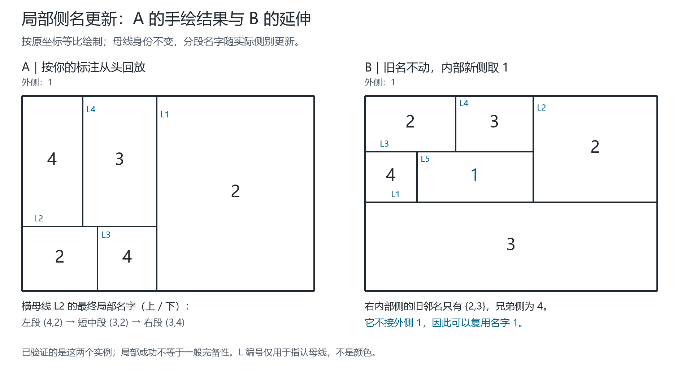
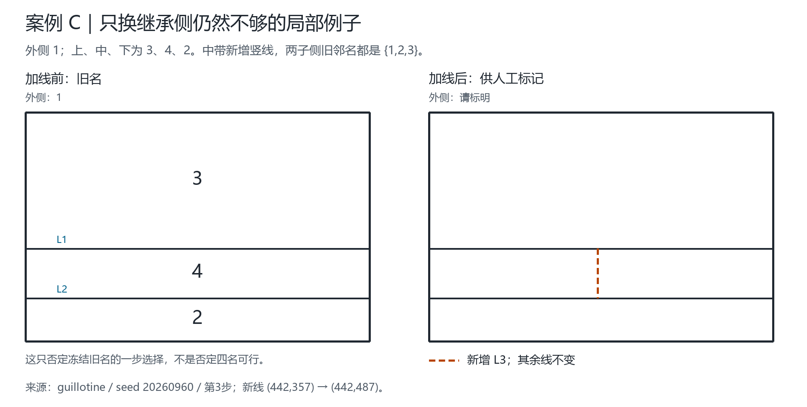
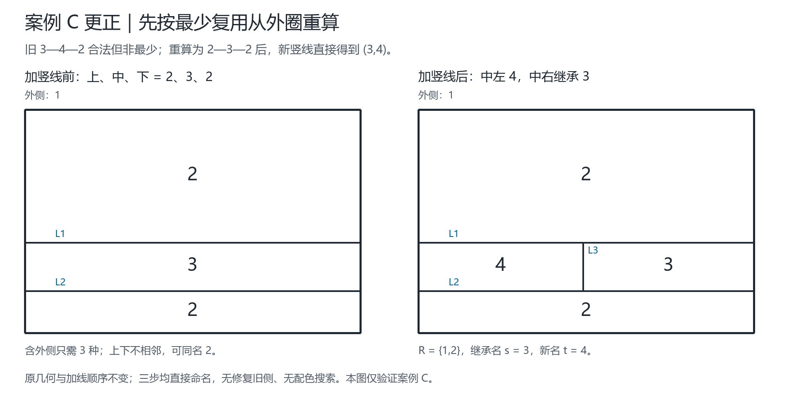

# 局部侧名标记：手绘 A 的规范化与 B 的延伸

日期：2026-09-18。母线命名与继承思路由 Qinzi27 提出。本轮依据提出者给 A 的手工标记整理，不改写原图、不替换旧实验。

> **同日更正：C 的起点应先重算。** 原图中的上、中、下 `3—4—2` 是旧固定继承策略的合法输出，却不符合提出者要求的最少复用。按原几何和顺序从外圈重算为 `2—3—2` 后，三个方法都在直接命名阶段成功，均不需要改旧侧。下面第6节的旧 C 表格只保留作固定旧名的历史对照，**不能作为提出者规则需要M2/M3的证据**。修正过程和最少性见第7节。

## 1. 先明确这次修正的含义

提出者已明确确认：在旧 `(3,4)` 上补写 `2`，指的是**记录局部当前侧名和位置**，不是整条母线此后永久禁止名字2。

因此建议使用三层记录：

| 层 | 记录内容 | 命名时的作用 |
| --- | --- | --- |
| 母线身份 | 线ID、方向、原有几何范围；经过T接点仍可为同一条母线 | 确认沿哪条线延伸，不能用同名对合并不同的线 |
| 当前局部剖面 | 每段位置、两侧的身份、两侧当前名字 | 提供此刻真实的同侧一致约束和异侧禁名 |
| 继承历史 | 原始名、变更位置、变更前后名字、导致变更的分割 | 解释为什么改名；历史名不自动累积为永久禁名 |

可记为：

\[
\mathcal L_t(\ell)=\left(\mathrm{id}_\ell,\gamma_\ell,
\{(I_j,u_j,v_j,c_t(u_j),c_t(v_j))\}_j,H_t(\ell)\right).
\]

`I_j` 是母线上的位置区间，`u_j,v_j` 是两侧身份，`c_t` 是当前名字，`H_t` 是历史记录。端点只用于定位、分段和线的连接，不被当成颜色命名对象。这是线中心的数据表达；矩形侧身份只是保证同一侧在不同母线上读取到同一个当前名，不是要求用户改用“先给区域随机上色”。

不能把这个记录压成无位置的 `{2,3,4}`：那会丢掉“哪个名字在哪一段、在哪一侧”。名字仍只取1至4，**记录项数量可以随分割增加**，不能从只有四个名字推出只有有限固定层数的历史或固定数量的母线记录。

### 保持标记轻量，不展开整棵历史

按提出者“先局部尝试”的要求，当前工作记录只保留母线ID、位置区间、两侧身份及当前名字；历史单独折叠。发生局部变化时替换对应当前条目，不把旧名一层层追加进工作禁名表；未受影响的线不重复写。展示时可以写“基础对 + 位置明确的例外段”。只有两侧身份也相同的相邻条目才可在逻辑记录中合并，不能只因颜色对相同就合并侧身份。

局部指的是**改名和记录更新范围**。判断一次改名是否安全，仍须读取受影响侧的所有真实边界邻接；不能只检查画面上近的两个端点。

## 2. A：按手绘结果逐步回放

约定外框记 `L0`，内部线按原几何顺序记 `L1..L4`。坐标与上一轮 A 完全相同，原点左上，x向右、y向下。此处的“左、右、上、下”都指画面位置。

初始外1、内2。下面是一条能复现手绘最后标注的确定过程，不将难以辨认的手写字句强行逐字转录：

| 步骤 | 几何动作 | 继承旧名的一侧 | 新命名侧的旧边界邻名 R | 再排除母侧原名 s | 新名 |
| --- | --- | --- | --- | --- | --- |
| L1 | `(415,0)→(415,600)` | 右侧继承2 | `{1}` | 2 | 左侧3 |
| L2 | `(0,402)→(415,402)` | 左上继承3 | `{1,2}` | 3 | 左下4 |
| L3 | `(233,402)→(233,600)` | 下方中间继承4 | `{1,3}` | 4 | 左下2 |
| L4 | `(187,0)→(187,402)` | 上方中间继承3 | `{1,2}` | 3 | 左上4 |

最终：外1、右整带2、左上4、上方中间3、左下2、下方中间4。每一步都是完整当前边界上取最小可用正整数；此次四步没有触发同步修复，也没有枚举整图配色。



### 横母线 L2 的“额外2”究竟在哪里

L3之前，L2上方3、下方4。L3之后，L2仍为同一条母线，但当前记录变成：

\[
P_3(L2)=\begin{cases}
(3,2),&0<x<233,\\
(3,4),&233<x<415.
\end{cases}
\]

这里有序对按**上、下**表示。新线L4的下端在 `x=187`，读到的是 `(3,2)`，不能仍照整条线的出生名字 `(3,4)` 来读。

L4加入后再次更新：

\[
P_4(L2)=\begin{cases}
(4,2),&0<x<187,\\
(3,2),&187<x<233,\\
(3,4),&233<x<415.
\end{cases}
\]

区间使用开区间是为了不把交点上的多侧扇区误当成唯一两侧；接点本身另存入射顺序。多个局部有序对不意味着把母线几何身份拆掉。

### 为什么上一轮 A 停住，而手绘能完成

上一轮 A 记录采用固定 `inherit=right`，旧名是左上4、下方中间3。手绘加L4前的这两个名字正好是把3与4整体交换；这是颜色等价，但**仅交换3和4并不能消除同一继承选择的限制**。

真正的差别还包括：手绘让新线画面右侧继承旧名，左侧取新名。按代码的有向约定，原4条线每一步均为 `inherit=left`，能从头直接回放。代码中的左右沿线方向定义，不是始终等于画面左右。

甚至不重命名原A的旧侧，仅把第4步改成另一继承方向，也得到合法结果：顶左3、顶中4、底左2、底中3、右2。该最终结果再整体交换3与4，正好得到手绘 A。因而本例不要求先进行双锚迁移；先前的“双锚规则不适用”只是那个固定策略停止的解释，不是地图不可继续的证据。

## 3. B：保留旧名，内部新侧可以复用1

沿用上一轮 B 的已提交旧名：外1、底部3、右上2、左上2、上中3、中间横带4。新增线仍是 `(160,172)→(160,327)`。

将原名4留给画面左子侧；右子侧完全在图内。分别计算两个新子侧的**完整旧边界**：

| 准备取新名的子侧 | 真实旧边界邻名 R | 加上兄弟继承名4后的禁止集合 | 1至4中的可用名 |
| --- | --- | --- | --- |
| 画面左子侧 | `{1,2,3}` | `{1,2,3,4}` | 空 |
| 画面右子侧（内部） | `{2,3}` | `{2,3,4}` | `{1}` |

所以让右内部侧取1，左侧保留4，新线两侧按画面左右为 `(4,1)`，其余旧侧不变。

右内部侧的上边分段接2和3、右边接2、下边接3、左边接新兄弟4。它没有任何一段边界接外侧1。**名字1并非外侧专用；没有真实邻接时可以复用。** “所有线都源于外框”是历史关系，不推出所有后代侧都与外侧相邻。

这也说明不能只查两个端点。B的新线两端保留名为2、3，但左新子侧另外仍接外侧1。若只读端点就把1给左侧，便与外侧冲突。额外标记必须支持查询整段实际边界，不能只增加端点缓存。

## 4. 从这两例可以规范出的局部规则

以下为**建议的新选择层**，不是宣称现有通用程序已替换为完整的新理论：

1. 新线闭合/锚定并明确分割的是哪个旧侧；合法几何是前提。
2. 更新母线分段及侧身份，读取两子侧的全部当前旧边界邻名 `R_L,R_R`。
3. 设母侧原名为 `s`，一次计算：

\[
A_L=\{1,2,3,4\}\setminus(R_L\cup\{s\}),\qquad
A_R=\{1,2,3,4\}\setminus(R_R\cup\{s\}).
\]

4. 只有一侧集合非空时，那一侧取最小可用名；另一侧继承 `s`。这两个例子的最后一步都属于这种情形。
5. 两侧均非空时，需要事先明确一个确定性选择约定；本轮没有证明任意平局选择都能保证未来可延拓。
6. 两侧均空时，这种“保留所有其他旧名、一个子侧继承s”的一步规则无法继续；应单独调用有证明的同步改名规则，或报告阻塞，不能偷偷调用回溯求解器。
7. 成功后重算所有受影响母线的当前剖面，同时保留改名位置与继承历史。

这里只对两个子侧分别计算约束集合，不是遍历全图着色方案，也没有失败后换整条历史重试。使用四元可用集合是在测试能否在四名内完成该步；**若不证明该集合在一般情形必非空，就没有证明四色定理**。

### 能直接证明的局部正确性

假设旧状态合法，新增线只将一个旧侧分成两子侧，其他侧名字不变。旧侧名为s，其所有旧邻居均不同于s，所以保留s的子侧仍与旧邻居异名。新命名侧取自 `A_D`，与它的所有旧邻居异名，也与兄弟侧的s异名。未受影响的旧邻接仍合法，因而新状态合法。

这证明的是**可用集非空时的正确性**，不是非空性的普遍保证，也不是下一步继续成功的保证。

## 5. 复现与检查边界

专用复现脚本为 `scripts/validate_marked_cases.py`，图例源数据为 `docs/figures/anchor-failures-2026-09-18/manifest.json`。原始手绘仍保持不变；本轮产物是解释与有限核查，未发布到GitHub，未更改网站默认命名规则。

正式报告：[marked-cases-2026-09-18.json](../outputs/marked-cases-2026-09-18.json)。三个固定实验共6个成功步骤，包含起始状态的9份证书全部通过独立矩形邻接、Node从线网重建几何与Python旋转次序审计。7个新增专项测试包括B误把1放在接外圈的子侧的负例。图从这份报告生成，[图的来源清单](figures/local-marks-2026-09-18/manifest.json)记录源数据和绘图脚本哈希。

```sh
python scripts/validate_marked_cases.py --output outputs/marked-cases-rerun.json
python -m unittest discover -s tests -v
python scripts/validate.py --output outputs/validation-marked-rerun.json
```

选择未使用过的输出名。`A`的手绘复现、`A`保留原旧名的另一方向、`B`的内部侧复用1是三个不同证书，不混算为三张独立地图，更不等于全部构造历史完成。

## 6. 三种方法只在 A/B/C 局部对照（历史输入；C已更正）

依照提出者追加要求，本轮不重跑全部地图、不扩张全图历史标记，只比较三张既定小图各一次新增线，共9次单步运行。`A`使用上一轮程序保留的旧名，不是偷偷换成手绘回放的中间状态；其结果与手绘结果差一个3/4整体置换。三方法的定义在运行前固定：

- **M1，当前候选直接选。** 一次算出两个子侧的可用集合；只有一个可行则选它，若两个都可行按子侧bounds字典序，再取最小名字。不回溯旧历史。
- **M2，只改一个相邻旧侧。** 先调用M1。若两侧均空，固定选bounds较小的子侧，目标为不等于母侧原名且不违反外侧固定名的最小数。只接受唯一的旧邻侧阻塞者，且该旧侧可直接改到其完整邻接允许的最小其他名；否则停止，不改试其他目标。
- **M3，有界双色联动。** 先调用M1，否则使用M2同一固定目标与阻塞者；第二名固定取不属于原名、目标名、外侧1的最小名。只交换该阻塞者所在的完整双色分量，最多3个旧侧、距离被分侧不超过2条旧邻接边。遇外侧/被分侧、第4个成员即拒绝；不截取前3个交换，不重试另一组名字。还检查交换是否把目标名带到新子侧的其他邻居。

这里M2、M3是从同一旧状态分别对照，不是先运行M2失败才自动再选M3的完整求解器。距离是侧邻接图距离（含外侧节点），不是欧氏距离；修改范围有上限，但完整边界验证不宣称为常数时间。M3拒绝记录中的成员可以只是已发现的拒绝见证，**只有接受交换的分量才保证完整**。

| 方法 | 原A最后一步 | B最后一步 | 旧C最后一步（冻结非最少342） |
| --- | --- | --- | --- |
| M1 | 成功，0个未分旧侧改名 | 成功，0个未分旧侧改名 | 两侧候选都空，停止 |
| M2 | M1已够，无需修复 | M1已够，无需修复 | 下带2→3，改1个旧侧后成功 |
| M3 | M1已够，无需修复 | M1已够，无需修复 | 同样只改下带1个旧侧，成功 |

M3在旧C中的双色分量只有一个侧，**本轮没有展示任何真正的多侧联动优势**。原先据此提出优先研究M2的建议，需要因C起点更正而收窄：M2/M3仅展示能修复一个冻结非最少名字的状态；这三图不证明最少复用流程需要它们。当前优先检查直接选择的复用优先级，不能据三图宣布某法普遍最好。

### 旧C：冻结非最少旧名时两侧均卡住，但改一个旧侧即可

来源为原报告 `guillotine / seed20260960 / inherit=right` 的第3刀。外1；上带3、中带4、下带2，新增 `(442,357)→(442,487)`。



两子侧旧邻名均为 `{1,2,3}`，所以保持母侧名4、其他旧名不变时可用集都空。下带2改3却合法，因为上下两条带并不相邻；之后中带画面左半取2、右半留4。该结果只说明局部修复可以挽救这个旧策略快照，不说明从符合提出者要求的最少起点出发仍需修复，更不是第五色必需的证据。

### 改一个旧侧，不等于只更新一个线名条目

| 实际成功操作 | 未分旧侧改名数 | 触及母线数（含新增线） | 精确段键差分记录数 |
| --- | ---: | ---: | ---: |
| A，M1 | 0 | 3 | 8 |
| B，M1 | 0 | 4 | 9 |
| C，M2或M3 | 1 | 4 | 11 |

这里精确段键由“母线ID+段端点”组成；一条旧段分成两条时计1个删除和2个新增。这是后台记录差分，不是颜色数、旧侧改名次数或人工需要写11层上标。界面可以只突出新线、那一个变名旧侧及受影响的局部母线段，其他当前记录原样保留。

正式对照报告：[local-marks-three-methods-2026-09-18.json](../outputs/local-marks-three-methods-2026-09-18.json)。8个成功输出全部通过独立Node几何与Python旋转审计；保留1个停止输出。无`three-methods`名称的 `local-marks-comparison-2026-09-18.json` 是优化组件早停之前的自测检查点，保留不覆盖，不作为正式报告。核心生产规则未改。

完整回归：`python -m unittest discover -s tests -v` 的214项测试通过；`scripts/validate.py` 再次运行214项测试及既有有界独立核验，通过并写入 [validation-local-marks-2026-09-18.json](../outputs/validation-local-marks-2026-09-18.json)。Node四套逻辑测试99项全部通过。这些是实现检查，不把测试数当成地图覆盖率或普遍数学证明。

```sh
python scripts/compare_local_marks.py --output outputs/local-marks-comparison-rerun.json
python scripts/render_marked_cases.py --input outputs/marked-cases-rerun.json --output-dir docs/figures/local-marks-rerun --font msyh.ttc
python scripts/render_local_block.py --input outputs/anchor-forest-continuation-2026-09-18-v2.json --output-dir docs/figures/local-block-c-rerun --font msyh.ttc
```

出图另需Pillow与中文字体；验证核心用Python标准库与Node。所有输出使用新路径，不覆盖旧产物。

## 7. C更正：先从外圈重算，再检验新增线

提出者指出上、中、下应先为 `2—3—2`。此处有两个必须分开的标准：

- **合法命名**：共边的两侧异名。旧 `3—4—2` 满足这一条。
- **最少复用**：在当前图形允许时不提前引入额外名字。旧 `3—4—2` 连同外侧1用了4种，而 `2—3—2` 连同外侧1只需3种。

因此，原C不能拿来证明提出者的最少复用规则受阻。其问题是旧固定继承选择造成的非最少起点，而不是四名不足。旧M1的“先按位置选子侧，再在该侧取最小名”也不等于“先在两个继承选择间优先复用最小可用名”；这两个策略不能混称为同一条规则。

### 原线不动、原顺序不动，三步直接回放

从外1、内2重启。下表每次让有向线的左侧继承旧名；对向右的横线是画面上侧，对向下的竖线是画面右侧。这个方向预先指定，不是失败后枚举历史得出。

| 步骤 | 原几何 | 继承名 s | 新侧完整旧边界邻名 R | 最小新名 t | 结果 |
| --- | --- | ---: | --- | ---: | --- |
| L1 | `(0,357)→(900,357)` | 2 | `{1}` | 3 | 上2、下3 |
| L2 | `(0,487)→(900,487)` | 3 | `{1}` | 2 | 上2、中3、下2 |
| L3 | `(442,357)→(442,487)` | 3 | `{1,2}` | 4 | 上下2，中左4、中右3 |

取名式仍为 `t = mex_positive(R ∪ {s})`，即取不在完整禁止集合里的最小正整数。前两条横母线的当前剖面在L3后按接点位置更新，不能继续把整条母线固定记为最初的一对名字。新竖线两侧的无向命名为 `{3,4}`；按有向左右记为 `(3,4)`，按画面左右则为 `(4,3)`。



严格说，旧流程第一次切成上3、下2仍使用最少的3种名字，只是方向规范不同；**第一次可证的多用名发生在第二刀**，当时固定继承造成 `s=2,R={1,3},t=4`。即使保留旧第一刀，第二刀选另一继承侧也能得到 `3—2—3`，与 `2—3—2` 只差名字2/3的整体置换。不能把第一次对称选择本身叫作错误。

### 这张图的最少性可以直接证明，无需搜索配色

加L3前，外侧、上带、中带两两共边，故至少3种；`2—3—2` 连同外1正好达到3种。

加L3后，外侧、上带、中左、中右两两共边，故至少4种；表中结果恰好4种。这里的邻接均有正长度公共边，不是仅碰到一个点。程序逐对验证这两个给定的三元组/四元组，没有枚举所有团或全部配色。

所以此前中带提前取4并非必要，**这次加竖线后的4才是该图确实需要的第四种名字**。这证明了C两个阶段的最少性，不证明任意地图的最少标色都能靠该固定方向获得，也未实现通用最少着色器。

### 修正后三方法与复现

在同一 `2—3—2` 起点分别运行M1/M2/M3，三者都停在 `M1_direct` 成功阶段：中左取4、中右留3、未分旧侧改名0个、修复调用0次。本例不再提供比较M2/M3优劣的证据。A、B的此前结果不受本次更正影响。

正式专用结果：[c-restart-2026-09-18-v2.json](../outputs/c-restart-2026-09-18-v2.json)。从头3次划线与三方法单步结果均已核验；7份状态证书通过独立Node几何重建和Python旋转审计，其中含重复终态，不计作7张独立地图。无v2版本是增加生成时最少性断言前的自测检查点，保留不覆盖；原JSON与原图也均保留，新图另存并记录输入和脚本哈希。

```sh
python scripts/validate_c_restart.py --output outputs/c-restart-rerun.json
python scripts/render_c_restart.py --input outputs/c-restart-rerun.json --output-dir docs/figures/c-restart-rerun --font msyh.ttc
python -m unittest discover -s tests -v
python scripts/validate.py --output outputs/validation-c-restart-rerun.json
```

新增7项回归检查旧起点非最少、232重启、逐步s/R/t、图面方向、四名必要性、三方法无需修复及非邻接不能作最少性见证。旧C修复测试保留并改名，明确只适用于冻结342的历史控制；没有更改生产命名算法或网站默认行为。

本轮完整回归221项Python、99项Node测试通过；`scripts/validate.py` 再运行221项测试及既有有界核验也通过，保存为 [validation-c-restart-2026-09-18.json](../outputs/validation-c-restart-2026-09-18.json)。通用验证器沿用的有限枚举是独立测试，不是本次C命名流程中的搜索后备。新PNG已人工式视觉检查，无名字方向颠倒、重叠或裁切。

后续顺序应是：先审计输入历史是否符合已经约定的复用优先级，再把失败归因到当前延伸规则。一般场景如何在不搜索的前提下选择与重算，仍需明确定义并另行验证；不能把“可按四名合法延伸”与“全图使用名字数最少”混为一谈。

## 方法来源说明

本轮采用科研审查流程区分“用户确认的标记语义”“有限实例通过”“可证明的局部条件”和“一般完备性”。可视化保留源坐标与记录，不把美化图当作推理证据。流程来源不是四色问题的证明：Kassis, T., Agarwal, V., He, Y., Patel, D., & Brueckner, A. M. (2026). *Scientific Agent Skills: A Library of Procedural Knowledge for Research Agents*. [arXiv:2609.00065](https://doi.org/10.48550/arXiv.2609.00065)，2026-09-18核对当前记录。
