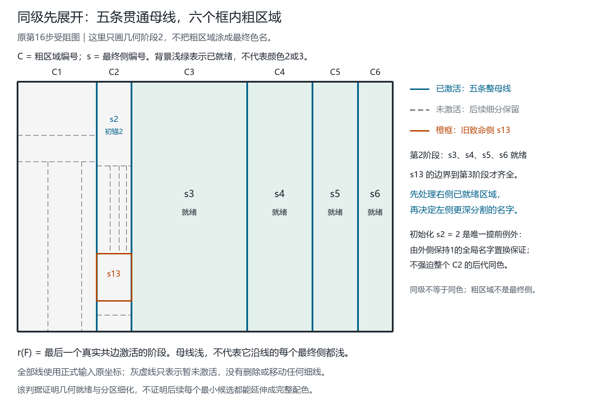

# 同级批量展开：完整重跑、退步原因与可证明的强化方向

日期：2026-09-19。原始线侧命名思路：Qinzi27。

## 1. 本轮结论

已经把“同级母线一起划出，再进入细分”写成明确的几何判据和可执行候选 `peer-batch-ready-sides-v4`。
**原四张受阻图全部完成，但完整库出现九张新退步；没有找到覆盖一般地图的通法，不能把本版替换为更强的默认算法。**

这否定的是本次固定的“就绪侧优先＋原关系过滤＋最小候选”组合的普遍成功性，
不是证明用户尚未完全形式化的所有修正方向都不成立，更不是说这些图需要第五色。
特别是“只让已完成几何展开的侧主动落名”是本轮为了可执行化引入的候选约定，不应倒写成用户早已规定的公理。

| 同一完整输入库 | 归档v3 | 新v4 |
| --- | ---: | ---: |
| 去重地图完成数 | 7065 / 7069 | 7060 / 7069 |
| 冲突图 | 4 | 9 |
| 所有前缀均完成的历史 | 362 / 363 | 358 / 363 |
| 历史最终图完成 | 363 / 363 | 362 / 363 |
| 静态引用完成 | 302 / 302 | 301 / 302 |

逐图配对为：7056张两版都成功，4张修复，9张退步，无两版共同失败。
不能取两版结果的并集后称为“一套规则全部通过”；v4没有在失败后调用v3。
原6113图组为6104成功、9冲突；后来961图组全部完成。两组有5个共同几何，合计仍是7069。
固定40诊断全部通过，但这不能代表完整库：完整结果正是该区别的实际例证。

## 2. 怎样数学化“同级一起划”

保留原有整母线身份和两真正端点的分级规则，中途的T/X接点不截断整母线。
同等级的整母线同一批激活；同级不要求连接相同父母线，也不意味着同色。
未知等级仍记为 `None`，只在最后一个调度桶处理，不伪造继承等级。

记母线的调度阶段为 \(\tau(M)\)。第 \(k\) 阶段只把阶段不超过 \(k\) 的母线看作已激活分隔。
在最终对偶图上，沿未激活的真实分隔边把最终侧暂时并入同一粗区域，得到分区 \(\Pi_k\)。
原图的线和坐标不删除；粗区域仅保存其所含最终侧的身份。

最终侧 \(F\) 的几何就绪阶段定义为

\[
r(F)=\max\bigl(\{1\}\cup\{\tau(M(e)):e\text{是}F\text{的真实非桥共边}\}\bigr).
\]

**已证明的几何引理：** \(F\) 在 \(\Pi_k\) 中单独成区，当且仅当 \(r(F)\le k\)。
如果它还有未激活的真实共边，它必与另一侧连在同一粗区；反之所有这些边已激活时，没有未激活边的邻接路径可以从它离开。
因此分区随阶段增加只细化，最终还原全部最终侧。
桥两侧相同，不产生异色约束，也不增加此处的分隔就绪条件；虚拟连接不是母线。

算法保留v3的唯一初始化：外1；第一条合格母线的选定框邻侧由全局名字置换规范化为2。
这一次规范化可以先于该侧几何就绪，不能误称整个粗区域的所有后代都被固定为2。
之后才按最小未定就绪阶段，沿用母线及区间次序选侧，再取 \(\min D(F)\)。
每次加线后从当前几何重启；不读旧色、不回溯、不换规则重试。

完整的选择顺序、权重和初始化边界见[运行前冻结规格](PEER_BATCH_RULES-2026-09-19.md)。

## 3. 原四张为什么解开

在旧最小受阻 `heldout-guillotine-20261936` 第16步中，
`x=190,274,551,708,817` 的五条贯通母线都在第2阶段激活，形成六个框内粗区域。
其中右边四区已经是最终侧；左边两区还有后续细分。



旧v3在初始侧s2取2后，直接给仍属于更深细分的s13取1，此决定已被上一轮证明不能延伸。
v4先处理第2阶段就绪的s3、s4、s5、s6，依次主动取3、2、3、2；s13最后为2。
它没有永久禁止内部1：后面的更深位置仍复用1。
同一历史的旧第18、19、20步也全部完成，整条25个前缀的历史全部恢复。

[旧四例实际新结果](figures/peer-batches-2026-09-19/four-prior-failures-v4-results.png)
与[第16步单图](figures/peer-batches-2026-09-19/step16-v4-actual-result.png)均来自正式结果的重新运行与独立核验。
它们不是示意配色，也不是复制旧合法解。

## 4. 九张新退步完整保留

下面的步数是对应历史加入线后的前缀编号；侧数包含图外侧。完整几何键、输入、过程和证明链均存于机器报告。

| 历史 | 步数 | 侧数 | 冲突前主动决定数 | 最后决定 |
| --- | ---: | ---: | ---: | --- |
| guillotine-20260946 | 18 | 20 | 2 | s4：{2,3,4}取2 |
| guillotine-20260946 | 19 | 21 | 2 | s4：{2,3,4}取2 |
| guillotine-20260946 | 20 | 22 | 2 | s4：{2,3,4}取2 |
| guillotine-20260950 | 19 | 21 | 2 | s4：{2,3,4}取2 |
| guillotine-20260968 | 24 | 26 | 2 | s4：{2,3,4}取2 |
| guillotine-20261041 | 21 | 23 | 2 | s17：{1,3,4}取1 |
| guillotine-20261041 | 22 | 24 | 2 | s18：{1,3,4}取1 |
| guillotine-20260936 | 21 | 23 | 5 | s7：{2,3,4}取2 |
| guillotine-20260936 | 22 | 24 | 5 | s7：{2,3,4}取2 |

`20260968` 第24步同时是一份静态引用，不能算两张不同失败地图。
“最后发生冲突”不自动等于“最后一步首次不可延伸”；后者还需要证明此前每一步共同拥有完整合法见证。
本轮诊断使用归档v3合法解的外1保持置换，检查所有此前锚、候选与二元关系；只在该证据足够时标记首次致命步骤。
这些旧解仅用于事后解释，未输入v4生产算法。
正式[九例诊断](../outputs/peer-batches-failure-diagnosis-2026-09-19.json)已证明全部首次致命位置：
七例是第2次，两例 `20260936` 是第5次，均有满足此前所有决定的合法见证。

### 最小新退步：20侧、第18步

几何键：`83774b23a0d4ca689637eb9555de40af629ace7e0de4eedd9855bb4864c7baba`。

先固定外1与s1=2；下一次给几何已就绪的s4从 `{2,3,4}` 中取2，随后可靠传播推出矛盾。
因此“已经就绪、目前候选非空”没有保证该最小名字能延伸。

- [完整空白图，供人工标注](figures/peer-batches-2026-09-19/least-new-conflict-blank.png)
- [归档v3合法配色对照，不是v4答案](figures/peer-batches-2026-09-19/least-new-conflict-v3-valid-comparison.png)
- [原坐标输入，仅frame和strokes](figures/peer-batches-2026-09-19/least-new-conflict-document.json)

原四失败的[旧理论档案](STAGED_LEVEL_CONFLICTS-2026-09-19.md)不改动、不删除。

## 5. 真正需要加强的命题

设 \(A\) 为已经提交的侧名约束，\(\Omega(A)\) 为满足它们的完整合法配色集合。
定义真正可延伸的名字集合

\[
E_A(F)=\{c:\exists x\in\Omega(A),\ x_F=c\}.
\]

现有可靠过滤能保证 \(E_A(F)\subseteq D_A(F)\)，却没有证明反向包含。
因此 \(\min D_A(F)\) 可能恰好位于 \(D_A(F)\setminus E_A(F)\)。
等级、权重或几何就绪只影响先选哪个F，不会单独把这个包含变成相等。
初次规范化2具有全局名字对称性；后续已经使用的1、2与未使用的3、4不再自动处于同一对称轨道。

本轮最值得继续保留的强化方向是**带证明的隐含异名约束**：
两侧不直接共边，也可能由一组真实连接关系推出在每个合法四色标注中必须异名。
这种约束应另记为关系证书，不在几何图里伪造一条分割线，也不变成某个祖先颜色的永久禁令。
已提炼的九侧模板及手工证明另见[隐含异名规则](IMPLICIT_INEQUALITY-2026-09-19.md)。
该附加规则未参与上表v4的完整运行，不把后验发现倒算进7060个成功结果。
固定模板只覆盖 `20260946` 的第18、19、20步，合计3/9；[全部九例覆盖证书](../outputs/peer-batches-implicit-inequality-coverage-2026-09-19.json)保留六个不匹配结果。
覆盖表示可以可靠排除当次错误名字，不表示已经给三个完整地图重新着色成功。

另一个可证明但不同的方向是条件排除：若在临时条件 \(x_F=c\) 下，可靠推导给出矛盾，
则可删除候选c。它是明确的条件试探，不应伪装成只是换名字；本轮没有将其加入生产程序。
无矛盾仍不等于存在完整解，所以该规则本身也不构成一般完备性证明。

## 6. 程序与独立验证

核心入口：`fourcolor.peer_batches.restart_peer_batch_names(geometry)`。
新增单图入口无需读取任何归档着色报告：

```powershell
python -X utf8 scripts/name_peer_batch_map.py examples/peer-batch-five-lines.json --output outputs/my-peer-example.json
```

环境需Python 3.10+与Node。`examples/peer-batch-five-lines.json` 包含五条贯通母线和两处细分，
已实际运行并核验；[示例输出](../outputs/peer-batch-five-lines-example-2026-09-19.json)保存整条母线每个区间的左右侧身份及名字。
母线全长可能有多个不同的当前名字对，不能挤成一个全局 `(a,b)` 丢掉位置。

复现最小新冲突：

```powershell
python -X utf8 scripts/name_peer_batch_map.py docs/figures/peer-batches-2026-09-19/least-new-conflict-document.json --output outputs/my-peer-conflict.json
```

程序会先保存完整冲突证书，再以非零状态返回（Python入口定义为2）；这不是输入错误或图无法四色标注的结论。
已有输出拒绝覆盖。输入上的旧颜色与旧等级字段不作为求解输入。

完整新运行及审计（输出和分片目录必须选未占用路径）：

```powershell
python -X utf8 scripts/validate_peer_batches_full.py --output outputs/peer-batches-rerun.json.gz --summary outputs/peer-batches-rerun-summary.json --checkpoints outputs/peer-batches-rerun-parts --workers 4 --batch-size 25
python -X utf8 scripts/audit_peer_batches_full.py --report outputs/peer-batches-rerun.json.gz --summary outputs/peer-batches-rerun-summary.json --output outputs/peer-batches-rerun-audit.json
python -X utf8 -m unittest discover -s tests -v
python -X utf8 scripts/validate.py --output outputs/validation-peer-rerun.json
node --test tests/*.test.mjs
```

完整库使用固定40诊断与全部7069个输入，保留7678个历史前缀引用、302静态引用。
每张图在正式运行中重新求解一次并独立核验；另一个全库审计重新导出所有几何、检查全部7060成功解，
重放9失败与40诊断共49份完整证书，再重新求解15个最小哈希样本与40诊断的并集55张。
后一次审计不是第二次7069张全量求解，证书核验成功也不等于所有地图着色成功。

最终完整Python单元测试 **536项通过**，通用验证通过并另存[最终验证报告](../outputs/validation-peer-batches-final-2026-09-19.json)；
本轮完整Node测试 **107项通过**，其后没有修改JavaScript。单图示例成功与最小受阻例的证书保存路径均已实际验证。
这些是实现/证据检查，不把九个数学策略冲突算成软件测试失败，也不把软件测试通过算成一般着色成功。

## 7. 证据与研究边界

- [完整结果](../outputs/peer-batches-full-2026-09-19.json.gz)：SHA-256 `fb004374e06ee0ace87328a8559e108b23e0e9b71663e1a35158738a5e3ad543`。
- [摘要](../outputs/peer-batches-full-summary-2026-09-19.json)及[独立审计](../outputs/peer-batches-full-audit-2026-09-19.json)：审计SHA-256 `78e1306cfe8d3407eb12ef7ebabcde1c70415fab17b27e54b9c9bbb95e558dba`。
- 30个生产/核验/规格文件起止哈希一致；283个分片及全部归档v3对照核验一致。运行约522秒，4个worker；时间是本机实验记录，不是复杂度证明。
- 图件见[溯源清单](figures/peer-batches-2026-09-19/manifest.json)，使用原坐标和精确区间；浅绿就绪标记不是颜色名，所有细窄区域均保留。
- 本库已经用于方法发展，不是未见留出；高通过率不用于推断任意平面地图的成功概率。
- 四个名字是程序的输入色盘，不是由本算法证明出的上界。没有枚举整图配色、回溯、读取旧解后兜底或失败后切换版本。
- 附件仅作只读参考，属于研究协作流程，不含四色算法。本轮借鉴分开保存命题/反例/验证证据的做法；未执行附件、未接入其外部服务，私有附件未发布。
- 按科研批判性思维流程保留负结果、严格区分局部引理与普遍结论；工作流归属沿用[既有说明](RELATED_WORK_UPDATE-2026-09-19.md#8-检索和评议工作流说明)。本轮没有新增文献原创性检索，九侧引理的原创性不作主张。

下一步应先把有证明的隐含关系接入候选过滤，再冻结为另一版本重跑全部输入；
不再仅凭修好几张图就认定某种排序普遍更好。旧算法、手稿、冲突记录、网站均保留；本轮未提交或上传GitHub。
