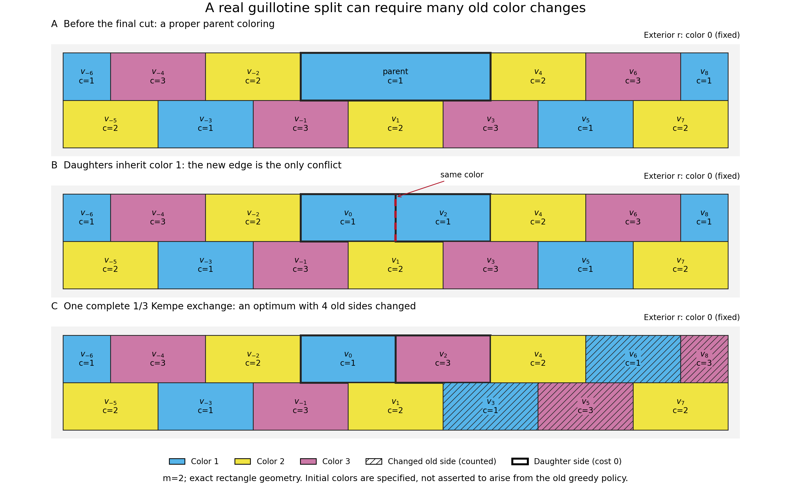

# 从两个成本 4 案例到可增长的矩形修复下界

本轮接续 `KEMPE_PROGRESS-2026-09-20.md`，回答两个问题：为什么两个冻结实例至少要改 4 个旧侧；这个代价能否被一个与地图规模无关的常数限制。起始研究想法属于 Qinzi27。

**结果：两个实例的成本 4 有可检查的三角形传播证书；进一步构造的真实矩形贯穿分割族，最少净旧侧改色数严格等于 (2m)，且一次 Kempe 交换就能达到。** 因此，在固定外侧颜色、允许任意给定合法初态的范围内，单次插线的旧侧改色数没有统一常数上界。

这是本项目这轮得到的受限构造与直接证明，不据此主张文献原创性。它也没有证明既有贪心取名流程会产生这些初态，不能用于宣称那个特定流程必有同样最坏情况。以下均不涉及新的四色定理证明。

## 1. 对象、动作与成本

约束图顶点是面对应的**侧一致性类**，不是地图的几何顶点，也不是每条线的一条有序记录。令 (H) 为两子侧继承同一父色、尚未要求彼此异色的约束图，(G=H+ab) 加上最后的子侧异色边。旧赋值 α 在 (H) 上合法，目标 β 在 (G) 上合法；外侧 (r) 固定为 0。

本轮目标为净旧侧成本

\[
C(\beta)=\sum_{v\notin\{r,a,b\}}[\beta(v)\ne\alpha(v)].
\]

两个新子侧及外侧权重为 0，其余侧权重为 1。这个成本不等于累计换色次数、路径总触及量或有序边记录写入数。边界表 (F(c_a,c_b)) 给定两个子侧最终颜色后，求其余全部侧的最小净成本；它保留 16 个有序颜色对，含明确不可行行。

`recoloring_boundary.py` 在原变量上枚举合法终点；`apex_triangle_cost.py` 在满足下述条件时先合并强制等色类再枚举。两者都是明确标注的研究求解器。本轮未把枚举接入原网页规则，也未实现一般的递归边界表拼接算法。

## 2. 固定通邻侧为何产生刚性

两个原例的外侧邻接所有其余侧。固定 (r=0) 后，其余侧只能使用 1、2、3。如果 (uvw) 和 (uvz) 都是三角形，则 (u,v) 已占用不同的两色，(w,z) 都只能取第三色，故 (w=z)。这里的三角形是**面邻接约束图**中的三角形。

程序逐个保存共享边及对顶点证书，将传递等式合并。商图一个合法赋值对应原图唯一合法赋值；反之亦然。每个类 (A) 对字面颜色 (c) 的成本是

\[
w_A(c)=\sum_{v\in A}w_v[c\ne\alpha(v)].
\]

所以商图保留全部终点与成本。不能把整体色名置换视为同一个成本状态：旧颜色固定后，交换色名可能改变许多旧侧。这是已知三色约束的直接应用，不是新的平面图定理。

### 原例 20260926

加入子侧边 (s5s10) 后，三组强制等色类为

- (A=\{s5,s9\})，颜色 1、2、3 的成本为 ((1,0,1))；
- (B=\{s7,s10\})，成本为 ((1,0,1))；
- (C=\{s4,s6,s8\})，成本为 ((3,2,1))。

三组两两相邻。剩余 (s1,s2,s3) 构成三角形，并由 (s3s4) 接入。其原色为 ((1,2,3))：当 (C\ne3) 时可不改；当 (C=3) 时，必须改变 (s3) 及另一个侧，最小附加成本为 2。于是：

- (C=1)：组成本 (1+3=4)，附加 0；
- (C=2)：组成本 (2+2=4)，附加 0；
- (C=3)：组成本 (1+1=2)，附加 2。

全部六种 (A,B,C) 配色的最低总成本均为 4。完整目标共有 24 个，其中成本 4 的目标有 8 个。

### 原例 20260980

加入子侧边 (s4s10) 后：

- (A=\{s4,s6,s8,s11\})，成本 ((2,2,2))；
- (B=\{s2,s5,s10\})，成本 ((1,1,2))；
- (C=\{s3,s7,s9\})，成本 ((2,3,1))。

剩余叶侧 (s1) 邻接 (B)，原色为 1，因此 (B=1) 时附加成本 1，否则 0。

| 子侧最终颜色 / (A,B) | 1,2 | 1,3 | 2,1 | 2,3 | 3,1 | 3,2 |
|---|---:|---:|---:|---:|---:|---:|
| 20260926 最少旧侧改色 | 4 | 4 | 4 | 4 | 4 | 4 |
| 20260980 最少旧侧改色 | 4 | 7 | 5 | 6 | 7 | 5 |

第二例共有 12 个合法目标，只有一个全局成本 4 的目标。按 (s0,\ldots,s11) 排列，它是 `0,1,2,3,1,2,1,3,1,3,2,1`，改动旧侧 `s3,s5,s6,s11`。两个原例只看子侧直接邻居的最低强制改动下界均为 1；成本 4 来自向外传播的约束。

## 3. 删除约束后的控制实验

固定原初色、子侧与成本定义，分别删除一条 (H) 的边，或删除一个非固定、非子侧的旧变量。它们是**抽象约束放松**，未证明每个结果都对应一次真实几何分割。

| 原例 | 原 H 边数 | 删一条边后成本 0 / 1 / 2 / 3 / 4 的例数 | 删一个旧侧后仍成本 4 |
|---|---:|---|---|
| 20260926 | 24 | 3 / 4 / 4 / 8 / 5 | 0 / 8 |
| 20260980 | 28 | 3 / 2 / 5 / 7 / 11 | 2 / 9 |

逐边贪心删除，只有保持最小成本 4 才接受，并对最后剩余的每条可删边重新核查：

| 可删范围 | 20260926 正序 / 逆序剩余边数 | 20260980 正序 / 逆序剩余边数 |
|---|---|---|
| 全部 H 边 | 19 / 19 | 19 / 20 |
| 保留全部外侧邻接边 | 23 / 23 | 24 / 24 |

这证明的是指定范围下的**包含极小**，不是全局边数最小；第二例不同删除顺序会得到不同核。两例总计检查 244 个去重后的成本问题，全部由边界枚举与独立预算搜索交叉核对。预算 (k-1) 不可行、预算 (k) 有见证，确认最小值为 (k)。这 244 个问题不是独立随机样本。

## 4. 真实两行错缝矩形族

对整数 (m\ge1)，记 (L=-3m,U=3m+2)。在外框 ([L,U]\times[0,2]) 内，对每个 (i=L,\ldots,U) 设置矩形

\[
R_i=[\max(L,i-1),\min(U,i+1)]\times
\begin{cases}[1,2],&i\text{ 为偶数},\\[0,1],&i\text{ 为奇数}.\end{cases}
\]

偶数矩形铺满上排，奇数矩形铺满下排；内部共边当且仅当 (|i-j|\in\{1,2\})，单独角点接触不算邻接。所有矩形均有边段接触外框，所以外侧是通邻顶点。最终共有 (6m+3) 个内部面，内部邻接图为路径平方 (P_{6m+3}^2)。

真实贯穿分割历史：先沿 (y=1) 分成两排，再逐排竖切，但上排保留父矩形 ([-1,3]\times[1,2])；最后沿 (x=1) 把它切成 (R_0,R_2)。这一最后切割对应唯一待边 (v_0v_2)。

初色取

\[
\alpha_i=\begin{cases}
(1,2,3)_{i\bmod3},&i\le0,\\
2,&i=1,\\
(3,2,1)_{i\bmod3},&i\ge2.
\end{cases}
\]

下标采用从 0 开始的三个余类。两子侧初色均为 1，合并后的父矩形也是合法的色 1；继承初色只在最后新增边上冲突。故这不是仅有抽象平面图的例子：它有实际矩形、完整贯穿切割历史和合法父态。

### 精确下界与达到下界的构造

在 (G) 中每三个连续编号构成三角形，且内部只能用三色，因此

\[
\beta_{i+3}=\beta_i.
\]

全部最终着色恰好是三个余类的六种颜色排列。排除零成本子侧 (v_0,v_2) 后，旧侧初色分布为：

| 编号模 3 | 初色 1 | 初色 2 | 初色 3 |
|---|---:|---:|---:|
| 0 | m | 0 | m |
| 1 | 0 | 2m+1 | 0 |
| 2 | m | 0 | m |

余类 0 和 2 各至少改 (m) 个旧侧，故 (C\ge2m)。保持余类 1 为颜色 2、另两类分别取 1 和 3 即可达到。另四种排列的成本为 ((2m+1)+2m+m=5m+1)。因此

\[
\boxed{\min C=2m,\qquad \{C(\beta):\beta\text{ 合法}\}=\{2m\ (2\text{个}),\ 5m+1\ (4\text{个})\}.}
\]

以上推导适用于所有正整数 (m)，不是从有限数值外推。若最终内部面数为 (N=6m+3)，最小成本就是 ((N-3)/3)。

### 为什么仍只需要一次 Kempe 交换

(H) 的颜色 1/3 诱导子图恰有两个分量：索引 ≤0 的那一侧，以及索引 ≥2 的那一侧。每个分量有 (2m+1) 个顶点，恰包含一个零成本子侧，其余 (2m) 个均是旧侧。任选一个完整分量交换 1/3，可使子侧异色且保持所有旧约束，达到成本 (2m)。零次操作没有修复子侧冲突，所以最少 Kempe 步数严格等于 1。

图示读取正式报告中的 (m=2) 数据。斜纹表示改色旧侧，粗边表示子侧；切割前父面与两个子面的身份不同。



## 5. 这对下一轮算法意味着什么

1. **应分开优化交换步数与旧侧净改色成本。** 一次操作可能影响线性数量的旧侧；仅缩短路径不能保证局部改动小。
2. **刚性传播可以用来生成成本证书。** 本族不论多长，都压缩为三个等色类，保留完整字面颜色成本便可得到精确答案。这是有明确适用条件的计算改进，尚未证明对一般输入的运行时间优势。
3. **不能把接口小等同于修复范围小。** 本族沿链传播，最终商图仅三个顶点，却仍必须修改许多旧侧。接口压缩有助于求解，不能自动给出改色数的常数界。
4. **接下来最有价值的测试是初态可达性。** 固定本族几何与切割顺序，实际运行既有取名规则，记录它产生什么初色，是否命中这一障碍；若没有，应研究该规则维持了什么限制。需要另建版本和成绩口径。

本轮没有把外部论文结论扩成未证明的最优性保证，也不把这个基本三色传播构造称作经过查新的原创算法。

## 6. 证据和复跑

正式报告：`outputs/recoloring-obstructions-2026-09-21.json`，SHA-256：
`a1a10b9fab64565426744f022dfb6af7ea4d50eaa96726c2547bde44dd94598e`。

- 两个原例从冻结几何归档重新构造，原始合法目标另核对 primal/dual XOR 关系。
- 16 行原变量精确枚举与三角形商图逐行比对；审计器另用商图颜色笛卡尔积核验全部行、计数与最优成本。
- 244 个抽象成本问题由独立预算搜索核对；所有正式搜索完成，没有把资源截断当作不可行。
- 几何族正式参数为 `1,2,3,4,5,6,7,8,16,32,64,100`。从坐标独立重建正长度共边、检查无重叠与面积覆盖，并逐步重放全部贯穿切割；精确核验六目标、净成本及完整 Kempe 分量。最大参数有 603 个面、601 个计费旧侧，最小成本 200。
- 原变量全枚举仅用于符合大小上限的小输入；大型族使用已核验等价关系和小商图的完整枚举，不能描述成对 604 个图顶点穷举所有 (4^{604}) 赋值。
- 输入及核心源码共 16 项 SHA-256 在报告开始和结束时一致。未变化的旧 160 例、7069 图成绩及旧网页不纳入新的构造族成绩。

从项目根目录使用现有 Python 3.10+：

```powershell
python -X utf8 -m unittest discover -s tests -v
python -X utf8 scripts/validate.py --output outputs/validation-recoloring-obstructions-rerun.json
python -X utf8 scripts/validate_recoloring_obstructions.py --output outputs/recoloring-obstructions-rerun.json
# 绘图需使用已有 Matplotlib 的解释器；核心和核验只需标准库。
python -X utf8 scripts/render_recoloring_obstruction.py --input outputs/recoloring-obstructions-rerun.json --output-dir docs/figures/recoloring-obstructions-rerun
```

输出均拒绝覆盖已有文件，请为每次重跑选择新的名字。测试与综合验证结果见本轮 `WORKLOG-2026-09-21-RECOLORING-OBSTRUCTIONS.md`。
