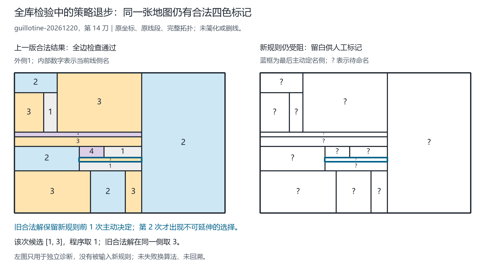

# 当前线侧关系规则：完整既有库检验

日期：2026-09-19。规则版本见 [侧名搭配关系](RELATION_FRONTIER-2026-09-19.md)。
本轮只冻结规则、扩大验证并诊断剩余失败，没有修改求解规则，没有失败换算法。

**结论：7069 张不同输入中完成 7063 张；363 条构造历史的最终图全部完成，
但只有 359 条历史的每一个中间步骤都完成。余下 6 张中间图不是无四色解：
两个旧基线都已经给出合法结果。当前不可逆选名规则仍不完备。**

## 1. “完整”的范围

- 原既有库：6113 张不同输入，323 条构造历史的 6678 个前缀引用，302 个静态案例。
- 上轮预声明种子 `20261901..20261940`：961 张不同输入，40 条历史的 1000 个前缀引用。
- 两组共有 5 张输入，因此并集为 `6113 + 961 - 5 = 7069`，不能直接相加。
- 所有历史都检查从初始图到最终图的每个前缀；中途受阻不跳过后续输入。
  每个前缀只读当时的完整几何，从外 1／首内 2 重新命名，不沿用旧颜色。
- 7980 个引用（7678 历史前缀 + 302 静态引用）保留来源；相同输入只运行一次，
  再回填每个引用位置。单图数、历史数、引用数不是同一个统计单位。
- 输入覆盖项目现有矩形分割、环与桥、边界扇形、条带、教学例、图库和静态线网；
  当前输入含外侧的侧身份数量为 2–57，输入笔画为 0–36。

这意味着**完整的现有有限测试库**，不意味着全部平面地图。原新种子组现在已被看过，
不能继续称本轮调优之外的未见留出集。各图共用生成器、构造前缀也相关，
这些比例不是独立随机样本上的普遍成功概率。

## 2. 冻结的规则与对照

三个策略对每张输入各独立运行一次：

1. `closed-support`：较早的整图重启基线。
2. `tight-hall`：上一阶段的线侧紧迫度与 Hall 候选预留。
3. `tight-hall-relations`：本次完整检验的当前规则，交替进行 Hall 预留和二元关系过滤。

母线身份、局部区间、侧身份与名字仍分别保存。实际共边产生异名要求；桥两侧
是同一身份，不产生自异名要求。内部可以复用 1；只有外侧身份固定为 1。
保持原优先级公式和旧闭合支撑平局项，本轮不增加分圈路线。

关系过滤缩小候选域后，紧迫度和实际选中顺序可能改变，即使排序公式没变。
非单候选的主动落名仍采用原“复用优先、再取小名”规则；选定后不回溯、
不尝试另一套颜色组合、不导入旧解。四进程只并行处理不同地图，不并行搜索答案。

## 3. 总结果：中间步骤与最终图分开计数

| 检验项目 | 较早基线 `closed-support` | 上一规则 `tight-hall` | 当前关系规则 |
|---|---:|---:|---:|
| 不同输入成功／7069 | 6488 | 6801 | **7063** |
| 所有前缀均成功的历史／363 | 208 | 268 | **359** |
| 最终图成功的历史／363 | 296 | 337 | **363** |
| 静态案例成功／302 | 244 | 279 | **302** |

各行有重叠，不能相加作为总图数。静态案例按声明案例数计，单图一行按不同输入计。

当前规则分组结果：

| 组别 | 不同输入成功 | 历史全程成功 | 历史最终图成功 |
|---|---:|---:|---:|
| 原既有库 | 6107/6113 | 319/323 | 323/323 |
| 上轮新种子组 | 961/961 | 40/40 | 40/40 |
| 去重并集 | 7063/7069 | 359/363 | 363/363 |

相对上一规则，268 张原失败图全部修复；另有 6 张原成功图退步。
两者均成功为 6795 张，均失败为 0 张。这是**净改善而非单调覆盖**。
不能把新旧两个成功集合取并集后声称当前规则通过全部地图。
原定向诊断集 307 张的结果及传播阶段哈希均精确复现，全部成功；
该定向结果没有预见本次全库出现的 6 个新退步。

## 4. 全部 6 张未完成图

六张图都属于原库的矩形分割历史；两个旧基线在这六张图上均成功。
同一历史的后续图仍从新几何完整重启，因此存在中间失败、最终成功的情况。

| 历史种子 | 加线步数 | 侧身份数，含外侧 | 输入 key 前缀 |
|---|---:|---:|---|
| 20261220 | 14 | 16 | `9f8211690f9b` |
| 20260962 | 15 | 17 | `d68ddb3f083e` |
| 20261018 | 16 | 18 | `0f0c4e8e6851` |
| 20261018 | 18 | 20 | `c3b32c0258e8` |
| 20261059 | 22 | 24 | `09045a40804e` |
| 20261059 | 23 | 25 | `32e0aa0ab078` |

完整 key、原始输入、所有来源别名、终态和轨迹哈希保存在机器报告中。
“未完成”指本策略先前选名造成不可延伸，不是几何无法四色命名，
也不能据此否定提出者尚未完全形式化的整体设想。

## 5. 最小剩余例：首次错误是第 2 次主动落名

最小按预先固定的“侧身份数、笔画数、输入 key”排序选择，不按图看起来简单程度挑选。
案例 `guillotine-20261220` 第 14 刀，完整 key 为：

`9f8211690f9b084b850340d04fd3cdb4652a5fafa9f138139ba22e8ec9639b4e`



图中填色和数字是当前线侧名字的可视化，同一侧沿不同母线出现时共享名字；
不是改用端点着色。原坐标、原线段和全部狭窄条带均保留。
蓝框只标记出问题的侧位置，不是新增分割线；空白中的问号表示待命名，不表示颜色 0。

具体核验链：

1. 外 1／首内 2 初始化后，第 1 次主动决定为侧 8 取 3。
2. 两个旧基线已有合法完整命名，可保留该决定；独立检查确认其每条实际共边均异名。
3. 该合法命名的所有侧对搭配，在初始和第一步后的每个传播阶段都仍保留。
   因此过滤没有误删这个答案。
4. 第 2 次主动决定落在侧 15，原坐标边界为 `(277,363,544,382)`，候选为 `{1,3}`。
   当前程序取 1，而上述合法完整命名在相同位置取 3。
5. 整次运行累计 51 条 Hall 事件及 194 条关系事件均经独立重放核验；
   其中固定 1 后的冲突传播包含 21 条 Hall 和 84 条关系事件。
   关系最终一边要求侧 12 与侧 14 同名，另一边又禁止其同名。

因此本例不只是“最后一次决定附近触发冲突”：第 1 次决定确实可延伸，
第 2 次决定确实不可延伸，是该运行中**首次错误的主动决定**。
旧解只用于事后诊断和作图，没有输入新规则。没有失败后改试 3 并计作成功。

另外两例的独立诊断也指向同一缺口：种子 20261018 第 16 刀在第 4 次主动决定
从 `{1,2}` 取 1；种子 20261059 第 22 刀在第 4 次从 `{1,3}` 取 1。
对应旧合法解分别取 2 和 3，并兼容各自先前全部主动决定。
这两例不是其余三个失败输入的替代证明；完整六例均保留，不假定它们机制完全相同。

人工标记入口：[空白 PNG](figures/relation-frontier-full-2026-09-19/manual-blank.png)
／[可编辑 SVG](figures/relation-frontier-full-2026-09-19/manual-blank.svg)。
建议标出母线处理顺序、局部侧位置、需要联动的名字，以及何时应暂缓固定名字。
图的输入、完整指定例证书、轨迹核对、来源和图片哈希见
[manifest.json](figures/relation-frontier-full-2026-09-19/manifest.json)。
两张 PNG 已按实际输出检查：边界完整、窄条数字自适应、问号与名字分开、未裁切标签。

## 6. 证明到哪里，缺口在哪里

设当前承诺集合为 `A`，满足完整共边条件和 `A` 的合法四名赋值集合为 `S(A)`。
过滤后某侧的候选为 `D_A(u)`。已有删除保真论证支持：

\[
\{s(u):s\in S(A)\}\subseteq D_A(u).
\]

意思是每个真正能完成的名字都应留下，不是每个留下的名字都能完成。
算法不必保证所有保留候选都安全，但需要保证选择函数实际选中的那个安全。
令 `c* = Pick(A,u,D_A,R_A)` 为当前规则选中的名字，尚缺的安全落名保证为：

\[
S(A)\ne\varnothing\quad\Longrightarrow\quad
S(A\cup\{u=c^*\})\ne\varnothing.
\]

当前规则不满足这个蕴含；上述第 2 步就是本实现的具体失败见证。
二元关系在不同第三侧上各有兼容支持，不保证这些支持能拼成一个共同的全局赋值。
增强必要条件过滤也会改变动态权重，从而改变原来成功的选名顺序。

所以合理的下一步是研究**何时允许不可逆定名**、何时保留多个名字的联动关系，
而不只是累加一个权重。这个建议尚未实现，不能预先称一定修复六例或覆盖全部平面图。
四名集合是程序的给定约束；本实验没有从“母线数量有限”推出颜色上界，
也没有证明全图最少色数。

## 7. 审计与可重复性

主运行对三策略共进行 21207 次独立状态／证书检查，包含成功终态与受阻证书，
不能称 21207 次成功着色。两个旧基线共 14138 个结果精确复现；
原 307 个诊断图的结果和传播阶段哈希也精确复现。
当前规则累计重放 46370 次传播、55584 个阶段、878909 条 Hall 事件、
986999 条关系事件，涉及 1698614 个有向配对删除。
这些事件包含重复推导，不是不同定理或独立地图的数量。

随后只读审计器独立重算计数和配对表，核对全部 7980 个来源引用、1089 条历史策略结果、
283 个批次及校验和、16 个运行源码文件的哈希，并确认完整报告与批次一致。
它不重新执行数学求解；数学证书独立重放在主验证运行中完成。
轨迹／传播阶段哈希和核验计数为所有输入保留，指定例及各批次最小失败另存详细证书；
并非所有成功图的每条中间证明都完整嵌入最终压缩报告。原输入可重跑生成详细轨迹。

回归检查：完整 Python **388 项通过**，Node **107 项通过**；
`scripts/validate.py` 再次调用 388 项 Python 测试通过。
新增十项全库运行器测试覆盖去重／漏项、失败后继续、串行与并行一致、
精确基线对照、检查点恢复、校验和破坏和禁用断言模式拒绝。

证据文件：

- [完整数据](../outputs/relation-frontier-full-2026-09-19.json.gz)
- [精简结果](../outputs/relation-frontier-full-summary-2026-09-19.json)
- [独立只读审计](../outputs/relation-frontier-full-audit-2026-09-19.json)
- [通用测试报告](../outputs/validation-relation-frontier-full-2026-09-19.json)

完整数据 SHA-256：

`5c4683c17f10c01bcacef456d852424e5ae81e0b56c39c872b3c6eb38fbe6c9b`

执行时使用四进程，每批 25 张，共 283 批，约 475 秒。
这不是控制硬件和负载后的算法速度基准。

复现命令（Python 3.10+，核心仅标准库；几何重建另需项目已有 Node）：

```shell
python -m unittest discover -s tests -v
node --test tests/web.test.mjs tests/construction.test.mjs tests/renaming.test.mjs tests/priority-names.test.mjs tests/restart-geometry.test.mjs
python scripts/validate.py --output outputs/validation-relation-frontier-rerun.json
python scripts/validate_relation_frontier_full.py --output outputs/relation-frontier-full-rerun.json.gz --summary outputs/relation-frontier-full-rerun-summary.json --checkpoints outputs/relation-frontier-full-rerun-parts --workers 4 --batch-size 25
python scripts/audit_relation_frontier_full.py --input outputs/relation-frontier-full-rerun.json.gz --summary outputs/relation-frontier-full-rerun-summary.json --output outputs/relation-frontier-full-rerun-audit.json
python scripts/render_relation_frontier_failure.py --input outputs/relation-frontier-full-rerun.json.gz --output-dir docs/figures/relation-frontier-full-rerun
```

每次换用尚不存在的输出名称，不覆盖本次或历史证据。运行器拒绝 Python `-O`，
因为独立核验使用断言。中断后可对原批次目录加 `--resume`，仅接受输入、源码、
策略、顺序和批次大小一致且校验和匹配的检查点；最终输出仍须为新文件。
作图另需 Pillow 及可用中文字体，沿用项目已有绘图实现；这不是求解器核心依赖。

## 8. 交付边界与方法披露

本轮新增完整运行器、只读审计器、十项测试、原几何作图及本报告，
没有修改数学求解模块，没有提交／上传 GitHub，没有更新网页或公开部署。
旧代码、旧图、旧报告和用户手稿均保留。

科研审查技能用于区分证明、有限实验、筛选后样本和策略回归；
科研可视化技能用于保留精确几何、重复数字标识和图像来源。
按科研审查技能要求单列流程工具来源（**不是四色数学结果的依据或独立同行评审**）：

Kassis, T., Agarwal, V., He, Y., Patel, D., & Brueckner, A. M. (2026).
*Scientific Agent Skills: A Library of Procedural Knowledge for Research Agents*.
[arXiv:2609.00065](https://arxiv.org/abs/2609.00065).
[DOI](https://doi.org/10.48550/arXiv.2609.00065).
