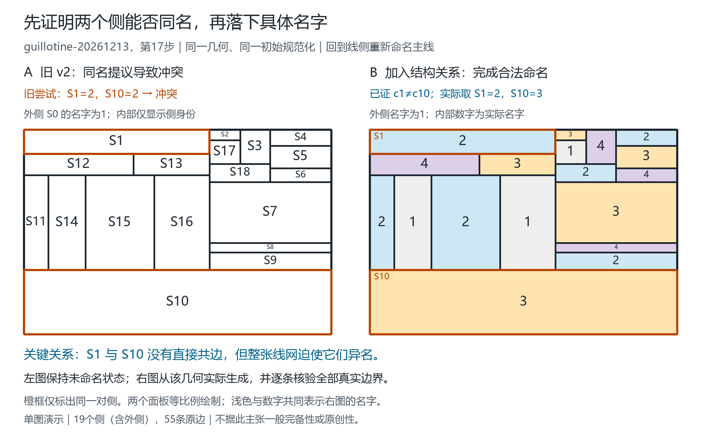

# 原线侧命名路线：有证明的同名检查及完整对照

2026-09-21。发起思路属于 Qinzi27。本轮实现 `mother-peer-structural-reuse-v1`：在整图按当前几何重新命名的过程中，先检查拟复用名字是否能被结构关系反驳，再决定是否提交。

## 1. 实际进步

| 数据口径 | 冻结v2 | 新规则 | 修复 / 新退步 |
|---|---:|---:|---:|
| 旧库7069个去重几何 | 7068完成，1冲突 | 7069完成，0冲突 | 1 / 0 |
| 旧库363条历史，所有前缀均完成 | 362 | 363 | 1 / 0 |
| 预声明新种子中479个旧库未见几何 | 478完成，1冲突 | 479完成，0冲突 | 1 / 0 |
| 新种子20条历史，所有前缀均完成 | 19 | 20 | 1 / 0 |

旧库363个终图、302个静态引用，两策略均全部完成；本次修复的是中间前缀，不应把它说成旧终图成功率的提高。旧库基线直接来自校验过哈希的原始归档，本轮新执行的是新策略的7069次；新种子组则每图分别新执行两种策略。

新种子固定为20262101–20262120，每条24次加线，包含空图共500个前缀引用，去重481图。其中479个几何键未见于旧库，2个与旧库重叠（对应21次引用）；完整481图的成绩是480/481→481/481，500次引用为499/500→500/500。两策略的新种子终图均20/20。没有按成功筛选输入，也没有拼接不同策略的成功集合。

“新几何”按规范化线段集合判定，不是图同构意义的全新结构。种子是预声明的新输入，但仍来自同一个guillotine生成家族；各前缀也不是相互独立的统计样本。

## 2. 改动如何对应原方法

保留“加线后以当前线网重新求名”，不输入旧配色；保留v2母线、接点、几何层级及确定性选择约定。改变的是准备把两个侧取成同名时的检查：

```text
当前线网 → 母线/线侧关系 → 提出下一名字
                             ↓
                   假设与某个已定侧同名
                             ↓
             真实共边关系推出矛盾？
             是：记录异名关系，重新传播/选择
             否：结果仅为不确定，沿原规则提交
```

这里的数学信息不局限于“直接共边必须异名”：**两个没有直接共边的侧，也可能被更远的线网关系迫使异名。** 这使用户的关系式命名思路多了一条可自动识别、可审计的具体推导。

这仍是用户原路线的一个实现候选，并未把所有闭环递归与由内向外排程都形式化。程序的编号、母线优先与取最小名约定不是用户已经证明的普遍公理。

## 3. 两个真实修复及证书

### 旧库最后一个失败

`guillotine-20261213`第17次加线后的图，共19侧（含外侧）。v2初始化外侧S0=1、S1=2，给S10的候选域为{2,3,4}，首次主动决定取2后冲突。

新规则从真实共边证明S1≠S10，先排除2，再完成合法命名。自动证书经过11次强制合并、12轮，终端出现五个两两异名的类，反驳最初同名假设；全图17次结构查询，只学得这一条异名关系。独立手工短证书可以更短，详见[失败诊断](V2_FAILURE_DIAGNOSIS-2026-09-21.md)，两份不同推导不要混报步数。



图由原几何及实际程序输出绘制，全部55条原边重新核验。图件保存的完整结果哈希与正式全库报告一致：`d9948830ec95156f0d3b463fb4d45137b048783cd693dae4326be0bf450c692f`。

### 冻结规则后出现的新修复

新种子`20262117`第12次加线，共14侧。v2第一主动选择S9，候选域为{1,2}，先取外侧也使用的名字1，随后冲突。新规则证明S0≠S9，排除1；该自动证书仅需2次强制合并、3轮，最终完成命名。

新修复的侧身份、位置及待排除名字与旧例不同。规则中没有硬编码S1/S10，也没有把外侧名1一律禁止在内部复用；这里只排除被当前图证明确实不允许的复用。

## 4. 除实测以外的成功保持性质

在同一初始化、无学习时同一选择过程、传播与反证可靠、承诺累积且没有资源中断等前提下，可以证明：

```text
Success(v2) ⊆ Success(structural-reuse-v1)。
```

原因是：若v2最终成功，它的完整合法结果就为沿途每个同名提议提供了合法见证。新程序不可能可靠地反驳这些提议，因此不会发生第一次学习或选择分叉。旧成功图保持相同主动提交轨迹及相同数字名字。完整前提、归纳证明和源码对应见[成功保持命题](STRUCTURAL_RESTART_SUCCESS_PRESERVATION-2026-09-21.md)。

实际报告中，旧库7068个旧成功图及新种子480个旧成功图分别全部满足：轨迹哈希相同、最终名字相同、学习关系为零。旧库还逐图核对了域、锚点、选择次数与未知层级母线列表相同。

该性质依赖“仅在当前将采用的提议被反证时分叉”。不能推广成任意额外可靠过滤都不会改变贪心成绩，因为提前改变别处的域可能改变选择顺序。它也不保证新策略能修复所有旧失败。

## 5. 核验与计算代价

- 旧库：7069次新策略运行与独立全审计，86451次结构查询、1条学习关系；38478次主动提交、842531条Hall事件、1136673条二元关系事件逐项审计。
- 新种子：481图×2策略，962次独立全审计；新规则5989次查询、1条学习关系。全部学习/失败图保留完整证书，其余完整执行并审计后保存哈希及实际名字。
- 关闭新检查的消融复现旧v2；证书测试包含篡改原边、合并类、假设、结论和遗漏查询等失败条件。结构规则另在2–5顶点全部1098个简单图及24个固定种子的6顶点图上，与直接枚举全部四名赋值对照。
- 完整831项Python单元测试及`scripts/validate.py`通过。JavaScript未改，本轮实际调用了原Node几何引擎，但未重新运行整套网页测试。
- 新旧源文件起止哈希相同：全库31项，新种子35项。旧库约494.2秒，新种子约89.1秒，均含并行执行、审计和证据保存，不是纯算法计时。

新种子每图两策略都实际计时：v2/新规则的生产程序耗时总和为126.941/129.004秒，每图中位数为0.100008/0.103882秒；配对差中位数为+0.000481秒。并发负载、固定v2先运行、单次测量等条件未受控，因此只保留观察，不声称速度优势或稳定开销比例。“零学习”也不等于没有查询开销。

## 6. 原创性与结论边界

共享三角形迫使共同邻点同名，以及在同名商图中推导冲突，属于既有图着色约束方法。直接先例见Hébrard与Katsirelos（2020），*Constraint and Satisfiability Reasoning for Graph Coloring*，§3与§6.3（印刷页53，Lemma 2的K4特例）。[作者全文](https://gkatsi.github.io/papers/hk-jair20.pdf)。

本轮建立的是：**该已知推理可按需接入用户的线侧重启路线，既有成功保持性质，又修复了旧库和预声明新种子中的实际失败。** 这是可复现的算法实现改进；整体组合的原创性优先权未确立，不能把已知引理改名为新发现。

还没有证明检查能找出所有不可延伸的选择，也没有证明任意平面图都能由本策略完成。找不到反证仍是`inconclusive`。四色上限是输入条件；本轮不是新的四色定理证明。

## 7. 复现与证据

先在旧失败的实际画板格式几何上运行一次：

```shell
python -X utf8 scripts/name_structural_map.py examples/structural-v2-failure-map-2026-09-21.json --output outputs/my-structural-map.json
```

完整复现（使用新的输出与目录）：

```shell
python -X utf8 scripts/validate_structural_restart_full.py --workers 4 --batch-size 25 --output outputs/my-structural-full.json.gz --summary outputs/my-structural-summary.json --checkpoints outputs/my-structural-checkpoints
python -X utf8 scripts/validate_structural_restart_new_seeds.py --workers 4 --batch-size 25 --output outputs/my-structural-new-seeds.json.gz --summary outputs/my-structural-new-seeds-summary.json --checkpoints outputs/my-structural-new-seeds-evidence
python -m unittest discover -s tests -v
python scripts/validate.py --output outputs/my-structural-validation.json
```

| 证据 | SHA-256 |
|---|---|
| `outputs/structural-restart-full-2026-09-21.json.gz` | `bc692056ee5395168bb39ceae9d3b24d5f5b2d289180bc3261a918c52c7daeca` |
| `outputs/structural-restart-new-seeds-2026-09-21.json.gz` | `62699d8f2953f77336e938f1ca4bde8be2fa65b4eb594b3bd19442e4b5efc49e` |
| `outputs/v2-failure-diagnosis-2026-09-21.json` | `7ec2c76bc683e86909731179fc92e403c87dbaef5767db83d52b913b461832fe` |

规则及完整实验设计见[冻结规则](STRUCTURAL_RESTART_RULES-2026-09-21.md)。输出拒绝覆盖；本轮未更改网页默认命名器或发布远端版本。

下一研究步骤应固定本版本，改用更大规模与不同构造家族测试，优先收集“关系检查无结论却随后冲突”的证书，并检查其所需信息是否超出当前二元关系。先定位新缺口，再讨论增加规则；不要在此成功集合上反复挑选种子。
